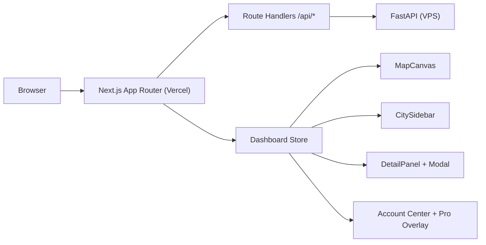

# 前端交付与重构报告（v1.4.0）

最后更新：`2026-03-14`

## 1. 报告目的

说明当前线上前端（`frontend/`）在收费阶段的实际交付状态。

## 2. 当前前端架构



## 3. 已落地能力

### 3.1 信息架构与交互

- 风险分组侧栏折叠（持久化）。
- 选中城市状态持久化。
- 今日分析、历史对账、未来日期分析联动。

### 3.2 收费相关

- 账户中心（登录态、积分、订阅状态、钱包管理）。
- Pro 解锁浮层（套餐、积分抵扣、FAQ、社群入口）。
- 钱包绑定：浏览器扩展钱包 + WalletConnect 扫码。
- 支付流程：create intent -> submit -> confirm。
- `confirm pending` 时自动轮询 intent 状态，确认后自动刷新订阅态。

### 3.3 缓存与性能

- BFF `ETag/304`：`cities` / `summary` / `history`。
- `summary?force_refresh=true` => `no-store`。
- `sessionStorage` + in-flight 去重。
- `localStorage`：选中城市、侧栏折叠状态。

### 3.4 可访问性与稳定性

- 详情面板 `inert + blur` 焦点冲突修复。
- 关键支付错误文案标准化（用户取消、gas 不足、pending）。

## 4. 当前明确未做

- 离线能力（Service Worker / IndexedDB）
- 前端级财务报表与退款后台（后端/运营侧）

## 5. 验收建议

### 5.1 前端构建

```bash
cd frontend
npm run build
```

### 5.2 缓存验收

```bash
./scripts/validate_frontend_cache.sh "https://polyweather-pro.vercel.app"
```

### 5.3 支付验收

- 绑定钱包
- 创建 intent
- 发交易
- 验证 `intent` 状态从 `submitted -> confirmed`
- 校验账户页订阅状态更新

## 6. 结论

前端已具备收费阶段的核心能力（账户、支付、权限展示、状态回收），可支持持续商业迭代。
