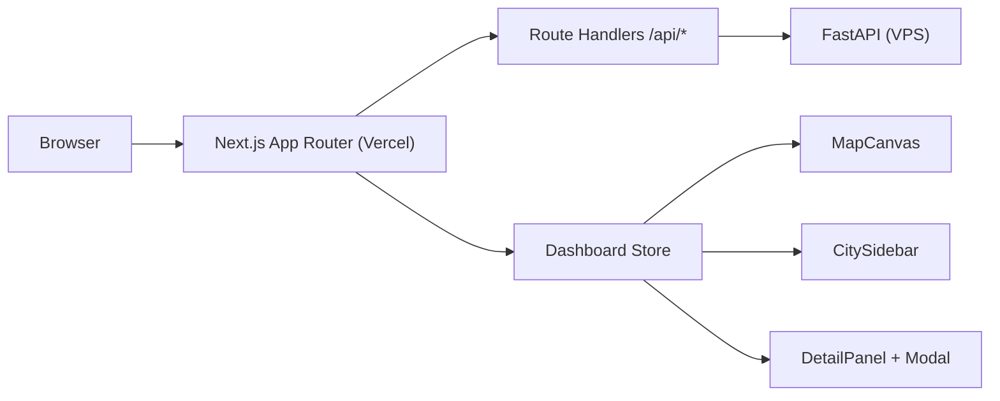

# 前端交付与重构报告（2026-03-12）

## 1. 报告目的

本报告用于说明当前线上前端（`frontend/`）的真实实现状态，替代旧版“单次改版完成报告”。

---

## 2. 当前前端架构



### 2.1 组件分层（实际）

- 页面入口：`frontend/app/page.tsx` + `frontend/components/dashboard/DashboardEntry.tsx`
- 核心容器：`frontend/components/dashboard/PolyWeatherDashboard.tsx`
- 主要视图：
  - `MapCanvas.tsx`
  - `CitySidebar.tsx`
  - `DetailPanel.tsx`
  - `FutureForecastModal.tsx`
  - `HistoryModal.tsx`
  - `GuideModal.tsx`
- 状态管理：`frontend/hooks/useDashboardStore.tsx`

---

## 3. 本轮已落地能力

### 3.1 侧栏风险分组折叠（已完成）

- 按 `high / medium / low / other` 分组展示城市。
- 分组支持折叠/展开。
- 保留“本地时间”和“峰值时间”显示。
- 折叠状态持久化到 `localStorage`（`polyWeather_sidebar_groups_v1`）。

### 3.2 选中城市状态持久化（已完成）

- 最近一次选中城市持久化到 `localStorage`（`polyWeather_selected_city_v1`）。
- 页面刷新后自动恢复。

### 3.3 未来日期分析与市场扫描（已完成）

- 前端通过 `target_date` 调用 `/api/city/{name}/detail`。
- 未来日期 modal 可展示对应日期的模型概率与市场扫描。

### 3.4 市场概率分布去重保护（已完成）

- 后端温度桶去重后，前端仍保留兜底去重逻辑。
- 避免“同温度重复四行”导致的可视化误导。

### 3.5 可访问性修复（已完成）

- 解决详情侧栏关闭时 `aria-hidden` 焦点冲突。
- 方案：`inert` + `activeElement.blur()`。

### 3.6 图标与性能观测（已完成）

- 已接入 favicon/Apple touch icon/manifest。
- 已集成 Vercel Speed Insights 与 Analytics。

---

## 4. 缓存与性能策略（当前状态）

### 4.1 BFF HTTP 缓存（Vercel）

- `/api/cities`：`ETag` + `s-maxage=300`
- `/api/city/{name}/summary`：`ETag` + `s-maxage=20`
- `/api/history/{name}`：`ETag` + `s-maxage=60`
- `summary?force_refresh=true`：`Cache-Control: no-store`

### 4.2 前端本地缓存

- `sessionStorage`：城市详情缓存（5 分钟 TTL + revision 探测）
- 请求去重：并发请求合并（pending request map）
- `localStorage`：选中城市 + 侧栏折叠状态

### 4.3 当前明确未做

- Service Worker Cache API
- IndexedDB

---

## 5. 验收记录

### 5.1 前端缓存验收脚本

```bash
./scripts/validate_frontend_cache.sh "https://polyweather-pro.vercel.app"
```

当前结果：`PASS (14 passed)`。

### 5.2 自动化测试

```bash
.\\venv\\Scripts\\python.exe -m pytest -q
```

当前结果：`31 passed`。

---

## 6. 风险与改进点

1. `frontend/.next` 构建产物在本地可见，需继续确保不进入版本管理。
2. 前端缓存策略已覆盖 P0+P1，但离线能力仍未建设（无 SW/IndexedDB）。
3. 多源数据仍依赖后端聚合延迟，前端仅能做缓存与降噪，不可替代后端刷新节奏。

---

## 7. 结论

当前前端已从“单体页面”演进为组件化 dashboard，具备：

- 风险分组侧栏与状态持久化
- 未来日期分析与市场扫描联动
- BFF 标准缓存头（`ETag/304`）
- 可访问性修复与基础性能观测

可以支持继续推进商业化接入，但支付相关能力仍需后端与权限体系配套完成。

---

最后更新：`2026-03-12`
