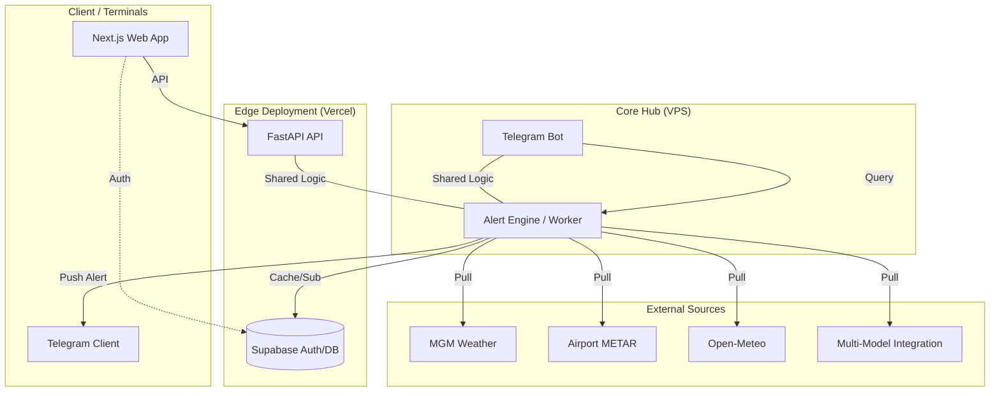

# 🌡️ PolyWeather Pro

> **Professional Weather Intelligence System** —— Specialized in edge data collection, DEB smart blending, and real-time decision alerts.

---

## 💎 Project Vision

PolyWeather is a specialized intelligence system built for **Polymarket** high-stakes participants. We don't just provide weather forecasts; we aggregate data from top-tier global meteorological sources, apply our proprietary **DEB (Dynamic Error Balancing)** algorithm, and deliver **market-shifting alerts** at critical decision nodes.

---

## 🏗️ Production Architecture

This project utilizes a production-grade decoupled architecture for high availability:

- **Frontend**: A **Next.js** interactive dashboard deployed on **Vercel**.
- **Backend API**: A **FastAPI** service running on a VPS, providing low-latency data access.
- **Bot & Alert Heartbeat**: A **Telegram Bot** running on a VPS, executing minute-level global scans and push notifications.

🔗 **Official Visit**: [polyweather-pro.vercel.app](https://polyweather-pro.vercel.app/)

---

## 🖼️ Preview & Interaction

<p align="center">
  
  <br>
  <em>📊 <b>Deep Query View</b>: DEB Blended Forecast + Settlement Probability + Groq AI Expert Advice</em>
</p>

<p align="center">
  
  <br>
  <em>🗺️ <b>Omni-Dashboard</b>: Real-time global heatmaps + array-style data visualization</em>
</p>

---

## 🚀 Core Features

- **📡 Full-Spectrum Collection**
  - **Major Models**: Real-time sync for ECMWF, GFS, ICON, GEM, and JMA high temperatures.
  - **Observed Data**: Global airport METAR reports + official Turkish MGM station-level data.
  - **Centralized Correction**: Integrated `17130` (Center) official data specifically for Ankara.
- **⚖️ DEB Smart Blending**
  - Dynamic weighting of forecasts based on recent 7-day historical performance.
- **🔔 Alert Engine**
  - **Momentum Spike**: Captures rapid temperature changes within 30 minutes.
  - **Forecast Breakthrough**: Fires when observations exceed all model predictions plus a safety margin.
  - **Advection Monitoring**: Simulates warm/cold advection based on lead stations and wind currents.
- **🛡️ Smart Suppression**
  - **Peak Protection**: Automatically switches to snapshot mode when the daily high has likely passed.
  - **Cooldown Management**: Global and city-level cooldowns to prevent notification fatigue.

---

## 🔐 Alert Logic Details

| Trigger Name     | Core Logic                                    | Trading Value                                 |
| :--------------- | :-------------------------------------------- | :-------------------------------------------- |
| **Center Hit**   | Detects DEB trigger only at Ankara HQ `17130` | **Highest priority signal**, the "truth"      |
| **Momentum**     | 30min temperature slope exceed threshold      | Captures sudden weather fronts                |
| **Breakthrough** | Pierces all model highs + margin              | Captures high-volatility outlier events       |
| **Advection**    | Lead station rise + Wind match                | Gain 20-40 minutes of lead time for execution |

---

## 🏗️ System Architecture



---

## 🛠️ Deployment

### 1. Backend / Bot (VPS)

```bash
# Pull Source
git pull

# Environment
# Edit .env with TELEGRAM_BOT_TOKEN and other keys

# Launch
docker-compose up -d --build
```

### 2. Frontend (Vercel)

Associate the `frontend` directory as the project root on Vercel for automatic CI/CD.

---

## 💬 Bot Commands

| Command   | Description                             | Example        |
| :-------- | :-------------------------------------- | :------------- |
| `/city`   | Query real-time analysis for a city     | `/city ankara` |
| `/deb`    | View historical accuracy of DEB model   | `/deb london`  |
| `/points` | View your activity points & leaderboard | `/points`      |
| `/help`   | Get detailed instructions               | `/help`        |

---

> [!NOTE]
> **Commercialization**: This project currently offers **Web Dashboard ($5/mo)** and **Telegram Signal Channel ($1/mo)** subscriptions.
> Point-earning via group participation is active and points can be redeemed for access.

---

---

**📅 Last Updated**: 2026-03-08
**🚀 Status**: v1.0 Stable - Professional Quant UI Locked

> [!TIP]
> **Production Note**: The current dashboard utilizes the high-density "Professional Quant" UI (v1.0-legacy) which integrates real-time METAR/MGM data, DEB ensemble blending, and multi-model probability distribution in a single high-performance view.
