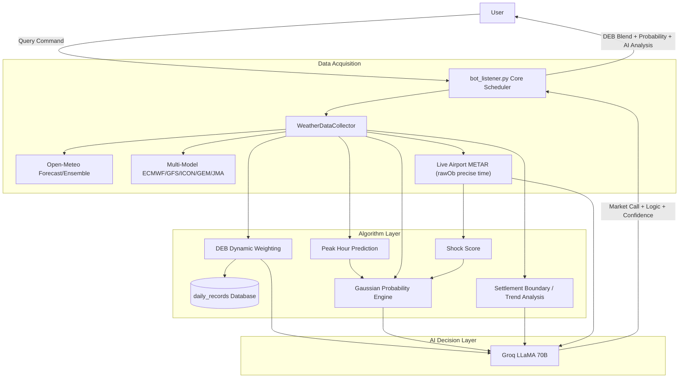

# 🌡️ PolyWeather: Intelligent Weather Quant Analysis Bot

[](https://github.com/yangyuan-zhen/PolyWeather/actions/workflows/python-app.yml)
[](https://www.python.org/downloads/)
[](https://opensource.org/licenses/MIT)
[](https://deepwiki.com/yangyuan-zhen/PolyWeather)
PolyWeather is a weather analysis tool built for prediction markets like **Polymarket**. It aggregates multi-source forecasts, real-time airport METAR observations, a math-based probability engine, and AI-driven decision support to help users evaluate weather trading risks more scientifically.

<p align="center">
  
  <br>
  <em>📊 Live query: DEB Blended Forecast + Settlement Probability + Groq AI Decision</em>
</p>

---

## ✨ Core Features

### 1. 🧬 Dynamic Ensemble Blending (DEB Algorithm)

The system automatically tracks the historical performance of weather models (ECMWF, GFS, ICON, GEM, JMA) per city:

- **Error-Based Weighting**: Dynamically adjusts model weights based on their Mean Absolute Error (MAE) over the past 7 days. Lower error = higher weight.
- **Blended Forecast**: Provides a bias-corrected "DEB Blended High Temperature" recommendation.
- **Self-Learning**: Requires at least 2 days of observations before activating weight differentiation. Uses equal-weight averaging during cold start.
- **Accuracy Tracking**: Use the `/deb` command to view DEB's historical WU settlement hit rate and MAE, compared against individual models.
- **Auto-Cleanup**: Only retains the last 14 days of records to prevent unbounded data growth.

### 2. 🎲 Math Probability Engine (Settlement Probability)

Automatically computes the probability for each possible WU settlement integer using a Gaussian distribution:

- **Distribution Center μ**: Weighted average of DEB/multi-model median (70%) and ensemble median (30%). Auto-corrects upward when METAR max exceeds μ.
- **Standard Deviation σ — Three-Layer Pipeline**:
  1. **Ensemble Base**: σ = (P90-P10) / 2.56
  2. **MAE Floor**: Uses DEB’s historical MAE as σ minimum—prevents ensembles from underestimating true uncertainty
  3. **Shock Score Amplifier**: σ × (1 + 0.5 × shock_score) when weather is changing rapidly
- **Time Decay**: Before peak σ×1.0 → During peak σ×0.7 → After peak σ×0.3
- **Observed Floor**: Temperatures below the current METAR max WU value are excluded

#### 💥 Shock Score: Weather Disruption Soft Scorer (0~1)

Evaluates environmental stability from the last 4 METAR observations. Higher = more unstable = wider σ:

| Component             | Weight | Trigger                                                           |
| :-------------------- | :----- | :---------------------------------------------------------------- |
| Wind Direction Change | 0~0.4  | Angle difference × wind speed amplifier (weak winds downweighted) |
| Cloud Cover Jump      | 0~0.35 | Cloud code escalation (FEW→BKN, etc.)                             |
| Pressure Change       | 0~0.25 | >2hPa change within 2 hours                                       |

### 3. 🤖 AI Deep Analysis (Groq LLaMA 3.3 70B)

Feeds all weather data into LLaMA 70B, analyzed via a **P1→P4 Priority Chain**:

- **P1 Real-Time Rhythm** (highest priority): 2 consecutive METAR highs → still warming; 2 non-highs past peak → dead market. Warming under low radiation → advection-driven, forecasts often underestimate.
- **P2 Inhibitors**: Humidity >80% **and** BKN/OVC sustained 2 reports → effective suppression. "Partly cloudy" alone is insufficient.
- **P3 Math Probability**: References settlement probability but cannot override P1 observations.
- **P4 Forecast Background**: DEB/forecasts used for ceiling estimation; downweighted when actuals exceed them.
- **Dead Market Trigger**: Past peak window + 2 consecutive non-highs + cloud buildup or precipitation → dead market declared.
- **High Availability**: Auto-retry + fallback model degradation (70B → 8B) to withstand Groq API outages.

### 4. ⏱️ Real-time Airport Observations (Zero-Cache METAR)

- **Precise Timing**: Extracts actual observation time from raw METAR text (`rawOb`), not the API's rounded `reportTime`. Accurate to the minute.
- **Live Passthrough**: Bypasses CDN caching via dynamic headers to obtain first-hand METAR reports.
- **Settlement Warning**: Automatically calculates the Wunderground settlement boundary (X.5 rounding line).
- **Anomaly Filtering**: Automatically filters out -9999 sentinel values from sources like MGM to prevent garbage data in output.

### 5. 📈 Historical Data Collection

- Includes `fetch_history.py` to retrieve up to 3 years of hourly historical weather data (temperature, humidity, radiation, pressure, 10+ dimensions), providing data foundation for future ML models (XGBoost/MOS).

---

## ⚡ Deployment

### Requirements

- **Python 3.11+** or **Docker & Docker Compose**
- **Environment Variables**: Set parameters in your `.env` file (copy from `.env.example`).

### 🐳 Docker Deployment (Recommended)

The easiest and most stable way to deploy without system dependency conflicts.

1. **Clone and configure**
   ```bash
   git clone https://github.com/yangyuan-zhen/PolyWeather.git
   cd PolyWeather
   cp .env.example .env
   # Edit .env to add TELEGRAM_BOT_TOKEN, GROQ_API_KEY, etc.
   nano .env
   ```
2. **Start the service in the background**
   ```bash
   docker-compose up -d --build
   ```
3. **View live logs**
   ```bash
   docker-compose logs -f
   ```

### 💻 Traditional VPS Deployment

1. Install dependencies: `pip install -r requirements.txt`
2. Configure your `.env` file.
3. Use the following script for one-click updates and restarts (for `nohup` background run):

```bash
cat > ~/update.sh << 'EOF'
#!/bin/bash
cd ~/PolyWeather
git fetch origin
git reset --hard origin/main
pkill -f bot_listener.py
sleep 1
nohup python3 bot_listener.py > bot.log 2>&1 &
echo "✅ PolyWeather Restarted!"
EOF
chmod +x ~/update.sh
```

---

## 🕹️ Bot Commands

| Command             | Description                                                                                                                         |
| :------------------ | :---------------------------------------------------------------------------------------------------------------------------------- |
| `/city [city_name]` | Get weather analysis, settlement probabilities, METAR tracking, and AI insights.                                                    |
| `/deb [city_name]`  | View DEB accuracy: daily hit/miss breakdown, bias analysis (underestimate/overestimate), model MAE comparison, trading suggestions. |
| `/id`               | View the Chat ID of the current conversation.                                                                                       |
| `/help`             | Display help information.                                                                                                           |

### Supported Cities

`lon` (London), `par` (Paris), `ank` (Ankara), `nyc` (New York), `chi` (Chicago), `dal` (Dallas), `mia` (Miami), `atl` (Atlanta), `sea` (Seattle), `tor` (Toronto), `sel` (Seoul), `ba` (Buenos Aires), `wel` (Wellington), etc.

---

## 🏗️ Architecture



---

## 💡 Trading Tips

1. **Real-time Rhythm First**: AI analysis follows P1→P4 priority. If live METAR trends (P1) conflict with math probabilities (P3)—e.g., probability favors 7°C but it’s still surging toward 8°C—always prioritize the live trend.
2. **Watch Settlement Probabilities**: Based on Gaussian models, direction is most certain when a temperature has > 70% probability while P1 rhythm is flat.
3. **Reference DEB Bias**: Use `/deb` to check for systematic bias. If a city is consistently "underestimated," habitually bid one WU notch higher.
4. **Identify Dead Market Signals**: When AI declares a "Dead Market," it usually means warming power is exhausted (post-peak window + no new highs + cloud buildup). This is an opportunity to harvest remaining value.
5. **Mind the Boundaries**: When the observed high is near X.5 (e.g., 7.50°C), be wary of Wunderground rounding up to 8 due to tiny fluctuations.
6. **Center Point μ**: The μ value represents the expected actual high. When market prices deviate significantly from μ, an arbitrage opportunity may exist.

---

_Updated 2026-03-01_
