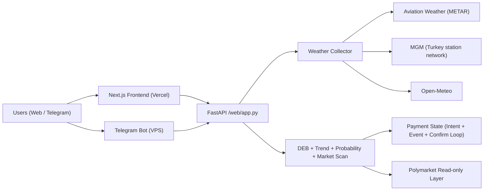

# PolyWeather Pro

Production weather-intelligence stack for temperature settlement markets.

Official dashboard: [polyweather-pro.vercel.app](https://polyweather-pro.vercel.app/)

## Product Screenshots

### Global Dashboard


### City Analysis (Ankara)


## Product Status (2026-03)

- Subscription live: `Pro Monthly 5 USDC`.
- Points redemption live: `500 points = 1 USDC`, max `3 USDC` off.
- Onchain checkout live: Polygon contract checkout (USDC / USDC.e).
- Auto-reconciliation live: event listener + periodic confirm loop.

## Open-Core Boundary (Important)

This repository follows an **Open-Core** strategy:

- Public in repo: weather aggregation, core analysis, dashboard, bot baseline, standard payment flow.
- Private in production: commercial risk rules, operational thresholds, pricing strategy details, internal reconciliation policies, and growth operations tooling.

See: [Open-Core & Commercial Boundary](docs/OPEN_CORE_POLICY.md)

## Core Capabilities

- Aggregates observations and forecasts for 20 monitored cities.
- Uses DEB (Dynamic Error Balancing) to blend multi-model highs.
- Generates settlement-oriented probability buckets (`mu` + bucket distribution).
- Maps weather view to Polymarket quotes for mispricing scan.
- Reuses one analysis core across web dashboard and Telegram bot.

## Reference Architecture



## Monitored Cities (20)

- Europe / Middle East: Ankara, London, Paris, Munich
- APAC: Seoul, Hong Kong, Shanghai, Singapore, Tokyo, Wellington
- Americas: Toronto, New York, Chicago, Dallas, Miami, Atlanta, Seattle, Buenos Aires, Sao Paulo
- South Asia: Lucknow

## Quick Start

### Backend + Bot (Docker)

```bash
docker compose up -d --build
```

### Frontend (local)

```bash
cd frontend
npm install
npm run dev
```

## Runtime Data (Recommended on VPS)

Use external runtime storage to avoid SQLite/git conflicts:

```env
POLYWEATHER_RUNTIME_DATA_DIR=/var/lib/polyweather
POLYWEATHER_DB_PATH=/var/lib/polyweather/polyweather.db
```

## Ops Verification

### Frontend cache headers

```bash
./scripts/validate_frontend_cache.sh "https://polyweather-pro.vercel.app"
```

### Payment auto-reconciliation logs

```bash
docker compose logs -f polyweather | egrep "payment event loop started|payment confirm loop started|payment auto-confirmed"
```

### Wallet activity logs

```bash
docker compose logs -f polyweather | egrep "polymarket wallet activity watcher started|wallet activity pushed"
```

## Telegram Commands

| Command | Purpose |
| :-- | :-- |
| `/city <name>` | City real-time analysis |
| `/deb <name>` | DEB historical reconciliation |
| `/top` | User leaderboard |
| `/id` | Show current chat ID |
| `/diag` | Startup diagnostics |
| `/help` | Help and usage |

## Documentation Index

- Chinese overview: [README_ZH.md](README_ZH.md)
- Chinese API guide: [docs/API_ZH.md](docs/API_ZH.md)
- Commercialization: [docs/COMMERCIALIZATION.md](docs/COMMERCIALIZATION.md)
- Open-Core policy: [docs/OPEN_CORE_POLICY.md](docs/OPEN_CORE_POLICY.md)
- Supabase setup (ZH): [docs/SUPABASE_SETUP_ZH.md](docs/SUPABASE_SETUP_ZH.md)
- Tech debt (EN): [docs/TECH_DEBT.md](docs/TECH_DEBT.md)
- Tech debt (ZH): [docs/TECH_DEBT_ZH.md](docs/TECH_DEBT_ZH.md)
- Payment verification: [docs/payments/POLYGONSCAN_VERIFY.md](docs/payments/POLYGONSCAN_VERIFY.md)
- Frontend report: [FRONTEND_REDESIGN_REPORT.md](FRONTEND_REDESIGN_REPORT.md)

## Version

- Version: `v1.4`
- Last Updated: `2026-03-14`
