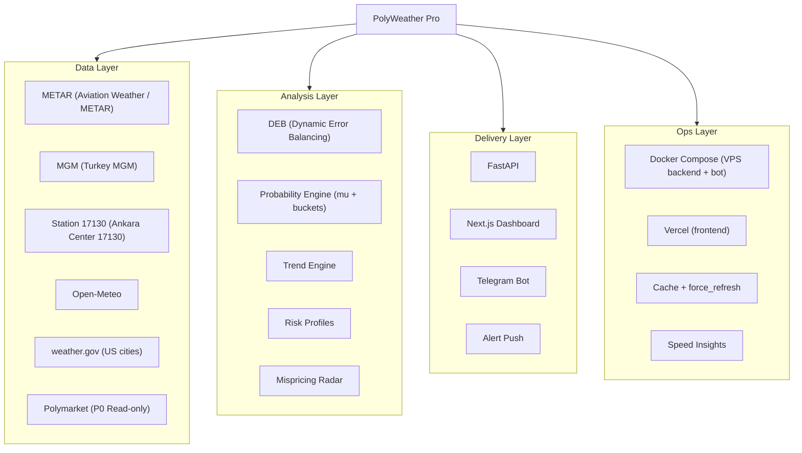
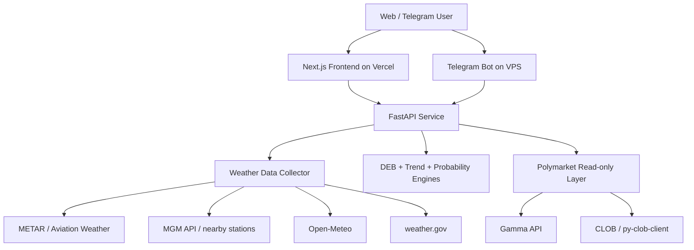

# PolyWeather Pro

Production weather-intelligence stack for temperature settlement markets.

Official dashboard: [polyweather-pro.vercel.app](https://polyweather-pro.vercel.app/)

## Product Screenshots

### Global Dashboard


### City Analysis (Ankara)


## What This Project Does

- Aggregates weather observations and forecasts for monitored cities.
- Blends multi-model forecasts with DEB (Dynamic Error Balancing).
- Computes settlement-oriented probability buckets (mu-centered distribution).
- Maps model view to Polymarket read-only market data for mispricing/risk scan.
- Delivers the same core logic to web dashboard and Telegram bot.

## Overview Diagram



## Architecture



## Current Source Policy

| Domain              | Source Policy                                        |
| :------------------ | :--------------------------------------------------- |
| Primary observation | Aviation Weather / METAR                             |
| Ankara enhancement  | MGM + nearby stations, lead station fixed to `17130` |
| Forecast baseline   | Open-Meteo                                           |
| US official context | weather.gov                                          |
| Market layer        | Polymarket P0 read-only discovery + quotes           |
| Removed source      | Meteoblue (fully removed from code and docs)         |

## Recent Changes (2026-03-12)

- Removed all Meteoblue API integration and references.
- Added frontend BFF `ETag + Cache-Control` for:
  - `/api/cities`
  - `/api/city/{name}/summary` (`force_refresh=true` keeps `no-store`)
  - `/api/history/{name}`
- Added frontend state persistence:
  - selected city in `localStorage`
  - risk-group collapse state in sidebar `localStorage`
  - background summary revision check to silently refresh stale detail cache
- Mispricing radar safety hardening:
  - skip non-tradable markets (`closed`, inactive, not accepting orders, or past `endDate`)
  - propagate tradable state in `market_scan.primary_market`
- AI decision guard:
  - peak-window state (`before` / `in_window` / `past`) now explicitly injected into AI context
  - before-peak state now forbids "locked/confirmed floor" style conclusions
- Fixed market top-bucket rendering path by deduplicating repeated temperature buckets.
- Added frontend fallback guard when market top buckets collapse to low-quality duplicates.
- Fixed detail panel accessibility issue (`aria-hidden` focus conflict) using `inert` + active-element blur.
- Added Vercel Speed Insights integration in `frontend/app/layout.tsx`.

## Repositories and Runtime Paths

- Frontend: `frontend/` (Next.js App Router)
- Backend API: `web/app.py` and `src/`
- Telegram runtime: `bot_listener.py` + `src/analysis/*`
- Docs: `docs/`

## Quick Start

### Backend + Bot (VPS / Docker)

```bash
docker compose up -d --build
```

### Frontend (local)

```bash
cd frontend
npm install
npm run dev
```

### Frontend production build check

```bash
cd frontend
npm run build
```

## Operations Verification

### Validate frontend cache headers (`ETag` / `304` / `force_refresh=no-store`)

```bash
./scripts/validate_frontend_cache.sh "https://polyweather-pro.vercel.app"
```

### Watch mispricing radar push decisions

```bash
docker compose logs -f polyweather | egrep "market not tradable|trade alert pushed|mispricing cap"
```

## Command Surface (Telegram)

| Command        | Purpose                       |
| :------------- | :---------------------------- |
| `/city <name>` | City real-time analysis       |
| `/deb <name>`  | DEB historical reconciliation |
| `/top`         | User leaderboard              |
| `/help`        | Help and command usage        |

## Documentation Index

- Chinese API guide: `docs/API_ZH.md`
- Commercial roadmap: `docs/COMMERCIALIZATION.md`
- Tech debt (EN): `docs/TECH_DEBT.md`
- Tech debt (ZH): `docs/TECH_DEBT_ZH.md`
- Chinese overview: `README_ZH.md`

## Status

- Version: `v1.4`
- Last Updated: `2026-03-12`
- Runtime: Stable (web + bot + market read-only layer in production)
