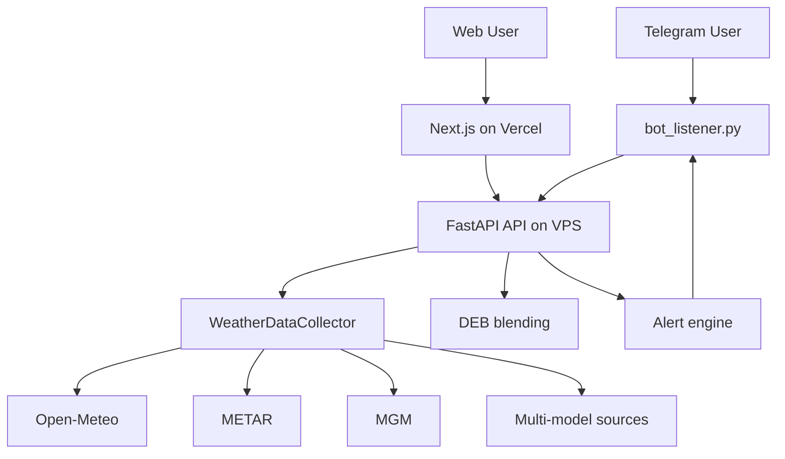

# PolyWeather

PolyWeather is a weather intelligence system built around live airport observations, multi-model forecasts, DEB blending, and Telegram alert delivery.

Current production layout:

- Frontend: Next.js on Vercel
- Backend API: FastAPI on VPS
- Bot / alert loop: Telegram bot on VPS

The old FastAPI static web page has been removed. Vercel is the only web entry point.

<p align="center">
  
  <br>
  <em>📊 Live query: DEB Blended Forecast + Settlement Probability + Groq AI Decision</em>
</p>

<p align="center">
  
  <br>
  <em>🗺️ Interactive Web Map: Real-time global monitoring with rich data visualization</em>
</p>

## Features

- Multi-source weather aggregation
  - Open-Meteo
  - METAR live observations
  - MGM official data for Ankara
  - Multi-model highs such as ECMWF / GFS / ICON / GEM / JMA when available
- DEB blended forecast
  - Dynamic weighting based on recent model error
- City dashboard
  - Global city list
  - City detail panel
  - Nearby station map markers
  - Trend chart
  - Multi-model comparison
  - Daily forecast table
- Telegram proactive alerts
  - Ankara Center reached DEB
  - Momentum spike
  - Forecast breakthrough
  - Advection / nearby lead station signal
- Late-day suppression
  - If the local daily high has likely already passed and the market is cooling off, active alerts are downgraded to status only and are not pushed

## Alert Rules

Implemented rules:

- `ankara_center_deb_hit`
  - Only uses `Ankara (Bolge/Center)` station / `istNo=17130`
  - This is the official Ankara center station used for the Center signal
- `momentum_spike`
  - 30-minute slope exceeds the configured threshold
- `forecast_breakthrough`
  - Current observed temperature is above the highest available major model high by margin
- `advection`
  - Nearby station leads the airport station and wind regime supports warm advection

Suppression rule:

- `peak_passed_guard`
  - No active push if the city's local peak has already passed, enough time has elapsed, and the current temperature has materially rolled over from the day's high

Push dedupe rule:

- Same city + same trigger type only pushes once while still active
- It can push again only after the signal clears and re-arms
- Cooldown still applies at city level

## Data Semantics

Alert message fields:

- `实测 / Now`
  - Uses `METAR current.temp` first
  - Falls back to `MGM current.temp` if METAR current temperature is unavailable
- `时间 / Time`
  - `local`: city local clock time
  - `observed`: observation time attached to the current reading

## Deployment

### Backend / bot on VPS

Requirements:

- Docker
- Docker Compose
- `.env`

Deploy:

```bash
git pull
docker-compose up -d --build
```

Main services:

- `polyweather_bot`
- `polyweather_web`

The FastAPI service is now API-only. It does not serve a static website.

### Frontend on Vercel

The Vercel project uses the `frontend` directory as root.

After pushing to Git, Vercel deploys automatically.

## Environment Variables

Minimum practical set:

```env
TELEGRAM_BOT_TOKEN=...
TELEGRAM_CHAT_ID=...
GROQ_API_KEY=...
POLYWEATHER_MAP_URL=https://polyweather-pro.vercel.app/
WEB_CORS_ORIGINS=http://localhost:3000,http://127.0.0.1:3000,https://polyweather-pro.vercel.app
```

Push tuning:

```env
TELEGRAM_ALERT_PUSH_ENABLED=true
TELEGRAM_ALERT_PUSH_INTERVAL_SEC=300
TELEGRAM_ALERT_PUSH_COOLDOWN_SEC=3600
TELEGRAM_ALERT_MIN_TRIGGER_COUNT=2
TELEGRAM_ALERT_MIN_SEVERITY=medium
TELEGRAM_ALERT_CITIES=ankara,london,paris,seoul,toronto,buenos aires,wellington,new york,chicago,dallas,miami,atlanta,seattle,lucknow,sao paulo,munich
```

Recommended:

- Use `3600` seconds cooldown for production paid groups unless you explicitly want more aggressive alerting

## Bot Commands

Supported user commands:

- `/city [city]`
- `/deb [city]`
- `/id`
- `/help`

`/tradealert` has been removed. Alerts are proactive push only.

## Architecture



## Testing

Quick checks used in development:

```bash
python -m py_compile src/analysis/market_alert_engine.py src/utils/telegram_push.py web/app.py bot_listener.py
node --check frontend/public/static/app.js
npm run build --prefix frontend
```

If you want to run pytest, install it first.

## Status

Last updated: 2026-03-06
