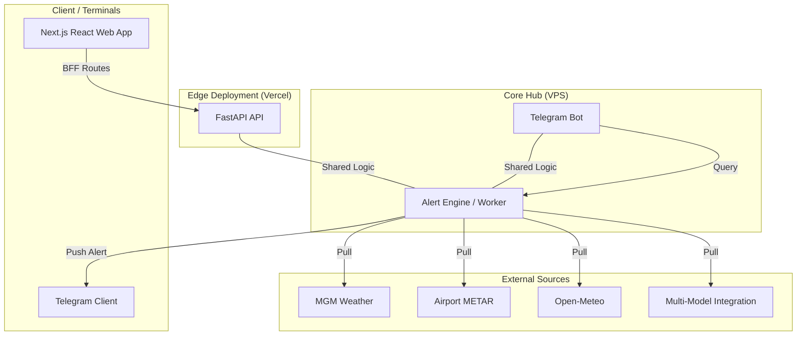

# 🌡️ PolyWeather Pro

> **Professional Weather Intelligence System** — Specialized in edge data collection, DEB smart blending, and real-time decision alerts.

---

## 💎 Project Vision

PolyWeather is a specialized intelligence system built for **Polymarket** high-stakes participants. We aggregate top-tier meteorological sources, apply proprietary **DEB (Dynamic Error Balancing)** logic, and surface **actionable shift signals** at critical decision windows.

---

## 🏗️ Production Architecture

This project uses a decoupled production setup for reliability and iteration speed:

- **Frontend**: A **Next.js** dashboard on **Vercel** with React component rendering.
- **Backend API**: A **FastAPI** service on VPS for low-latency weather aggregation and analysis.
- **Bot & Alert Heartbeat**: A **Telegram Bot** on VPS for minute-level scanning and push alerts.

🔗 **Official Visit**: [polyweather-pro.vercel.app](https://polyweather-pro.vercel.app/)

---

## 🖼️ Preview & Interaction

<p align="center">
  
  <br>
  <em>📊 <b>Deep Query View</b>: DEB blended forecast + settlement probability + AI analysis context</em>
</p>

<p align="center">
  
  <br>
  <em>🗺️ <b>Omni-Dashboard</b>: global station markers + nearby station context + right-side city intelligence panel</em>
</p>

---

## 🚀 Core Features

- **📡 Full-Spectrum Collection**
  - **Major Models**: ECMWF, GFS, ICON, GEM, JMA, Open-Meteo, and city-level daily/hourly guidance.
  - **Observed Data**: Aviation Weather / METAR as the primary observation source, plus Turkish MGM coverage for Ankara.
  - **City Specialization**: `17130` (`Ankara (Bölge/Center)`) remains the Ankara lead station without replacing LTAC settlement observation.
- **⚖️ DEB Smart Blending**
  - Dynamic weighting based on city-level performance and current model spread.
- **📈 Market Data Integration**
  - Live Polymarket quotes, probabilities, and dynamic settlement bucket tracking.
  - Automatic Market Edge and Spread calculation comparing DEB vs Market.
- **🧩 React Quant Dashboard (v2.0)**
  - **Pull-based Dynamic Cache**: Default 5-minute TTL safety lock, with a 1-minute high-frequency bypass exclusively for Ankara (ANKARA).
  - **Optimistic UI & Cache Breakthrough**: Manual `force_refresh` trigger maintains legacy observations during load to prevent screen flickering, isolating loading states only to external polymarket edges.
  - **Dark Quant Aesthetics**: Upgraded from emojis to native `lucide-react` SVGs. Re-engineered cold/warm structure progress bars, dynamic threshold palettes, and fluid 100% card widths.
  - **Bilingual & Seamless**: Built-in comprehensive `i18n.ts` with transparent localization mapping.
- **🔔 Edge Analytics & Alerts**
  - **Momentum Spike**: Captures rapid short-window temperature slope changes.
  - **Forecast Breakthrough**: Fires when observations break model envelopes plus margin.
  - **Advection Monitoring**: Combines lead-station and wind direction to judge cold/warm advections against live temperature drifts.

---

## 🔐 Alert Logic Details

| Trigger Name     | Core Logic                                    | Trading Value                                 |
| :--------------- | :-------------------------------------------- | :-------------------------------------------- |
| **Center Hit**   | Detects DEB trigger only at Ankara HQ `17130` | **Highest priority signal**, the "truth"      |
| **Momentum**     | 30min temperature slope exceed threshold      | Captures sudden weather fronts                |
| **Breakthrough** | Pierces all model highs + margin              | Captures high-volatility outlier events       |
| **Advection**    | Lead station rise + Wind match                | Gain 20-40 minutes of lead time for execution |

---

## 🧭 Current Data Logic

- **Primary observation source**: Aviation Weather / METAR
- **Ankara enhancement**:
  - Settlement observation: `LTAC / Esenboğa`
  - Official lead station: `Ankara (Bölge/Center)` / `17130`
  - Nearby station layer: Turkish MGM network (Ankara-specific preferred station ordering)
- **Other cities nearby layer**:
  - Production currently uses Aviation Weather METAR clusters
  - U.S. cities may later receive Mesonet augmentation while METAR stays baseline
- **Frontend request optimization**:
  - Initial map temperatures preload via `/api/city/{name}/summary`
  - City detail cache TTL = 5 minutes, revision probe avoids unnecessary refetch
  - Map movements, panel toggles, and modal open/close do not trigger redundant requests
  - Manual refresh always bypasses cache (`force_refresh=true`)

---

## 🏗️ System Architecture



---

## 🛠️ Deployment

### 1. Backend / Bot (VPS)

```bash
# Pull source
git pull

# Environment
# Edit .env with TELEGRAM_BOT_TOKEN and other keys

# Launch
docker-compose up -d --build
```

### 2. Frontend (Vercel)

Set `frontend` as the Vercel root directory for automatic CI/CD.

---

## 💬 Bot Commands

| Command | Description                           | Example        |
| :------ | :------------------------------------ | :------------- |
| `/city` | Query real-time analysis for a city   | `/city ankara` |
| `/deb`  | View historical accuracy of DEB model | `/deb london`  |
| `/top`  | View activity leaderboard             | `/top`         |
| `/help` | Get detailed instructions             | `/help`        |

---

> [!NOTE]
> **Commercialization**: Current plans keep **Web Dashboard ($5/mo)** and **Telegram Signal Channel ($1/mo)** as the core entry offers.
> User entitlement and payment automation are tracked in `docs/COMMERCIALIZATION.md`.

> [!NOTE]
> **Frontend Model**: Production rendering is now fully handled by React components under `frontend/components/dashboard` and hooks under `frontend/hooks`.
> Legacy static files are retained for reference, but no longer act as the main runtime path.

---

---

**📅 Last Updated**: 2026-03-10
**🚀 Status**: v1.2 Stable - React Dashboard with i18n & Polymarket Integration in Production

> [!TIP]
> **Production Note**: The UI layout remains consistent while introducing full internationalization, market quote integration, and premium visual feedback (glassmorphism overlays, sonar markers).
