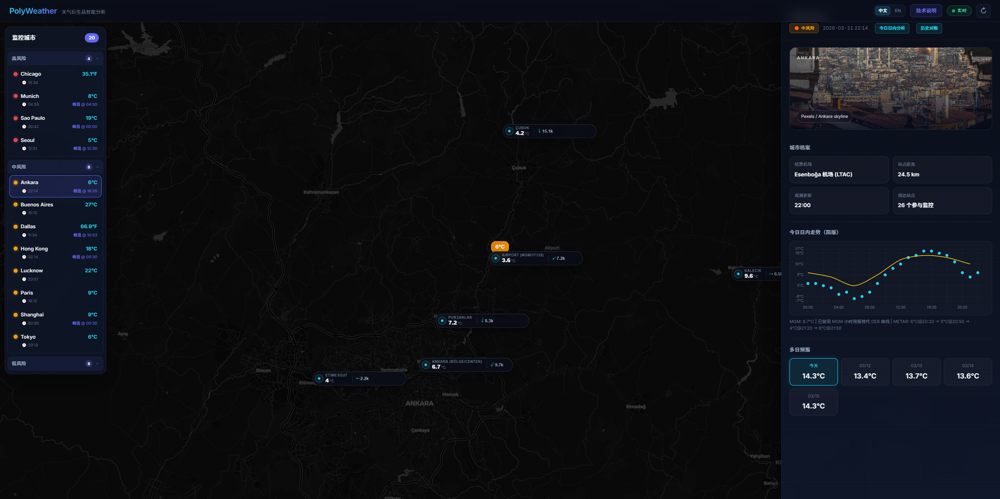
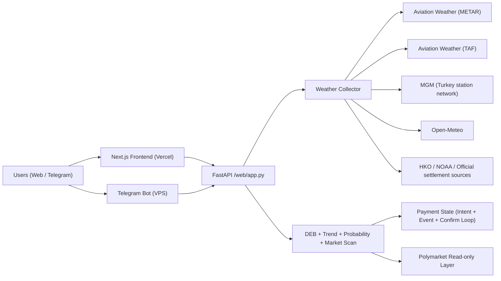

# PolyWeather Pro

Production weather-intelligence stack for temperature settlement markets.

Official dashboard: [polyweather-pro.vercel.app](https://polyweather-pro.vercel.app/)

Public docs center: `/docs/intro` on the main site (bilingual product documentation, including intraday signals, TAF, settlement sources, history, and extension).

## Product Screenshots

### Global Dashboard



### City Analysis (Ankara)


## Product Status (2026-03-24)

- Subscription live: `Pro Monthly 5 USDC`.
- Points redemption live: `500 points = 1 USDC`, max `3 USDC` off.
- Onchain checkout live: Polygon contract checkout (USDC / USDC.e).
- Auto-reconciliation live: event listener + periodic confirm loop.
- Ops dashboard live: `/ops` for memberships, leaderboard, manual point grants, and payment incident triage.
- Lightweight observability live: `/healthz`, `/api/system/status`, `/metrics`.
- Runtime state supports gradual SQLite migration (`file / dual / sqlite`).
- EMOS/CRPS pipeline is integrated in `shadow` mode with rollout gating.
- Intraday structural signal is now peak-window aware and bilingual (`zh-CN` / `en-US`).
- Non-Hong Kong airport cities now ingest `TAF` and parse `FM / TEMPO / BECMG / PROB30/40`.
- Temperature chart now overlays `TAF Timing` markers near the expected peak window.
- Trade cue now combines upper-air structure, `TAF`, market crowding, and `edge_percent`.
- Browser extension now uses `DEB` for multi-day forecast and stays positioned as a lightweight lead-in to the main site.

## Open-Core Boundary (Important)

This repository follows an **Open-Core** strategy:

- Public in repo: weather aggregation, core analysis, dashboard, bot baseline, standard payment flow.
- Private in production: commercial risk rules, operational thresholds, pricing strategy details, internal reconciliation policies, and growth operations tooling.

See: [Open-Core & Commercial Boundary](docs/OPEN_CORE_POLICY.md)

## Core Capabilities

- Aggregates observations and forecasts for 30 monitored cities.
- Uses DEB (Dynamic Error Balancing) to blend multi-model highs.
- Generates settlement-oriented probability buckets (`mu` + bucket distribution).
- Maps weather view to Polymarket quotes for mispricing scan.
- Reuses one analysis core across web dashboard and Telegram bot.
- Adds payment audit trails, replay tooling, and incident visibility in ops.
- Adds peak-window-oriented intraday structure cards for surface + upper-air analysis.
- Adds airport-side `TAF` timing overlays and airport suppression/disruption interpretation for non-Hong Kong airport cities.

## Reference Architecture



## Monitored Cities (30)

- Europe / Middle East: Ankara, London, Paris, Munich, Tel Aviv, Milan, Warsaw, Madrid
- APAC: Seoul, Hong Kong, Taipei, Shanghai, Singapore, Tokyo, Wellington
- Americas: Toronto, New York, Chicago, Dallas, Miami, Atlanta, Seattle, Buenos Aires, Sao Paulo
- South Asia: Lucknow
- China extension: Chengdu, Chongqing, Shenzhen, Beijing, Wuhan

## Quick Start

### Backend + Bot (Docker)

```bash
docker compose up -d --build
```

### Frontend (local)

```bash
cd frontend
npm install
npm run dev
```

## Recent Highlights

- Taipei settlement is aligned to `NOAA RCTP` and rounded whole-degree Celsius logic.
- Hong Kong keeps `HKO` official readings in dashboard and history, without falling back to airport METAR lines.
- Intraday analysis now separates:
  - `Surface Structure`
  - `Upper-Air Structure`
  - `Trade cue`
- `TAF` is used as an airport-side confirmation layer, not as the main temperature model.
- Browser extension remains a lightweight monitoring + basic-bias product, while the site holds the full analysis experience.

## Runtime Data (Recommended on VPS)

Use external runtime storage to avoid SQLite/git conflicts:

```env
POLYWEATHER_RUNTIME_DATA_DIR=/var/lib/polyweather
POLYWEATHER_DB_PATH=/var/lib/polyweather/polyweather.db
```

## Ops Verification

### Health / system status / metrics

```bash
curl http://127.0.0.1:8000/healthz
curl http://127.0.0.1:8000/api/system/status
curl http://127.0.0.1:8000/metrics
```

### Frontend cache headers

```bash
./scripts/validate_frontend_cache.sh "https://polyweather-pro.vercel.app"
```

### Payment auto-reconciliation logs

```bash
docker compose logs -f polyweather | egrep "payment event loop started|payment confirm loop started|payment auto-confirmed"
```

### Payment runtime

```bash
curl http://127.0.0.1:8000/api/payments/runtime
```

### Wallet activity logs

```bash
docker compose logs -f polyweather | egrep "polymarket wallet activity watcher started|wallet activity pushed"
```

## Telegram Commands

| Command | Purpose |
| :-- | :-- |
| `/city <name>` | City real-time analysis |
| `/deb <name>` | DEB historical reconciliation |
| `/top` | User leaderboard |
| `/id` | Show current chat ID |
| `/diag` | Startup diagnostics |
| `/help` | Help and usage |

## Documentation Index

- Chinese overview: [README_ZH.md](README_ZH.md)
- Chinese API guide: [docs/API_ZH.md](docs/API_ZH.md)
- TAF signal guide (ZH): [docs/TAF_SIGNAL_ZH.md](docs/TAF_SIGNAL_ZH.md)
- Commercialization: [docs/COMMERCIALIZATION.md](docs/COMMERCIALIZATION.md)
- Open-Core policy: [docs/OPEN_CORE_POLICY.md](docs/OPEN_CORE_POLICY.md)
- Supabase setup (ZH): [docs/SUPABASE_SETUP_ZH.md](docs/SUPABASE_SETUP_ZH.md)
- Configuration & secrets (ZH): [docs/CONFIGURATION_ZH.md](docs/CONFIGURATION_ZH.md)
- LightGBM daily-high model (ZH): [docs/LGBM_DAILY_HIGH_ZH.md](docs/LGBM_DAILY_HIGH_ZH.md)
- Frontend deployment (ZH): [docs/FRONTEND_DEPLOYMENT_ZH.md](docs/FRONTEND_DEPLOYMENT_ZH.md)
- Tech debt (EN): [docs/TECH_DEBT.md](docs/TECH_DEBT.md)
- Tech debt (ZH): [docs/TECH_DEBT_ZH.md](docs/TECH_DEBT_ZH.md)
- Payment verification: [docs/payments/POLYGONSCAN_VERIFY.md](docs/payments/POLYGONSCAN_VERIFY.md)
- Payment audit: [docs/payments/PAYMENT_AUDIT_ZH.md](docs/payments/PAYMENT_AUDIT_ZH.md)
- Payment V2 upgrade: [docs/payments/PAYMENT_UPGRADE_V2_ZH.md](docs/payments/PAYMENT_UPGRADE_V2_ZH.md)
- Ops admin guide: [docs/OPS_ADMIN_ZH.md](docs/OPS_ADMIN_ZH.md)
- Deep research report: [docs/deep-research-report.md](docs/deep-research-report.md)
- Frontend report: [FRONTEND_REDESIGN_REPORT.md](FRONTEND_REDESIGN_REPORT.md)
- Release process: [RELEASE.md](RELEASE.md)
- Changelog: [CHANGELOG.md](CHANGELOG.md)

## Version

- Version: `v1.5.1`
- Last Updated: `2026-03-24`
