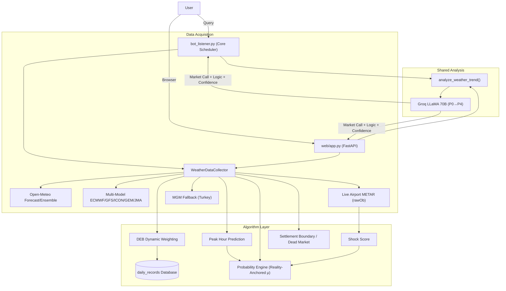

# 🌡️ PolyWeather: Intelligent Weather Quant Analysis Bot

[](https://www.python.org/downloads/)
[](https://opensource.org/licenses/MIT)
[](https://deepwiki.com/yangyuan-zhen/PolyWeather)

PolyWeather is a weather analysis tool built for prediction markets like **Polymarket**. It aggregates multi-source forecasts, real-time airport METAR observations, a math-based probability engine, and AI-driven decision support to help users evaluate weather trading risks more scientifically.

<p align="center">
  
  <br>
  <em>📊 Live query: DEB Blended Forecast + Settlement Probability + Groq AI Decision</em>
</p>

<p align="center">
  
  <br>
  <em>🗺️ Interactive Web Map: Real-time global monitoring with rich data visualization</em>
</p>

---

## ✨ Core Features

### 1. 🌐 Interactive Web Map Dashboard

- **Global Overview**: Real-time Leaflet-based dark-themed map pinpointed to official Polymarket settlement airport coordinates.
- **Progressive Background Loading**: Intelligently fetches multi-source data across all cities without hitting API rate limits.
- **Rich Visualization**: Chart.js-powered temperature trends with METAR scatter overlay, multi-model comparison bars, Gaussian probability distribution, and dynamic risk badges.
- **Cinematic Interaction & Sync**: City selection triggers a smooth fly-to zoom animation. The **Multi-Model Forecast** panel automatically synchronizes with the selected day in the 5-day forecast table.
- **Dual-Engine Architecture**: Runs concurrently with the Telegram bot via a FastAPI backend, sharing the same data collection, analysis logic (`analyze_weather_trend`), and AI prompt pipeline.

### 2. 🧬 Dynamic Ensemble Blending (DEB Algorithm)

The system automatically tracks the historical performance of weather models (ECMWF, GFS, ICON, GEM, JMA) per city:

- **Error-Based Weighting**: Dynamically adjusts model weights based on their Mean Absolute Error (MAE) over the past 7 days. Lower error = higher weight.
- **Blended Forecast**: Provides a bias-corrected "DEB Blended High Temperature" recommendation.
- **Self-Learning**: Requires at least 2 days of observations before activating weight differentiation. Uses equal-weight averaging during cold start.
- **Accuracy Tracking**: Use the `/deb` command to view DEB's historical WU settlement hit rate and MAE, compared against individual models.
- **Auto-Cleanup**: Only retains the last 14 days of records to prevent unbounded data growth.

### 3. 🎲 Math Probability Engine (Settlement Probability)

Automatically computes the probability for each possible settlement integer using a Gaussian distribution:

- **Reality-Anchored μ**: When actual max temperature is significantly below forecasts during/after the peak window (forecast bust), μ anchors on the observed max instead of failed predictions. Otherwise, uses a weighted average of DEB/multi-model median (70%) and ensemble median (30%).
- **Standard Deviation σ — Three-Layer Pipeline**:
  1. **Ensemble Base**: σ = (P90-P10) / 2.56
  2. **MAE Floor**: Uses DEB's historical MAE as σ minimum—prevents ensembles from underestimating true uncertainty
  3. **Shock Score Amplifier**: σ × (1 + 0.5 × shock_score) when weather is changing rapidly
- **Time Decay**: Before peak σ×1.0 → During peak σ×0.7 → After peak σ×0.3
- **Observed Floor**: Temperatures below the current METAR max WU value are excluded
- **Dead Market Override**: When a dead market is confirmed, probability collapses to 100% at the settled value

#### 💥 Shock Score: Weather Disruption Soft Scorer (0~1)

Evaluates environmental stability from the last 4 METAR observations. Higher = more unstable = wider σ:

| Component             | Weight | Trigger                                                           |
| :-------------------- | :----- | :---------------------------------------------------------------- |
| Wind Direction Change | 0~0.4  | Angle difference × wind speed amplifier (weak winds downweighted) |
| Cloud Cover Jump      | 0~0.35 | Cloud code escalation (FEW→BKN, etc.)                             |
| Pressure Change       | 0~0.25 | >2hPa change within 2 hours                                       |

### 4. 🤖 AI Deep Analysis (Groq LLaMA 3.3 70B)

Feeds all weather data into LLaMA 70B, analyzed via a **P0→P4 Priority Chain**:

- **P0 Forecast Bust Detection** (highest priority): Graded severity (light/medium/heavy) when actual temps diverge from forecasts. Requires slope + wind/cloud verification before declaring settlement locked. "Bust ≠ locked" — still checks for second-wave warming.
- **P1 Real-Time Rhythm**: 2 consecutive METAR highs → still warming; 2 non-highs with slope ≤ 0 → dead market. Low-radiation warming → multi-factor (advection/mixing layer/heat island), no single-factor attribution.
- **P2 Inhibitors** (city-aware): Precipitation → strong suppression. High humidity + thick clouds sustained 2+ reports → possible suppression, but thresholds vary by city type (maritime vs. continental). Single factor insufficient.
- **P3 Probability Cross-Check**: References settlement probability for consistency check with P1. Contradictions explained with deviation rationale.
- **P4 Forecast Background**: DEB/forecasts for ceiling estimation; silenced when actuals significantly deviate.
- **Single Source of Truth**: Both web and Telegram bot share the same `analyze_weather_trend` function and `get_ai_analysis` prompt — identical context, identical decisions.
- **High Availability**: Auto-retry + fallback model degradation (70B → 8B). Proxy support for restricted networks.

### 5. ⏱️ Real-time Airport Observations (Zero-Cache METAR)

- **Precise Timing**: Extracts actual observation time from raw METAR text (`rawOb`), not the API's rounded `reportTime`. Accurate to the minute.
- **Live Passthrough**: Bypasses CDN caching via dynamic headers to obtain first-hand METAR reports.
- **Settlement Warning**: Automatically calculates the settlement boundary (X.5 rounding line).
- **MGM Fallback**: For Turkish cities (Ankara), falls back to MGM data when METAR is unavailable.
- **Anomaly Filtering**: Automatically filters out -9999 sentinel values to prevent garbage data in output.

### 6. 📈 Historical Data Collection

- Includes `fetch_history.py` to retrieve up to 3 years of hourly historical weather data (temperature, humidity, radiation, pressure, 10+ dimensions), providing data foundation for future ML models (XGBoost/MOS).

---

## ⚡ Deployment

### Requirements

- **Python 3.11+** or **Docker & Docker Compose**
- **Environment Variables**: Set parameters in your `.env` file (copy from `.env.example`).

### 🐳 Docker Deployment (Recommended)

The easiest and most stable way to deploy without system dependency conflicts.

1. **Clone and configure**
   ```bash
   git clone https://github.com/yangyuan-zhen/PolyWeather.git
   cd PolyWeather
   cp .env.example .env
   # Edit .env to add TELEGRAM_BOT_TOKEN, GROQ_API_KEY, etc.
   nano .env
   ```
2. **Start the service in the background**
   ```bash
   docker-compose up -d --build
   ```
3. **View live logs**
   ```bash
   docker-compose logs -f
   ```

### 💻 Traditional VPS Deployment

1. Install dependencies: `pip install -r requirements.txt`
2. Configure your `.env` file.
3. Use the included `update.sh` script for one-click updates and restarts for both the Telegram Bot and the Web Map:

```bash
# Run the script to update code and restart both services in the background
./update.sh
```

_(Note: The `update.sh` script automatically fetches the latest code, kills old processes, clears ports, and launches both `bot_listener.py` and `web/app.py` via `nohup`.)_

---

## 🕹️ Bot Commands

| Command             | Description                                                                                                                         |
| :------------------ | :---------------------------------------------------------------------------------------------------------------------------------- |
| `/city [city_name]` | Get weather analysis, settlement probabilities, METAR tracking, and AI insights.                                                    |
| `/deb [city_name]`  | View DEB accuracy: daily hit/miss breakdown, bias analysis (underestimate/overestimate), model MAE comparison, trading suggestions. |
| `/id`               | View the Chat ID of the current conversation.                                                                                       |
| `/help`             | Display help information.                                                                                                           |

### Supported Cities

`lon` (London), `par` (Paris), `ank` (Ankara), `nyc` (New York), `chi` (Chicago), `dal` (Dallas), `mia` (Miami), `atl` (Atlanta), `sea` (Seattle), `tor` (Toronto), `sel` (Seoul), `ba` (Buenos Aires), `wel` (Wellington), etc.

---

## 🏗️ Architecture



---

## 💡 Trading Tips

1. **Real-time Rhythm First**: AI analysis follows P0→P4 priority. If live METAR trends (P1) conflict with math probabilities (P3), always prioritize the live trend.
2. **Watch Settlement Probabilities**: Based on Gaussian models, direction is most certain when a temperature has > 70% probability while P1 rhythm is flat.
3. **Reference DEB Bias**: Use `/deb` to check for systematic bias. If a city is consistently "underestimated," habitually bid one WU notch higher.
4. **Identify Dead Market Signals**: When the system declares a "Dead Market," probability collapses to 100% at the settled value. Warming power is exhausted.
5. **Mind the Boundaries**: When the observed high is near X.5 (e.g., 7.50°C), be wary of rounding up due to tiny fluctuations.
6. **Forecast Bust Awareness**: When the AI reports a forecast bust (especially medium/heavy grade), all model predictions have lost reference value. Focus exclusively on METAR actuals.

---

## 🛠️ Development & Testing

Run unit tests for the core trend engine and probability models:

```bash
python -m pytest tests/test_trend_engine.py -v
```

Deploying updates to the server:

```bash
git pull
./update.sh
```

---

_Updated 2026-03-04_
