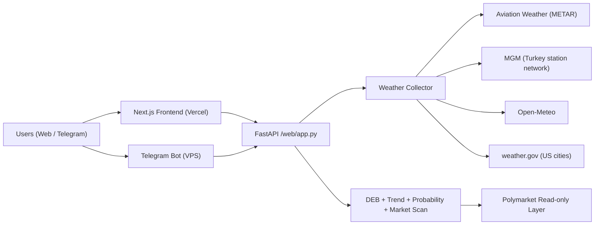
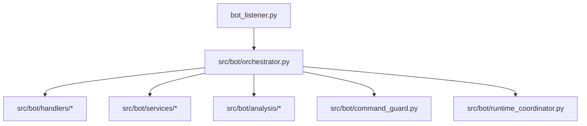

# PolyWeather Pro

Production weather-intelligence stack for temperature settlement markets.

Official dashboard: [polyweather-pro.vercel.app](https://polyweather-pro.vercel.app/)

## Product Screenshots

### Global Dashboard


### City Analysis (Ankara)


## Core Capabilities

- Aggregates real-time observations and forecasts for 20 monitored cities.
- Uses DEB (Dynamic Error Balancing) to blend multi-model highs.
- Produces settlement-oriented probability buckets (`mu` + bucket distribution).
- Maps weather model view to Polymarket read-only quotes for mispricing scan.
- Serves the same analysis core to web dashboard and Telegram bot.

## Architecture (Current)



## Bot Runtime Layout



## Source Policy

| Domain | Current Policy |
| :-- | :-- |
| Primary observation | Aviation Weather / METAR |
| Ankara enhancement | MGM + nearby stations, lead station fixed to `17130` |
| Forecast baseline | Open-Meteo + multi-model (ECMWF/GFS/ICON/GEM/JMA) |
| US official context | weather.gov |
| Market layer | Polymarket P0 read-only discovery + quotes |
| Removed source | Meteoblue (fully removed from runtime and docs) |

## Monitored Cities (20)

- Europe / Middle East: Ankara, London, Paris, Munich
- APAC: Seoul, Hong Kong, Shanghai, Singapore, Tokyo, Wellington
- Americas: Toronto, New York, Chicago, Dallas, Miami, Atlanta, Seattle, Buenos Aires, Sao Paulo
- South Asia: Lucknow

## Major Updates (2026-03-12)

1. Bot architecture refactor completed:
   - `bot_listener.py` is now a thin entrypoint.
   - Core runtime moved to orchestrator + handlers/services/analysis layers.
   - Startup loops managed by `StartupCoordinator`, with `/diag` diagnostics.
2. Mispricing radar hardened:
   - Anchor changed from single Open-Meteo settlement to multi-model highest-high anchor.
   - Skip non-tradable markets (`closed`, inactive, not accepting orders, or past end time).
   - Future-date scan supported via `target_date` in detail aggregate endpoint.
3. Wallet activity watcher upgraded:
   - Wallet aliases (`POLYMARKET_WALLET_ACTIVITY_USER_ALIASES`) supported.
   - Telegram link preview toggle (`POLYMARKET_WALLET_ACTIVITY_LINK_PREVIEW`) supported.
   - Debounce + immediate delta push controls reduce noisy spam bursts.
4. Frontend P0+P1 cache and UX improvements:
   - BFF `ETag + 304` on `/api/cities`, `/api/city/{name}/summary`, `/api/history/{name}`.
   - `force_refresh=true` on summary keeps `Cache-Control: no-store`.
   - `sessionStorage` city-detail cache + background summary revision probe.
   - `localStorage` persistence for selected city and risk-group collapse state.
   - Detail panel accessibility fix (`inert` + active-element blur).
5. Observability:
   - Vercel Speed Insights integrated.
   - Telegram alert/watcher startup diagnostics exposed through `/diag`.

## Repository Layout

- Frontend: `frontend/`
- Backend API: `web/app.py`, `src/`
- Telegram bot runtime: `bot_listener.py`, `src/bot/*`
- Wallet watchers: `src/onchain/*`
- Ops scripts: `scripts/`
- Docs: `docs/`

## Quick Start

### Backend + Bot (Docker)

```bash
docker compose up -d --build
```

### Frontend (local)

```bash
cd frontend
npm install
npm run dev
```

### Frontend production build

```bash
cd frontend
npm run build
```

## Ops Verification

### Validate frontend cache headers (`ETag` / `304` / `force_refresh=no-store`)

```bash
./scripts/validate_frontend_cache.sh "https://polyweather-pro.vercel.app"
```

### Watch mispricing radar decisions

```bash
docker compose logs -f polyweather | egrep "market not tradable|trade alert pushed|mispricing cap"
```

### Watch wallet activity watcher startup and pushes

```bash
docker compose logs -f polyweather | egrep "wallet activity watcher started|wallet activity pushed|wallet activity cycle failed"
```

### Check bot startup diagnosis in Telegram

```text
/diag
```

## Telegram Command Surface

| Command | Purpose |
| :-- | :-- |
| `/city <name>` | City real-time analysis |
| `/deb <name>` | DEB historical reconciliation |
| `/top` | User leaderboard |
| `/id` | Show current chat ID |
| `/diag` | Bot startup diagnostics and loop status |
| `/help` | Help and usage |

## Documentation Index

- Chinese overview: `README_ZH.md`
- Chinese API guide: `docs/API_ZH.md`
- Commercial roadmap: `docs/COMMERCIALIZATION.md`
- Tech debt (EN): `docs/TECH_DEBT.md`
- Tech debt (ZH): `docs/TECH_DEBT_ZH.md`
- Frontend delivery report: `FRONTEND_REDESIGN_REPORT.md`

## Status

- Version: `v1.3`
- Test status: `31 passed` (`.\\venv\\Scripts\\python.exe -m pytest -q`)
- Last Updated: `2026-03-12`
