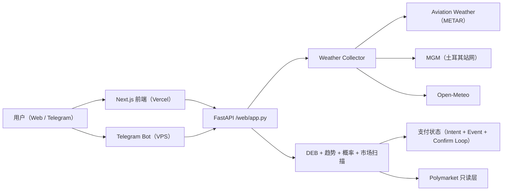

# PolyWeather Pro

面向温度结算市场的生产级气象情报系统。

官方看板：[polyweather-pro.vercel.app](https://polyweather-pro.vercel.app/)

## 产品截图

### 全球看板


### 城市分析（Ankara）


## 当前产品状态（2026-03）

- 已上线订阅制：`Pro 月付 5 USDC`。
- 已上线积分抵扣：`500 积分 = 1 USDC`，最多抵扣 `3 USDC`。
- 已上线链上支付：Polygon 合约支付（USDC / USDC.e）。
- 已上线自动补单：事件监听 + 周期确认双链路。

## 开源边界（重要）

本项目采用 **Open-Core** 策略：

- 仓库公开部分：天气聚合、基础分析、前端看板、Bot 基础能力、支付标准流程示例。
- 生产私有部分：商业风控规则、运营阈值、收费策略细节、付费用户运营脚本、内部对账与审计策略。

详细见：[Open-Core 与商用边界](docs/OPEN_CORE_POLICY.md)

## 核心能力

- 聚合 20 个监控城市的实测与预报数据。
- DEB（Dynamic Error Balancing）融合多模型最高温。
- 输出结算导向概率分布（`mu` + 温度桶）。
- 将模型观点映射到 Polymarket 行情，做错价扫描。
- Web 仪表盘与 Telegram Bot 复用同一分析内核。

## 参考架构



## 监控城市（20）

- 欧洲/中东：Ankara、London、Paris、Munich
- 亚太：Seoul、Hong Kong、Shanghai、Singapore、Tokyo、Wellington
- 美洲：Toronto、New York、Chicago、Dallas、Miami、Atlanta、Seattle、Buenos Aires、Sao Paulo
- 南亚：Lucknow

## 快速启动

### 后端 + Bot（Docker）

```bash
docker compose up -d --build
```

### 前端本地运行

```bash
cd frontend
npm install
npm run dev
```

## 运行数据目录（VPS 推荐）

建议将运行态数据放到仓库外（避免 `git pull` 被 SQLite 卡住）：

```env
POLYWEATHER_RUNTIME_DATA_DIR=/var/lib/polyweather
POLYWEATHER_DB_PATH=/var/lib/polyweather/polyweather.db
```

## 运维验收

### 前端缓存头

```bash
./scripts/validate_frontend_cache.sh "https://polyweather-pro.vercel.app"
```

### 支付自动补单日志

```bash
docker compose logs -f polyweather | egrep "payment event loop started|payment confirm loop started|payment auto-confirmed"
```

### 钱包异动监听日志

```bash
docker compose logs -f polyweather | egrep "polymarket wallet activity watcher started|wallet activity pushed"
```

## Telegram 指令

| 指令 | 用途 |
| :-- | :-- |
| `/city <name>` | 城市实时分析 |
| `/deb <name>` | DEB 历史对账 |
| `/top` | 用户积分排行 |
| `/id` | 查看聊天 Chat ID |
| `/diag` | Bot 启动诊断 |
| `/help` | 帮助与用法 |

## 文档索引

- 英文总览：[README.md](README.md)
- API 文档（中文）：[docs/API_ZH.md](docs/API_ZH.md)
- 商业化说明：[docs/COMMERCIALIZATION.md](docs/COMMERCIALIZATION.md)
- Open-Core 边界：[docs/OPEN_CORE_POLICY.md](docs/OPEN_CORE_POLICY.md)
- Supabase 接入：[docs/SUPABASE_SETUP_ZH.md](docs/SUPABASE_SETUP_ZH.md)
- 技术债（中文）：[docs/TECH_DEBT_ZH.md](docs/TECH_DEBT_ZH.md)
- 技术债（英文）：[docs/TECH_DEBT.md](docs/TECH_DEBT.md)
- 支付合约验证：[docs/payments/POLYGONSCAN_VERIFY.md](docs/payments/POLYGONSCAN_VERIFY.md)
- 前端报告：[FRONTEND_REDESIGN_REPORT.md](FRONTEND_REDESIGN_REPORT.md)

## 当前版本

- 版本：`v1.4`
- 最后更新：`2026-03-14`
