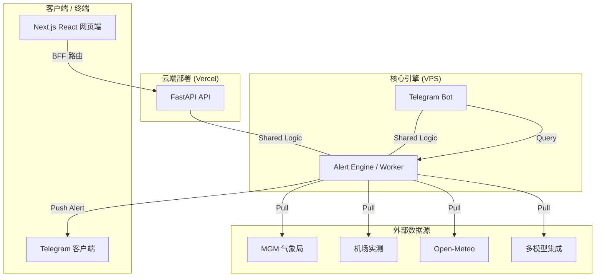

# 🌡️ PolyWeather Pro

> **专业级博弈情报系统** —— 专注边缘气象数据采集、DEB 智能融合与实时决策预警。

---

## 💎 项目愿景

PolyWeather 是一套专为 **Polymarket** 深度博弈者设计的实时情报系统。我们不只提供天气预报，而是通过聚合全球气象源、应用自研 **DEB (Dynamic Error Balancing)** 算法，并在关键时间节点输出**可执行的异动信号**。

---

## 🏗️ 生产架构

本项目采用生产级解耦架构，确保高可用与迭代效率：

- **前端**：部署在 **Vercel** 上的 **Next.js + React 组件化仪表盘**。
- **后端 API**：运行在 VPS 上的 **FastAPI**，负责多源聚合与分析计算。
- **机器人与预警心跳**：运行在 VPS 上的 **Telegram Bot**，执行分钟级扫描与推送。

🔗 **官方访问地址**：[polyweather-pro.vercel.app](https://polyweather-pro.vercel.app/)

---

## 🖼️ 预览与交互

<p align="center">
  
  <br>
  <em>📊 <b>深度查询效果</b>：DEB 融合预测 + 结算概率 + AI 分析上下文</em>
</p>

<p align="center">
  
  <br>
  <em>🗺️ <b>全景仪表盘</b>：全球站点标记 + 周边站点联动 + 右侧城市详情卡片</em>
</p>

---

## 🚀 核心功能

- **📡 多源全量采集**
  - **主流模型**：ECMWF、GFS、ICON、GEM、JMA、Open-Meteo 的日/小时指导。
  - **实测数据**：Aviation Weather / METAR 为主观测源，安卡拉叠加 Turkish MGM 官方网络。
  - **城市特化**：安卡拉保留 `17130`（`Ankara (Bölge/Center)`）领先站逻辑，不替代 LTAC 结算主站。
- **⚖️ DEB 智能融合**
  - 基于城市历史表现与当前模型分歧动态调整权重。
- **📈 市场数据深度整合**
  - 实时接入 Polymarket 报价、结算概率及动态“最热温度桶”追踪。
  - 自动对比 DEB 与市场差值，计算 Edge 与点差。
- **🧩 React 量化仪表盘 (v2.0)**
  - **按需动态缓存体系 (Pull-based Cache)**：默认 5 分钟安全锁，安卡拉 (ANKARA) 特权级 1 分钟短平快刷新。
  - **乐观 UI (Optimistic UI) & 缓存击穿**：专属“强制刷新”按键，数据加载期间保持旧版实况渲染无黑屏跳动，仅对市场边缘概率面板挂载极客加载遮罩。
  - **极致暗黑美学**：使用 `lucide-react` SVG 高清响应图标替代生硬 Emoji，重绘冷暖平流进度（蓝/深/橙阈值指示），卡片 100% 自适应满屏。
  - **双语零感切换**：自带完善的中英语言包 `i18n.ts` 以及数据可视化映射机制。
- **🔔 边缘套利与预警**
  - **动量突变**：捕捉短窗口温度斜率变化。
  - **预测突破**：实测突破模型包络与安全边际时触发。
  - **平流监测**：结合前导站和风向智能判断冷暖平流并与温度走势做叉乘对比。

---

## 🔐 预警逻辑深度说明

| 触发器名称       | 核心逻辑                                     | 博弈价值                           |
| :--------------- | :------------------------------------------- | :--------------------------------- |
| **Center Hit**   | 仅识别安卡拉总部 `17130` 站点的 DEB 触发信号 | **最高级信号**，定盘星             |
| **Momentum**     | 30min 温度斜率超过                           | 捕捉突发天气系统（如锋面）         |
| **Breakthrough** | 击穿所有预报上限 + 安全边际                  | 捕捉市场极少数情况下的暴利点       |
| **Advection**    | 前导站温升 + 风向匹配                        | 获得 20-40 分钟的提前离场/建仓时间 |

---

## 🧭 当前数据逻辑

- **主观测源**：Aviation Weather / METAR
- **安卡拉增强逻辑**：
  - 结算主观测：`LTAC / Esenboğa`
  - 官方领先站：`Ankara (Bölge/Center)` / `17130`
  - 周边站层：土耳其 MGM 网络（含安卡拉优先站筛选）
- **其他城市周边站层**：
  - 当前生产环境使用 Aviation Weather METAR cluster
  - 美国城市后续可叠加 Mesonet，但 METAR 仍为基础层
- **前端请求优化口径**：
  - 首屏先走 `/api/city/{name}/summary` 预热地图温度
  - 城市详情 5 分钟 TTL，revision 不变则跳过重拉
  - 地图联动、侧卡开关、modal 开关不会重复请求
  - 手动刷新强制绕过缓存（`force_refresh=true`）

---

## 🏗️ 架构解析



---

## 🛠️ 部署指南

### 1. 后端 / 机器人 (VPS)

```bash
# 获取源码
git pull

# 环境配置
# 编辑 .env 文件，填入 TELEGRAM_BOT_TOKEN 等关键参数

# 一键启动
docker-compose up -d --build
```

### 2. 前端 (Vercel)

关联本项目 `frontend` 目录作为根目录，启用自动 CI/CD。

---

## 💬 机器人指令

| 命令    | 说明                      | 示例           |
| :------ | :------------------------ | :------------- |
| `/city` | 查询指定城市实时分析      | `/city ankara` |
| `/deb`  | 查看 DEB 模型的历史准确率 | `/deb london`  |
| `/top`  | 查看活跃积分排行榜        | `/top`         |
| `/help` | 获取详细功能说明          | `/help`        |

---

> [!NOTE]
> **商业化提示**：当前仍以 **Web 仪表盘 ($5/月)** 与 **Telegram 信号频道 ($1/月)** 为核心入口套餐。
> 自动化支付与订阅鉴权规划见 `docs/COMMERCIALIZATION.md`。

> [!NOTE]
> **前端现状**：生产环境页面已由 `frontend/components/dashboard` 与 `frontend/hooks` 完整接管渲染。
> legacy 静态文件仅保留为历史参考，不再作为主运行入口。

---

---

**📅 最后更新**：2026-03-10
**🚀 状态**：v1.2 稳定版 - 国际化及 Polymarket 市场层融合已上线

> [!TIP]
> **生产提示**：在不改变既有 UI 布局的前提下，前端已全面引入国际化、市场报价集成及进阶视觉效果（如动态雷达标记、高级加载与毛玻璃控件）。
