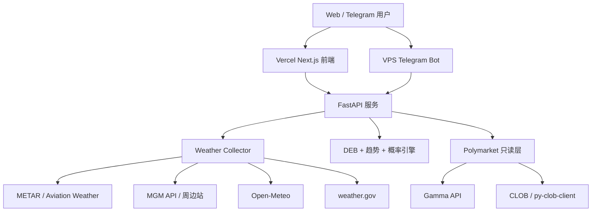

# PolyWeather Pro

面向温度结算市场的生产级气象情报系统。

官方看板：[polyweather-pro.vercel.app](https://polyweather-pro.vercel.app/)

## 这个项目在做什么

- 聚合监控城市的实测与预报数据。
- 用 DEB（Dynamic Error Balancing）做动态融合预测。
- 计算结算导向的温度概率分布（`μ` + 温度桶）。
- 将模型概率与 Polymarket 只读市场数据对齐，输出错价/风险信号。
- Web 仪表盘与 Telegram 机器人共用同一套核心逻辑。

## 思维导图

```mermaid
mindmap
  root((PolyWeather Pro))
    "数据层"
      "METAR (Aviation Weather / METAR)"
      "MGM (土耳其 MGM)"
      "安卡拉主站 (17130 Center)"
      "Open-Meteo"
      "weather.gov (美国城市)"
      "Polymarket (P0 只读)"
    "分析层"
      "DEB (动态误差平衡)"
      "概率引擎 (mu + 桶分布)"
      "趋势引擎"
      "城市风险档案"
      "错价雷达"
    "交付层"
      "FastAPI"
      "Next.js 仪表盘"
      "Telegram Bot"
      "预警推送"
    "运维层"
      "Docker Compose (VPS)"
      "Vercel (前端)"
      "缓存 + force_refresh"
      "Speed Insights"
```

## 系统架构



## 当前数据源口径

| 领域           | 当前口径                          |
| :------------- | :-------------------------------- |
| 主观测源       | Aviation Weather / METAR          |
| Ankara 增强    | MGM + 周边站，领先站固定 `17130`  |
| 预报基线       | Open-Meteo                        |
| 美国官方语义层 | weather.gov                       |
| 市场层         | Polymarket P0 只读发现 + 报价     |
| 已移除         | Meteoblue（代码与文档已全部移除） |

## 最近更新（2026-03-11）

- 完整移除 Meteoblue API 及全部引用。
- 修复市场“最热温度桶”重复温度刷屏问题（后端按温度去重 + 前端兜底去重）。
- 修复详情面板可访问性告警（`aria-hidden` 焦点冲突），改为 `inert + blur`。
- 集成 Vercel Speed Insights（`frontend/app/layout.tsx`）。

## 目录说明

- 前端：`frontend/`（Next.js App Router）
- 后端：`web/app.py` 与 `src/`
- 机器人：`bot_listener.py` + `src/analysis/*`
- 文档：`docs/`

## 快速启动

### 后端 + 机器人（VPS / Docker）

```bash
docker compose up -d --build
```

### 前端本地运行

```bash
cd frontend
npm install
npm run dev
```

### 前端构建校验

```bash
cd frontend
npm run build
```

## Telegram 命令

| 命令           | 用途         |
| :------------- | :----------- |
| `/city <name>` | 城市实时分析 |
| `/deb <name>`  | DEB 历史对账 |
| `/top`         | 用户排行榜   |
| `/help`        | 帮助说明     |

## 文档索引

- API 文档（中文）：`docs/API_ZH.md`
- 商业化路线：`docs/COMMERCIALIZATION.md`
- 技术债（英文）：`docs/TECH_DEBT.md`
- 技术债（中文）：`docs/TECH_DEBT_ZH.md`
- 英文总览：`README.md`

## 当前状态

- 版本：`v1.3`
- 最后更新：`2026-03-11`
- 状态：稳定运行（Web + Bot + 市场只读层）
