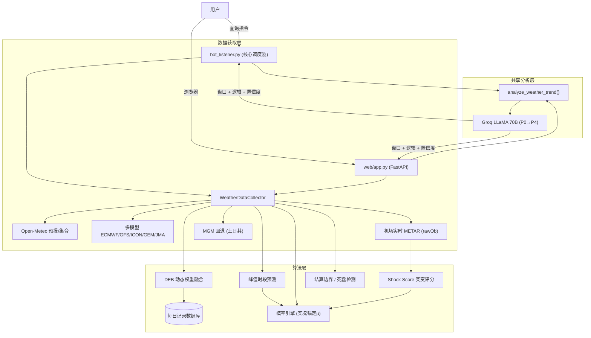

# 🌡️ PolyWeather: 智能天气量化分析机器人

[](https://www.python.org/downloads/)
[](https://opensource.org/licenses/MIT)
[](https://deepwiki.com/yangyuan-zhen/PolyWeather)

PolyWeather 是一款专为 **Polymarket** 等预测市场打造的天气分析工具。它通过聚合多源气象预报、实时机场 METAR 观测，并引入数学概率模型与 AI 决策支持，帮助用户更科学地评估天气博弈风险。

<p align="center">
  
  <br>
  <em>📊 实时查询效果：DEB 融合预测 + 结算概率 + Groq AI 决策</em>
</p>

<p align="center">
  
  <br>
  <em>🗺️ 交互式网页地图：全球城市实时监控与丰富的数据可视化</em>
</p>

---

## ✨ 核心功能

### 1. 🌐 交互式网页地图面板

- **全球纵览**：基于 Leaflet 的暗黑全屏实时地图，直接采用官方结算机场经纬度进行追踪与显示。
- **渐进式数据流加载**：进图后智能在后台无感知拉取，不触发 API 频率限制。
- **丰富的数据可视化**：Chart.js 温度走势图叠加 METAR 实测散点，多模型对比条形图，高斯概率分布条，实时风险等级色彩系统。
- **镜头联动**：点击城市触发平滑飞入缩放动画。
- **双引擎共生**：FastAPI 后端与 Telegram Bot 共享同一份分析逻辑（`analyze_weather_trend`）和 AI Prompt 管线，确保两端输出完全一致。

### 2. 🧬 动态权重集合预报 (DEB 算法)

系统会自动追踪各个气象模型（ECMWF, GFS, ICON, GEM, JMA）在特定城市的历史表现：

- **误差加权**：根据过去 7 天的平均绝对误差（MAE），动态调整各模型的权重。误差越小的模型，话语权越大。
- **融合预报**：给出经过历史偏差修正后的"DEB 融合最高温"建议值。
- **自学习机制**：系统需要至少 2 天的实测记录才会启动权重分化。冷启动期间以等权平均过渡。
- **准确率追踪**：通过 `/deb` 命令查看 DEB 融合预测的历史 WU 结算命中率和 MAE，并与各个单一模型对比。
- **自动清理**：只保留最近 14 天的记录，防止数据无限增长。

### 3. 🎲 数学概率引擎 (Settlement Probability)

基于集合预报的正态分布拟合，自动计算每个结算整数温度的概率：

- **实况锚定 μ**：当实测最高温在峰值窗口期间/之后显著低于预报中位数（预报崩盘），μ 直接锚定在实测值上，而非失败的预报。正常情况下使用 DEB/多模型中位数（70%）和集合中位数（30%）的加权平均。
- **标准差 σ 三层修正管线**：
  1. **集合基础**：σ = (P90-P10) / 2.56
  2. **MAE 兜底**：用 DEB 历史 MAE 作为 σ 下限——防止集合预报低估真实不确定性
  3. **Shock Score 放宽**：σ × (1 + 0.5 × shock_score)，气象突变时自动加宽
- **时间衰减**：峰值前 σ×1.0 → 峰值窗口 σ×0.7 → 峰值后 σ×0.3
- **实测过滤**：已实测 WU 值以下的候选自动排除
- **死盘覆盖**：确认死盘后，概率直接坍缩为结算值 100%

#### 💥 Shock Score：气象突变软评分 (0~1)

用近 4 条 METAR 报文的风向/云量/气压变化评估环境稳定性，越高 = 越不稳定 = σ 放宽：

| 分项     | 权重   | 触发条件                              |
| :------- | :----- | :------------------------------------ |
| 风向变化 | 0~0.4  | 角度差 × 风速放大系数（弱风降权避噪） |
| 云量阶跃 | 0~0.35 | FEW→BKN 等云码跳变                    |
| 气压变化 | 0~0.25 | 2h 内气压差 > 2hPa                    |

### 4. 🤖 AI 深度分析 (Groq LLaMA 3.3 70B)

将全部气象数据投喂给 LLaMA 70B，按 **P0→P4 分析框架** 决策：

- **P0 预报失准检测**（最高优先级）：分级失准（轻/中/重），根据偏差幅度自动标记。"失准 ≠ 已定局"——还需检查斜率 + 风云条件。支持二次抬升判断。
- **P1 实况节奏**：连续 2 报创新高 → 升温未止；连续 2 报未创新高且斜率 ≤ 0 → 偏死盘。低辐射升温 → 可能多因子叠加（平流/混合层/热岛），不做单因子归因。
- **P2 阻碍因子**（需结合城市特性判断）：降水 → 强压温。高湿度 + 厚云层持续 2 报以上 → 可能压温，但阈值因城市类型（海洋 vs 大陆）而异。单因子不足以断定。
- **P3 概率与一致性校验**：参考结算概率分布，与 P1 实况做交叉检查。矛盾时以实况为准并说明偏离原因。
- **P4 预报背景**（最低优先级）：可参考 DEB/预报做上沿评估。实测显著偏离时禁止引用。
- **统一分析源**：Web 和 Telegram Bot 共用同一个 `analyze_weather_trend` 函数和 `get_ai_analysis` 提示词——完全相同的上下文，完全相同的决策。
- **高可用保障**：自动重试 + 备用模型降级（70B → 8B）。支持代理配置。

### 5. ⏱️ 实时机场观测 (Zero-Cache METAR)

- **精确时间**：从 METAR 原始报文 (`rawOb`) 中提取真实观测时间，精确到分钟。
- **实时穿透**：通过动态请求头绕过 CDN 缓存，获取机场第一手 METAR 报文。
- **结算预警**：自动计算结算边界（X.5 进位线），提醒潜在波动。
- **MGM 回退**：土耳其城市（安卡拉）METAR 不可用时回退至 MGM 数据。
- **异常过滤**：自动过滤 -9999 等哨兵值，避免垃圾数据污染输出。

### 6. 📈 历史数据采集

- 提供 `fetch_history.py` 脚本，可一键获取各城市过去 3 年的小时级历史气象数据（温度、湿度、辐射、气压等 10+ 维度），为后续机器学习模型（XGBoost/MOS）提供数据基础。

---

## ⚡ 部署说明

### 环境要求

- **Python 3.11+** 或 **Docker & Docker Compose**
- **环境变量**: 在 `.env` 中设置关键参数（参考 `.env.example`）。

### 🐳 Docker 部署 (推荐)

最简单、稳定的部署方式，避免系统依赖冲突。

1. **克隆项目并配置环境**
   ```bash
   git clone https://github.com/yangyuan-zhen/PolyWeather.git
   cd PolyWeather
   cp .env.example .env
   # 编辑 .env 文件填入 TELEGRAM_BOT_TOKEN 和 GROQ_API_KEY 等
   nano .env
   ```
2. **后台一键启动服务**
   ```bash
   docker-compose up -d --build
   ```
3. **查看实时日志**
   ```bash
   docker-compose logs -f
   ```

### 💻 传统 VPS 部署方案

1. 安装依赖: `pip install -r requirements.txt`
2. 配置 `.env` 文件。
3. 利用项目中已包含的 `update.sh` 实现机器人和网站的双轨后台一键重启：

```bash
# 每次代码变更后，只需在 VPS 执行此命令
./update.sh
```

_(该脚本将自动执行 git 抓取、杀僵尸进程、解绑端口、并分别利用 nohup 重新唤醒 bot_listener.py 和 FastAPI app.py 服务。)_

---

## 🕹️ 机器人指令

| 指令             | 说明                                                                            |
| :--------------- | :------------------------------------------------------------------------------ |
| `/city [城市名]` | 获取深度气象分析、结算概率、实测追踪及 AI 决策建议。                            |
| `/deb [城市名]`  | 查看 DEB 准确率：逐日命中明细、偏差分析（低估/高估）、模型 MAE 对比、交易建议。 |
| `/id`            | 查看当前对话的 Chat ID。                                                        |
| `/help`          | 显示说明信息。                                                                  |

### 支持城市示例

`lon`(伦敦)、`par`(巴黎)、`ank`(安卡拉)、`nyc`(纽约)、`chi`(芝加哥)、`dal`(达拉斯)、`mia`(迈阿密)、`atl`(亚特兰大)、`sea`(西雅图)、`tor`(多伦多)、`sel`(首尔)、`ba`(布宜诺斯艾利斯)、`wel`(惠灵顿) 等。

---

## 🏗️ 系统架构



---

## 💡 交易提示

1. **实况节奏优先**：AI 分析遵循 P0→P4 优先级。如果实况趋势（P1）与数学概率（P3）冲突，以实况走势为准。
2. **紧盯结算概率**：概率引擎基于数学模型，当某个温度概率 > 70% 且 P1 节奏持平时，方向最为明确。
3. **参考 DEB 偏差**：通过 `/deb` 查看城市的系统性偏差。如果某个城市经常"低估"，交易时应看高 1 个 WU 档位。
4. **识别死盘信号**：系统判定"死盘"时，概率会直接坍缩为结算值 100%。升温动力彻底枯竭。
5. **注意结算边界**：实测最高温接近 X.5 时，微小波动可能导致进位，需防范"偷鸡"。
6. **预报崩盘意识**：当 AI 标记预报失准（尤其中/重级），所有模型预测已失去参考价值，需专注 METAR 实测。

---

_更新于 2026-03-04_
