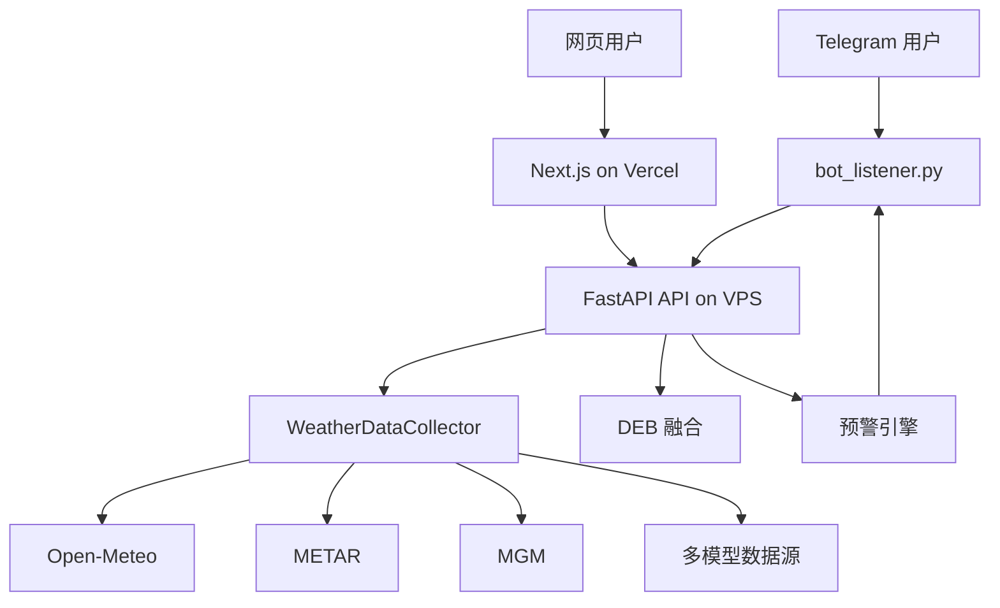

# PolyWeather

PolyWeather 是一套围绕实时机场观测、多模型预报、DEB 融合和 Telegram 主动推送构建的天气情报系统。

当前生产架构：

- 前端：Vercel 上的 Next.js
- 后端 API：VPS 上的 FastAPI
- 机器人与预警循环：VPS 上的 Telegram Bot

FastAPI 旧静态网页已经移除。Vercel 是唯一网页入口。

<p align="center">
  
  <br>
  <em>📊 实时查询效果：DEB 融合预测 + 结算概率 + Groq AI 决策</em>
</p>

<p align="center">
  
  <br>
  <em>🗺️ 交互式网页地图：全球城市实时监控与丰富的数据可视化</em>
</p>

## 当前功能

- 多源天气采集
  - Open-Meteo
  - METAR 实时观测
  - 安卡拉官方 MGM 数据
  - ECMWF / GFS / ICON / GEM / JMA 等多模型最高温
- DEB 融合预报
  - 基于近期误差动态调权
- 网页仪表盘
  - 全球监控城市列表
  - 城市详情面板
  - 周边站点地图标记
  - 今日趋势图
  - 多模型对比
  - 多日预报表
- Telegram 主动预警
  - Ankara Center 达到 DEB
  - 动量突变
  - 预测突破
  - 暖平流 / 周边站联动
- 晚盘压制逻辑
  - 当地高温大概率已经兑现且开始回落时，预警降级为状态快照，不主动推送

## 预警规则

当前启用的规则：

- `ankara_center_deb_hit`
  - 只使用 `Ankara (Bolge/Center)` 站点，`istNo=17130`
  - 这是安卡拉 Center 信号唯一认可的官方站点
- `momentum_spike`
  - 30 分钟温度斜率超过阈值
- `forecast_breakthrough`
  - 当前实测温度高于主流模型最高值，并超过安全边际
- `advection`
  - 周边站领先升温，且风向与暖平流传播方向匹配

压制规则：

- `peak_passed_guard`
  - 当地高点已经过去、间隔足够长、且温度已从日内高点明显回落时，不再主动推送

去重规则：

- 同一城市、同一 trigger type，只会在激活时推送一次
- 只有信号先解除，再重新触发，才允许再次推送
- 同时仍保留城市级 cooldown

## 数据语义

预警文案中的字段：

- `实测`
  - 优先使用 `METAR current.temp`
  - 如果 METAR 当前温度不可用，再退回 `MGM current.temp`
- `时间`
  - `当地`：城市本地当前时间
  - `观测`：这条实测温度对应的观测时间

## 部署

### VPS 后端 / 机器人

要求：

- Docker
- Docker Compose
- `.env`

部署命令：

```bash
git pull
docker-compose up -d --build
```

主要服务：

- `polyweather_bot`
- `polyweather_web`

现在的 FastAPI 只提供 API，不再承载网页静态资源。

### Vercel 前端

Vercel 项目根目录使用 `frontend`。

代码推送后，Vercel 会自动部署。

## 环境变量

最小可用集合：

```env
TELEGRAM_BOT_TOKEN=...
TELEGRAM_CHAT_ID=...
GROQ_API_KEY=...
POLYWEATHER_MAP_URL=https://polyweather-pro.vercel.app/
WEB_CORS_ORIGINS=http://localhost:3000,http://127.0.0.1:3000,https://polyweather-pro.vercel.app
```

预警推送调优：

```env
TELEGRAM_ALERT_PUSH_ENABLED=true
TELEGRAM_ALERT_PUSH_INTERVAL_SEC=300
TELEGRAM_ALERT_PUSH_COOLDOWN_SEC=3600
TELEGRAM_ALERT_MIN_TRIGGER_COUNT=2
TELEGRAM_ALERT_MIN_SEVERITY=medium
TELEGRAM_ALERT_CITIES=ankara,london,paris,seoul,toronto,buenos aires,wellington,new york,chicago,dallas,miami,atlanta,seattle,lucknow,sao paulo,munich
```

生产环境建议：

- 付费群默认使用 `3600` 秒 cooldown，避免同一城市短时间内刷屏

## 机器人命令

当前保留的命令：

- `/city [city]`
- `/deb [city]`
- `/id`
- `/help`

`/tradealert` 已移除。预警只支持主动推送。

## 架构



## 测试

开发时常用快速检查：

```bash
python -m py_compile src/analysis/market_alert_engine.py src/utils/telegram_push.py web/app.py bot_listener.py
node --check frontend/public/static/app.js
npm run build --prefix frontend
```

如果要跑 pytest，请先安装 pytest。

## 状态

最后更新：2026-03-06
