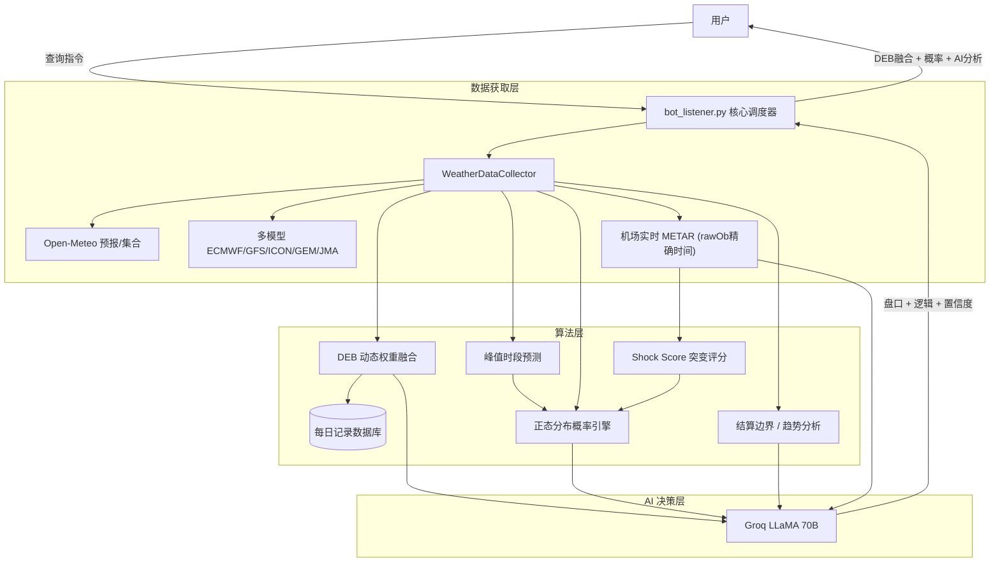

# 🌡️ PolyWeather: 智能天气量化分析机器人

[](https://deepwiki.com/yangyuan-zhen/PolyWeather)

PolyWeather 是一款专为 **Polymarket** 等预测市场打造的天气分析工具。它通过聚合多源气象预报、实时机场 METAR 观测，并引入数学概率模型与 AI 决策支持，帮助用户更科学地评估天气博弈风险。

<p align="center">
  
  <br>
  <em>📊 实时查询效果：DEB 融合预测 + 结算概率 + Groq AI 决策</em>
</p>

---

## ✨ 核心功能

### 1. 🧬 动态权重集合预报 (DEB 算法)

系统会自动追踪各个气象模型（ECMWF, GFS, ICON, GEM, JMA）在特定城市的历史表现：

- **误差加权**：根据过去 7 天的平均绝对误差（MAE），动态调整各模型的权重。误差越小的模型，话语权越大。
- **融合预报**：给出经过历史偏差修正后的"DEB 融合最高温"建议值。
- **自学习机制**：系统需要至少 2 天的实测记录才会启动权重分化。冷启动期间以等权平均过渡。
- **准确率追踪**：通过 `/deb` 命令查看 DEB 融合预测的历史 WU 结算命中率和 MAE，并与各个单一模型对比。
- **自动清理**：只保留最近 14 天的记录，防止数据无限增长。

### 2. 🎲 数学概率引擎 (Settlement Probability)

基于集合预报的正态分布拟合，自动计算每个 WU 结算整数温度的概率：

- **分布中心 μ**：以 DEB/多模型中位数（70%）和集合中位数（30%）的加权均值为中心。实测超过 μ 时自动上修。
- **标准差 σ 三层修正管线**：
  1. **集合基础**：σ = (P90-P10) / 2.56
  2. **MAE 兆底**：用 DEB 历史 MAE 作为 σ 下限——防止集合预报低估真实不确定性
  3. **Shock Score 放宽**：σ × (1 + 0.5 × shock_score)，气象突变时自动加宽
- **时间衰减**：峰值前 σ×1.0 → 峰值窗口 σ×0.7 → 峰值后 σ×0.3
- **实测过滤**：已实测 WU 值以下的候选自动排除

#### 💥 Shock Score：气象突变软评分 (0~1)

用近 4 条 METAR 报文的风向/云量/气压变化评估环境稳定性，越高 = 越不稳定 = σ 放宽：

| 分项     | 权重   | 触发条件                              |
| :------- | :----- | :------------------------------------ |
| 风向变化 | 0~0.4  | 角度差 × 风速放大系数（弱风降权避噪） |
| 云量阶跃 | 0~0.35 | FEW→BKN 等云码跳变                    |
| 气压变化 | 0~0.25 | 2h 内气压差 > 2hPa                    |

### 3. 🤖 AI 深度分析 (Groq LLaMA 3.3 70B)

将全部气象数据投喂给 LLaMA 70B，按 **P1→P4 优先级链** 分析：

- **P1 实况节奏**（最高优先级）：连续 2 报创新高→升温未止；连续 2 报未创新高且过峰→偏死盘。低辐射升温→暖平流驱动。
- **P2 阻碍因子**：湿度>80% **且** BKN/OVC 持续 2 报→压温有效。单"多云"不足以判断受限。
- **P3 数学概率**：参考结算概率分布，但不可压过 P1 实况。
- **P4 预报背景**：DEB/预报用于判断上沿，实测超预报时降权。
- **死盘判定**：峰值窗口已过 + 连续 2 报未创新高 + 云量回补或降水→判定死盘。
- **高可用保障**：自动重试 + 备用模型降级（70B → 8B），抵御 Groq API 故障。

### 4. ⏱️ 实时机场观测 (Zero-Cache METAR)

- **精确时间**：从 METAR 原始报文 (`rawOb`) 中提取真实观测时间，而非 API 取整后的 `reportTime`，精确到分钟。
- **实时穿透**：通过动态请求头绕过 CDN 缓存，获取机场第一手 METAR 报文。
- **结算预警**：自动计算 Wunderground 结算边界（X.5 进位线），提醒潜在波动。
- **异常过滤**：自动过滤 MGM 等数据源的 -9999 哨兵值，避免垃圾数据污染输出。

### 5. 📈 历史数据采集

- 提供 `fetch_history.py` 脚本，可一键获取各城市过去 3 年的小时级历史气象数据（温度、湿度、辐射、气压等 10+ 维度），为后续机器学习模型（XGBoost/MOS）提供数据基础。

---

## ⚡ 部署说明

### 环境要求

- **Python 3.11+**
- 依赖安装: `pip install -r requirements.txt`
- **环境变量**: 在 `.env` 中设置 `TELEGRAM_BOT_TOKEN` 和 `GROQ_API_KEY`。

### VPS 快捷部署

1. 克隆仓库并安装依赖。
2. 配置 `.env` 文件。
3. 使用以下脚本实现一键更新与重启：

```bash
cat > ~/update.sh << 'EOF'
#!/bin/bash
cd ~/PolyWeather
git fetch origin
git reset --hard origin/main
pkill -f bot_listener.py
sleep 1
nohup python3 bot_listener.py > bot.log 2>&1 &
echo "✅ PolyWeather 已重启！"
EOF
chmod +x ~/update.sh
```

---

## 🕹️ 机器人指令

| 指令             | 说明                                                                            |
| :--------------- | :------------------------------------------------------------------------------ |
| `/city [城市名]` | 获取深度气象分析、结算概率、实测追踪及 AI 决策建议。                            |
| `/deb [城市名]`  | 查看 DEB 准确率：逐日命中明细、偏差分析（低估/高估）、模型 MAE 对比、交易建议。 |
| `/id`            | 查看当前对话的 Chat ID。                                                        |
| `/help`          | 显示说明信息。                                                                  |

### 支持城市示例

`lon`(伦敦)、`par`(巴黎)、`ank`(安卡拉)、`nyc`(纽约)、`chi`(芝加哥)、`dal`(达拉斯)、`mia`(迈阿密)、`atl`(亚特兰大)、`sea`(西雅图)、`tor`(多伦多)、`sel`(首尔)、`ba`(布宜诺斯艾利斯)、`wel`(惠灵顿) 等。

---

## 🏗️ 系统架构



---

## 💡 交易提示

1. **实况节奏优先**：AI 分析遵循 P1→P4 优先级。如果实况趋势（P1）与数学概率（P3）冲突（例如概率看好 7°C 但实况仍猛涨冲向 8°C），请务必以实况走势为准。
2. **紧盯结算概率**：概率引擎基于数学模型，当某个温度概率 > 70% 且 P1 节奏持平时，方向最为明确。
3. **参考 DEB 偏差**：通过 `/deb` 查看城市的系统性偏差。如果某个城市经常“低估”，交易时应习惯性看高 1 个 WU 档位。
4. **识别死盘信号**：当 AI 判定“死盘”时，通常意味着升温动力彻底枯竭（峰值窗后+不创新高+云量回补），此时是反向对收割残余价值的机会。
5. **注意结算边界**：实测最高温接近 X.5（如 7.50°C）时，Wunderground 可能会因极微小波动从 7 进位到 8，需防范“偷鸡”。
6. **分布中心 μ**：μ 值代表算法预期的实际最高温中心点，直接对标盘口价格。当价格严重偏离 μ，通常存在套利空间。

---

_更新于 2026-03-01_
