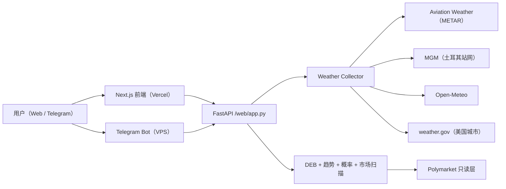
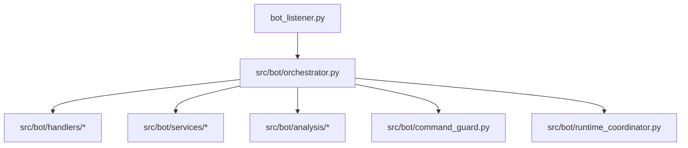

# PolyWeather Pro

面向温度结算市场的生产级气象情报系统。

官方看板：[polyweather-pro.vercel.app](https://polyweather-pro.vercel.app/)

## 产品截图

### 全球看板


### 城市分析（Ankara）


## 核心能力

- 聚合 20 个监控城市的实时实测与预报数据。
- 通过 DEB（Dynamic Error Balancing）融合多模型最高温。
- 输出结算导向的概率分布（`mu` + 温度桶）。
- 将模型观点映射到 Polymarket 只读市场，做错价扫描。
- Web 仪表盘与 Telegram 机器人复用同一套分析内核。

## 当前架构



## Bot 运行分层



## 数据源口径

| 领域 | 当前口径 |
| :-- | :-- |
| 主观测源 | Aviation Weather / METAR |
| Ankara 增强 | MGM + 周边站，领先站固定 `17130` |
| 预报基线 | Open-Meteo + 多模型（ECMWF/GFS/ICON/GEM/JMA） |
| 美国官方语义层 | weather.gov |
| 市场层 | Polymarket P0 只读发现 + 报价 |
| 已移除 | Meteoblue（代码与文档已彻底移除） |

## 监控城市（20）

- 欧洲/中东：Ankara、London、Paris、Munich
- 亚太：Seoul、Hong Kong、Shanghai、Singapore、Tokyo、Wellington
- 美洲：Toronto、New York、Chicago、Dallas、Miami、Atlanta、Seattle、Buenos Aires、Sao Paulo
- 南亚：Lucknow

## 本轮主要更新（2026-03-12）

1. Bot 分层改造完成：
   - `bot_listener.py` 变为极薄入口。
   - 运行时迁移到 orchestrator + handlers/services/analysis 分层。
   - 启动循环由 `StartupCoordinator` 统一编排，并通过 `/diag` 暴露诊断。
2. 错价雷达口径升级：
   - 锚点从“单一 Open-Meteo 结算”改为“多模型最高温锚点”。
   - 不可交易市场硬拦截（`closed` / inactive / 不接单 / 过结束时间）。
   - 未来日期分析支持 `target_date`（聚合详情接口）。
3. 钱包异动监听升级：
   - 支持钱包昵称映射（`POLYMARKET_WALLET_ACTIVITY_USER_ALIASES`）。
   - 支持 Telegram 链接预览开关（`POLYMARKET_WALLET_ACTIVITY_LINK_PREVIEW`）。
   - 增加 debounce + 立即推送控制，减少连续下单刷屏。
4. 前端 P0+P1 缓存与体验优化：
   - BFF 在 `/api/cities`、`/api/city/{name}/summary`、`/api/history/{name}` 返回 `ETag + 304`。
   - `summary?force_refresh=true` 保持 `Cache-Control: no-store`。
   - `sessionStorage` 详情缓存 + 后台 revision 静默探测。
   - `localStorage` 持久化“选中城市”和“风险分组折叠状态”。
   - 详情面板可访问性修复（`inert + active-element blur`）。
5. 可观测性：
   - 前端集成 Vercel Speed Insights。
   - Bot 启动和后台循环状态可通过 `/diag` 查看。
6. P1 合约支付链路（新增）：
   - 新增支付接口：`/api/payments/config|wallets|intents/*`。
   - 支持 MetaMask 钱包绑定（nonce + `personal_sign` 验签）。
   - 支持 Polygon 双币种支付（USDC.e + Native USDC），后端按代币白名单路由。
   - 支持合约订单支付：前端拿 `tx_payload` 调 `eth_sendTransaction`。
   - 后端按 `OrderPaid(orderId,payer,planId,token,amount)` 事件验单并自动开通订阅。
   - 交易确认后自动写入 `payments/subscriptions/entitlement_events` 并可推送 Telegram。

## 目录说明

- 前端：`frontend/`
- 后端 API：`web/app.py`、`src/`
- Telegram 机器人：`bot_listener.py`、`src/bot/*`
- 钱包监听：`src/onchain/*`
- 运维脚本：`scripts/`
- 文档：`docs/`

## 快速启动

### 后端 + Bot（Docker）

```bash
docker compose up -d --build
```

### 前端本地运行

```bash
cd frontend
npm install
npm run dev
```

### 前端生产构建

```bash
cd frontend
npm run build
```

## 运维验收

### 校验前端缓存头（`ETag` / `304` / `force_refresh=no-store`）

```bash
./scripts/validate_frontend_cache.sh "https://polyweather-pro.vercel.app"
```

### 观察错价雷达决策日志

```bash
docker compose logs -f polyweather | egrep "market not tradable|trade alert pushed|mispricing cap"
```

### 观察钱包异动监听日志

```bash
docker compose logs -f polyweather | egrep "wallet activity watcher started|wallet activity pushed|wallet activity cycle failed"
```

### Telegram 启动诊断

```text
/diag
```

## Telegram 指令面

| 指令 | 用途 |
| :-- | :-- |
| `/city <name>` | 城市实时分析 |
| `/deb <name>` | DEB 历史对账 |
| `/top` | 用户积分排行 |
| `/id` | 查看当前聊天 Chat ID |
| `/diag` | Bot 启动诊断与后台循环状态 |
| `/help` | 帮助与用法 |

## 文档索引

- 英文总览：`README.md`
- API 文档（中文）：`docs/API_ZH.md`
- 商业化路线：`docs/COMMERCIALIZATION.md`
- 技术债（英文）：`docs/TECH_DEBT.md`
- 技术债（中文）：`docs/TECH_DEBT_ZH.md`
- 前端交付报告：`FRONTEND_REDESIGN_REPORT.md`

## 当前状态

- 版本：`v1.3`
- 测试状态：`31 passed`（`.\\venv\\Scripts\\python.exe -m pytest -q`）
- 最后更新：`2026-03-12`
