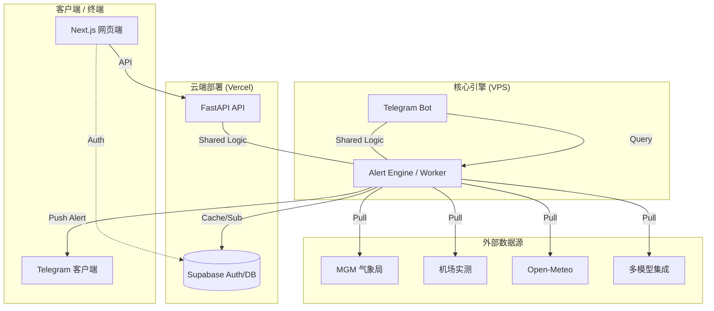

# 🌡️ PolyWeather Pro

> **专业级博弈情报系统** —— 专注边缘气象数据采集、DEB 智能融合与实时决策预警。

---

## 💎 项目愿景

PolyWeather 是一套专为 **Polymarket** 深度博弈者设计的实时情报系统。我们不只是提供天气预报，而是通过聚合全球顶级气象源、应用自研的 **DEB (Dynamic Error Balancing)** 算法，并在关键时间节点提供**具有博弈预测价值**的异动预警。

---

## 🏗️ 生产架构

本项目采用生产级解耦架构，确保高可用与实时性：

- **前端**：部署在 **Vercel** 上的 **Next.js** 交互式仪表盘。
- **后端 API**：运行在 VPS 上的 **FastAPI**，提供低延迟数据服务。
- **机器人与预警心跳**：运行在 VPS 上的 **Telegram Bot**，执行每分钟级的全球扫描与推送。

🔗 **官方访问地址**：[polyweather-pro.vercel.app](https://polyweather-pro.vercel.app/)

---

## 🖼️ 预览与交互

<p align="center">
  
  <br>
  <em>📊 <b>深度查询效果</b>：DEB 融合预测 + 结算概率 + Groq AI 专家建议</em>
</p>

<p align="center">
  
  <br>
  <em>🗺️ <b>全景仪表盘</b>：全球站点实时热力场 + 阵列式数据展示</em>
</p>

---

## 🚀 核心功能

- **📡 多源全量采集**
  - **主流模型**：ECMWF, GFS, ICON, GEM, JMA 实时最高温同步。
  - **实测数据**：全球机场 METAR 定时报文 + 土耳其 MGM 局点官方实测。
  - **中心化纠偏**：针对安卡拉特别接入 `17130` (Center) 官方指挥中心数据。
- **⚖️ DEB 智能融合**
  - 基于近期 7 天历史表现，动态调整各模型权重的博弈预测。
- **🔔 异动预警系统 (Alert Engine)**
  - **动量突变**：捕捉 30 分钟内的急剧温变。
  - **预测突破**：当实测击穿所有预报上限时触发告警。
  - **平流监测**：基于周边前导站的风向流场模拟，预测冷/暖平流的到达。
- **🛡️ 智能压制逻辑**
  - **峰值保护**：当日高温峰值大概率已过时，自动转为静默/快照模式，拒绝骚扰。
  - **冷却管理**：同一信号路径支持全局与城市级双重 CD。

---

## 🔐 预警逻辑深度说明

| 触发器名称       | 核心逻辑                                     | 博弈价值                           |
| :--------------- | :------------------------------------------- | :--------------------------------- |
| **Center Hit**   | 仅识别安卡拉总部 `17130` 站点的 DEB 触发信号 | **最高级信号**，定盘星             |
| **Momentum**     | 30min 温度斜率超过                           | 捕捉突发天气系统（如锋面）         |
| **Breakthrough** | 击穿所有预报上限 + 安全边际                  | 捕捉市场极少数情况下的暴利点       |
| **Advection**    | 前导站温升 + 风向匹配                        | 获得 20-40 分钟的提前离场/建仓时间 |

---

## 🏗️ 架构解析



---

## 🛠️ 部署指南

### 1. 后端 / 机器人 (VPS)

```bash
# 获取源码
git pull

# 环境配置
# 编辑 .env 文件，填入 TELEGRAM_BOT_TOKEN 等关键参数

# 一键启动
docker-compose up -d --build
```

### 2. 前端 (Vercel)

直接关联本项目 `frontend` 目录作为根目录即可，享受自动 CI/CD。

---

## 💬 机器人指令

| 命令      | 说明                      | 示例           |
| :-------- | :------------------------ | :------------- |
| `/city`   | 查询指定城市实时分析      | `/city ankara` |
| `/deb`    | 查看 DEB 模型的历史准确率 | `/deb london`  |
| `/points` | 查看您的活跃积分与排行榜  | `/points`      |
| `/help`   | 获取详细功能说明          | `/help`        |

---

> [!NOTE]
> **商业化提示**：本项目目前提供 **Web 仪表盘 ($5/月)** 与 **Telegram 信号频道 ($1/月)** 订阅服务。
> 发言获取积分逻辑已上线，活跃用户可兑换相应权限。

---

---

**📅 最后更新**：2026-03-08
**🚀 状态**：v1.0 稳定版 - 专业量化 UI 已锁定

> [!TIP]
> **生产提示**：当前仪表盘采用高密度“专业量化版” UI (v1.0-legacy)，深度集成了 METAR/MGM 实测数据、DEB 智能融合预报及多模型概率分布，提供最高性能的数据交互体验。
