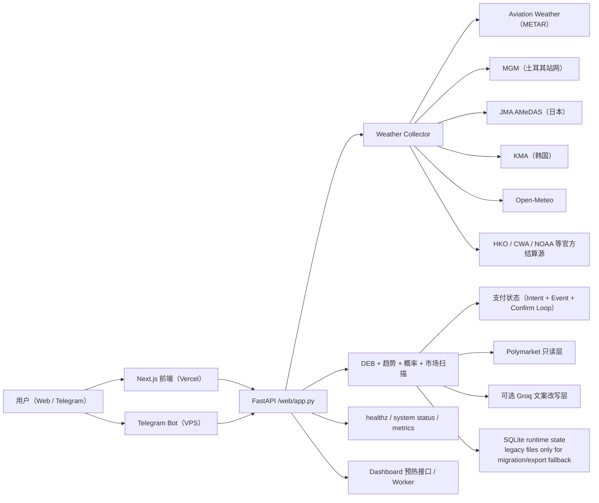

# PolyWeather Pro

面向温度结算市场的生产级气象情报系统。

官方看板：[polyweather-pro.vercel.app](https://polyweather-pro.vercel.app/)

## 产品截图

### 全球看板


### 城市分析（Ankara）


## 当前产品状态（2026-04-10）

- 已上线订阅制：`Pro 月付 5 USDC`。
- 已上线积分抵扣：`500 积分 = 1 USDC`，最多抵扣 `3 USDC`。
- 已上线链上支付：Polygon 合约支付（USDC / USDC.e）。
- 已上线自动补单：事件监听 + 周期确认双链路。
- 已上线支付运行态与审计接口：`/api/payments/runtime`。
- 已上线轻量运营后台：`/ops`（会员、周榜、补分、支付异常单）。
- 已上线轻量可观测性：`/healthz`、`/api/system/status`、`/metrics`。
- 已补最小外部监控栈：Prometheus + Alertmanager + Grafana + Telegram 告警 relay。
- 运行态状态、缓存与核心离线训练/回填链路已完成 SQLite 主路径收口；legacy JSON/JSONL 仅保留给迁移、导出与显式回退输入。
- 已接入 EMOS/CRPS 校准链路，但当前仍保持 `emos_shadow`。
- 官方增强站网已统一接入：
  - `MGM`（土耳其）
  - `CMA/NMC`（中国内地）
  - `JMA AMeDAS`（日本）
  - `KMA`（韩国）
  - `HKO`（香港）
  - `CWA`（台湾）
- 东京现已接入羽田 `JMA AMeDAS` 10 分钟温度作为官方增强层。
- 已支持 Dashboard 定向预热 worker / cron 路径，运行态在 `/api/system/status` 与 `/ops` 可见。
- `/ops` 现已展示缓存桶数量、summary cache hit/miss 与 prewarm heartbeat。
- 今日日内结构解读已支持可选 `Groq` 改写层，失败时自动回退规则文案。
- 前端部署文档已补充 Vercel 节流建议，包括 analytics 关闭、eager fetch 开关与扫描流量防火墙规则。

## 许可证与商用边界（重要）

本仓库自 `2026-03-30` 起采用 **GNU AGPL-3.0-only**。

- 仓库公开部分：天气聚合、基础分析、前端看板、Bot 基础能力、标准支付流程。
- 不包含在仓库中的部分：生产私有数据、商业风控规则、运营阈值、收费策略细节、内部对账与增长工具。
- 商标、品牌、域名、生产数据库与托管服务运营能力，不因代码许可证一并授权。

详细见：[AGPL-3.0 与商用边界](docs/OPEN_CORE_POLICY.md)

## 核心能力

- 聚合 45 个监控城市的实测与预报数据。
- DEB（Dynamic Error Balancing）融合多模型最高温。
- 输出结算导向概率分布（`mu` + 温度桶）。
- 将模型观点映射到 Polymarket 行情，做错价扫描。
- Web 仪表盘与 Telegram Bot 复用同一分析内核。
- 支付链路具备事件重放、SQLite 审计事件与 RPC 容灾能力。
- 官方增强层支持按国家 provider 统一接入，但不替代机场主站或明确官方结算站。
- 支持后台预热热点城市，降低用户点击城市后的冷启动成本。

## 参考架构



## 监控城市（45）

- 欧洲/中东：Ankara、Istanbul、Moscow、London、Paris、Munich、Milan、Warsaw、Madrid、Tel Aviv、Amsterdam、Helsinki
- 亚太：Seoul、Busan、Hong Kong、Lau Fau Shan、Taipei、Shanghai、Beijing、Wuhan、Chengdu、Chongqing、Shenzhen、Singapore、Tokyo、Kuala Lumpur、Jakarta、Wellington
- 美洲：Toronto、New York、Los Angeles、San Francisco、Denver、Austin、Houston、Chicago、Dallas、Miami、Atlanta、Seattle、Mexico City、Buenos Aires、Sao Paulo、Panama City
- 南亚：Lucknow

## 快速启动

### 后端 + Bot（Docker）

```bash
docker compose up -d --build
```

### 前端本地运行

```bash
cd frontend
npm ci
npm run dev
```

## 运行数据目录（VPS 推荐）

建议将运行态数据放到仓库外（避免 `git pull` 被 SQLite 卡住）：

```env
POLYWEATHER_RUNTIME_DATA_DIR=/var/lib/polyweather
POLYWEATHER_DB_PATH=/var/lib/polyweather/polyweather.db
POLYWEATHER_STATE_STORAGE_MODE=sqlite
```

## 运维验收

### 健康与系统状态

```bash
curl http://127.0.0.1:8000/healthz
curl http://127.0.0.1:8000/api/system/status
curl http://127.0.0.1:8000/metrics
```

### Dashboard 预热 Worker

```bash
docker compose --profile workers up -d polyweather_prewarm
curl http://127.0.0.1:8000/api/system/status
```

重点关注：

- `prewarm.thread_alive`
- `prewarm.runtime.cycle_count`
- `prewarm.runtime.last_summary_ok`
- `cache.analysis.hit_rate`

### 前端缓存头

```bash
./scripts/validate_frontend_cache.sh "https://polyweather-pro.vercel.app"
```

### 支付自动补单日志

```bash
docker compose logs -f polyweather | egrep "payment event loop started|payment confirm loop started|payment auto-confirmed"
```

### 外部监控栈

```bash
docker compose --profile monitoring up -d polyweather_prometheus polyweather_alertmanager polyweather_alert_relay polyweather_grafana
```

- Prometheus：`http://127.0.0.1:${POLYWEATHER_PROMETHEUS_PORT:-9090}`
- Alertmanager：`http://127.0.0.1:${POLYWEATHER_ALERTMANAGER_PORT:-9093}`
- Grafana：`http://127.0.0.1:${POLYWEATHER_GRAFANA_PORT:-3001}`

手动巡检：

```bash
python scripts/check_ops_health.py --base-url http://127.0.0.1:8000
```

### 支付运行态

```bash
curl http://127.0.0.1:8000/api/payments/runtime
```

### 运营后台

- 前端入口：`https://polyweather-pro.vercel.app/ops`
- 后端需配置：

```env
POLYWEATHER_OPS_ADMIN_EMAILS=yhrsc30@gmail.com
```

### 钱包异动监听日志

```bash
docker compose logs -f polyweather | egrep "polymarket wallet activity watcher started|wallet activity pushed"
```

## Telegram 指令

| 指令 | 用途 |
| :-- | :-- |
| `/city <name>` | 城市实时分析 |
| `/deb <name>` | DEB 历史对账 |
| `/top` | 用户积分排行 |
| `/id` | 查看聊天 Chat ID |
| `/diag` | Bot 启动诊断 |
| `/help` | 帮助与用法 |

## 文档索引

- 英文总览：[README.md](README.md)
- API 文档（中文）：[docs/API_ZH.md](docs/API_ZH.md)
- 商业化说明：[docs/COMMERCIALIZATION.md](docs/COMMERCIALIZATION.md)
- AGPL-3.0 边界：[docs/OPEN_CORE_POLICY.md](docs/OPEN_CORE_POLICY.md)
- Supabase 接入：[docs/SUPABASE_SETUP_ZH.md](docs/SUPABASE_SETUP_ZH.md)
- 配置与密钥管理：[docs/CONFIGURATION_ZH.md](docs/CONFIGURATION_ZH.md)
- 前端部署（Vercel）：[docs/FRONTEND_DEPLOYMENT_ZH.md](docs/FRONTEND_DEPLOYMENT_ZH.md)
- EMOS 训练报告：[docs/EMOS_TRAINING_REPORT_ZH.md](docs/EMOS_TRAINING_REPORT_ZH.md)
- 概率快照归档：[docs/PROBABILITY_SNAPSHOT_ARCHIVE_ZH.md](docs/PROBABILITY_SNAPSHOT_ARCHIVE_ZH.md)
- 技术债（中文镜像）：[docs/TECH_DEBT_ZH.md](docs/TECH_DEBT_ZH.md)
- 技术债（主文档）：[docs/TECH_DEBT.md](docs/TECH_DEBT.md)
- 支付合约验证：[docs/payments/POLYGONSCAN_VERIFY.md](docs/payments/POLYGONSCAN_VERIFY.md)
- 支付审计说明：[docs/payments/PAYMENT_AUDIT_ZH.md](docs/payments/PAYMENT_AUDIT_ZH.md)
- 支付 V2 升级方案：[docs/payments/PAYMENT_UPGRADE_V2_ZH.md](docs/payments/PAYMENT_UPGRADE_V2_ZH.md)
- 运营后台说明：[docs/OPS_ADMIN_ZH.md](docs/OPS_ADMIN_ZH.md)
- 外部监控说明：[docs/MONITORING_ZH.md](docs/MONITORING_ZH.md)
- 深度评估报告：[docs/deep-research-report.md](docs/deep-research-report.md)
- 前端报告：[FRONTEND_REDESIGN_REPORT.md](FRONTEND_REDESIGN_REPORT.md)
- 发布流程：[RELEASE.md](RELEASE.md)
- 变更记录：[CHANGELOG.md](CHANGELOG.md)

## 当前版本

- 版本：`v1.5.3`
- 文档最后更新：`2026-04-10`
