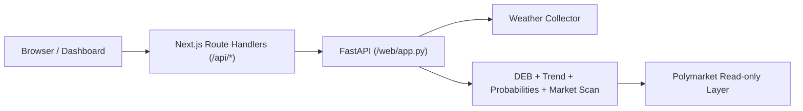

# PolyWeather API 文档（v1.3）

本文档基于当前代码（`web/app.py` + `frontend/app/api/*`）整理。  
前端默认通过 Next.js BFF 路由访问后端。

---

## 1. 基础信息

- 后端直连：`http://127.0.0.1:8000`
- 前端 BFF：`https://polyweather-pro.vercel.app/api/*`
- 返回格式：`application/json`
- 口径说明：
  - 结算导向分析以温度最高值和温度桶概率为核心。
  - Ankara 增强使用 MGM，主站固定 `17130`。
  - Meteoblue 已移除，不再出现在任何有效字段中。

---

## 2. 请求链路



---

## 3. 接口总览

| 接口 | 方法 | 用途 |
| :-- | :-- | :-- |
| `/api/cities` | GET | 监控城市列表（地图/侧栏） |
| `/api/city/{name}` | GET | 城市主分析（今日分析核心数据） |
| `/api/city/{name}/summary` | GET | 轻量摘要（首屏预热/低成本轮询） |
| `/api/city/{name}/detail` | GET | 聚合详情（含 `market_scan`） |
| `/api/history/{name}` | GET | 历史对账数据 |

---

## 4. 关键接口说明

### 4.1 `GET /api/cities`

返回监控城市清单。

关键字段：

- `name`, `display_name`
- `lat`, `lon`
- `risk_level`, `risk_emoji`
- `airport`, `icao`
- `temp_unit`（`celsius` / `fahrenheit`）

### 4.2 `GET /api/city/{name}`

主分析接口，返回当前实况、预报、概率、趋势、AI 分析等。

可选参数：

- `force_refresh=true|false`

关键字段：

- `current`（温度、今日最高、METAR 观测时间、原始 METAR）
- `forecast`（今日及多日高温、日出日落、日照时长）
- `mgm`, `mgm_nearby`
- `multi_model`, `multi_model_daily`
- `deb`, `ensemble`
- `probabilities`（`mu` + `distribution`）
- `trend`, `peak`
- `hourly`, `hourly_next_48h`
- `source_forecasts.weather_gov`

### 4.3 `GET /api/city/{name}/summary`

轻量摘要接口，适合高频刷新列表。

可选参数：

- `force_refresh=true|false`

关键字段：

- `name`, `display_name`, `icao`
- `local_time`, `temp_symbol`
- `current.temp`, `current.obs_time`
- `deb.prediction`
- `risk.level`, `risk.warning`
- `updated_at`

### 4.4 `GET /api/city/{name}/detail`

聚合详情接口，市场分析与未来日期分析都依赖该接口。

可选参数：

- `force_refresh=true|false`
- `market_slug=<slug>`
- `target_date=YYYY-MM-DD`

关键返回块：

- `overview`
- `official`
- `timeseries`
- `models`
- `probabilities`
- `market_scan`
- `risk`
- `ai_analysis`

`market_scan` 重点字段：

- `available`, `selected_date`, `selected_slug`, `signal_label`
- `yes_buy`, `yes_sell`, `no_buy`, `no_sell`
- `temperature_bucket`, `forecast_bucket`, `top_buckets`
- `anchor_model`, `anchor_high`, `anchor_settlement`
- `open_meteo_settlement`（兼容旧字段，当前与 `anchor_settlement` 同值）
- `primary_market.tradable`, `primary_market.tradable_reason`
- `primary_market.accepting_orders`, `primary_market.ended_at_utc`

说明：

- 当前错价锚点不是单一 Open-Meteo，而是“多模型最高温锚点”。
- 推送层会再次校验市场可交易性，不可交易市场会跳过。

### 4.5 `GET /api/history/{name}`

历史对账接口。

关键字段：

- `date`
- `actual`
- `deb`
- `mu`
- `mgm`

---

## 5. 缓存与刷新策略（当前已实现）

### 5.1 FastAPI 后端缓存

- `_analyze` 结果内存缓存：默认 5 分钟
- Ankara 特例：60 秒
- `force_refresh=true`：绕过后端缓存

### 5.2 Next.js BFF HTTP 缓存（Vercel）

- `GET /api/cities`
  - `ETag`
  - `Cache-Control: public, max-age=0, s-maxage=300, stale-while-revalidate=1800`
- `GET /api/city/{name}/summary`
  - `ETag`
  - `Cache-Control: public, max-age=0, s-maxage=20, stale-while-revalidate=60`
- `GET /api/history/{name}`
  - `ETag`
  - `Cache-Control: public, max-age=0, s-maxage=60, stale-while-revalidate=300`
- `summary?force_refresh=true`
  - `Cache-Control: no-store`

### 5.3 前端本地缓存

- `sessionStorage`
  - 城市详情缓存（5 分钟 TTL + revision 探测）
- `localStorage`
  - 上次选中城市
  - 侧栏风险分组折叠状态

### 5.4 尚未引入（当前明确未做）

- Service Worker Cache API
- IndexedDB

---

## 6. 常用调试示例

### 6.1 查询未来日期 `market_scan`

```bash
curl -s "http://127.0.0.1:8000/api/city/ankara/detail?force_refresh=true&target_date=2026-03-12" \
| python3 -c "import sys,json; m=json.load(sys.stdin).get('market_scan',{}); print({k:m.get(k) for k in ['available','selected_date','anchor_model','anchor_high','anchor_settlement','yes_buy','no_buy']})"
```

### 6.2 验证前端缓存头

```bash
./scripts/validate_frontend_cache.sh "https://polyweather-pro.vercel.app"
```

### 6.3 观察错价雷达跳过原因

```bash
docker compose logs -f polyweather | egrep "market not tradable|trade alert pushed|mispricing cap"
```

---

## 7. 常见问题

### 7.1 VPS `:8000` 为什么看不到 `ETag`？

- `:8000` 是 FastAPI 直连层，主要负责聚合分析。
- `ETag/304` 在前端 BFF（Vercel 的 `/api/*`）侧实现。

### 7.2 为什么 `target_date` 有时没有市场价格？

- 该日期可能没有可交易市场。
- 或目标桶在市场里无可用报价（`yes_buy/no_buy` 缺失）。
- 可先看 `market_scan.available` 与 `primary_market.tradable`。

### 7.3 如何确认 Bot 后台循环是否启动？

- Telegram 里发送 `/diag`。
- 查看三类循环状态：错价雷达、Polygon 钱包监听、Polymarket 钱包异动监听。

---

最后更新：`2026-03-12`
