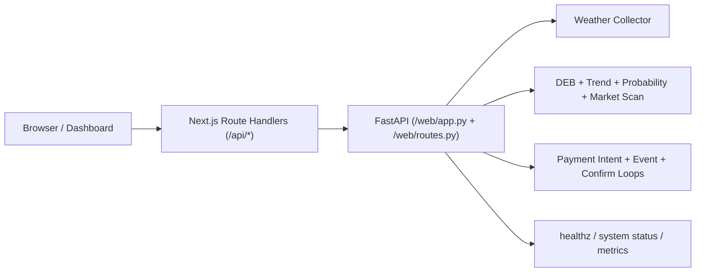

# PolyWeather API 文档（v1.5.0）

最后更新：`2026-03-20`

本文档描述当前对外可用 API 口径（`web/app.py` + `web/routes.py` + `frontend/app/api/*`）。

## 1. 基础信息

- 后端直连：`http://127.0.0.1:8000`
- 前端 BFF：`https://polyweather-pro.vercel.app/api/*`
- 返回格式：`application/json`

## 2. 请求链路



## 3. 天气分析接口

| 接口 | 方法 | 用途 |
| :-- | :-- | :-- |
| `/api/cities` | GET | 监控城市列表 |
| `/api/city/{name}` | GET | 城市主分析 |
| `/api/city/{name}/summary` | GET | 轻量摘要 |
| `/api/city/{name}/detail` | GET | 聚合详情（含 market_scan） |
| `/api/history/{name}` | GET | 历史对账 |

### `GET /api/city/{name}/detail`

可选参数：

- `force_refresh=true|false`
- `market_slug=<slug>`
- `target_date=YYYY-MM-DD`

重点字段：

- `market_scan.available`
- `market_scan.signal_label`
- `market_scan.anchor_model / anchor_high / anchor_settlement`
- `market_scan.yes_buy / no_buy`
- `market_scan.primary_market.tradable`

## 4. 鉴权与账户接口

| 接口 | 方法 | 用途 |
| :-- | :-- | :-- |
| `/api/auth/me` | GET | 当前登录态、积分、订阅状态 |

`/api/auth/me` 关键字段：

- `authenticated`
- `user_id`, `email`
- `points`, `weekly_points`, `weekly_rank`
- `subscription_active`, `subscription_plan_code`, `subscription_expires_at`

## 5. 支付接口

| 接口 | 方法 | 用途 |
| :-- | :-- | :-- |
| `/api/payments/config` | GET | 支付配置、代币列表、套餐、积分抵扣规则 |
| `/api/payments/runtime` | GET | 支付运行态、RPC 状态、event loop 状态、最近审计事件 |
| `/api/payments/wallets` | GET | 当前用户已绑定钱包 |
| `/api/payments/wallets/challenge` | POST | 获取绑定签名 challenge |
| `/api/payments/wallets/verify` | POST | 提交签名并绑定钱包 |
| `/api/payments/intents` | POST | 创建支付意图（intent） |
| `/api/payments/intents/{intent_id}` | GET | 查询 intent 最新状态 |
| `/api/payments/intents/{intent_id}/submit` | POST | 提交交易哈希 |
| `/api/payments/intents/{intent_id}/confirm` | POST | 手动触发确认 |

### 支付状态建议

前端流程建议：

1. `POST /intents`
2. 钱包发链上交易
3. `POST /submit`
4. `POST /confirm`
5. 若 pending，轮询 `GET /intents/{id}` 直到 `confirmed`

## 6. 运维与观测接口

| 接口 | 方法 | 用途 |
| :-- | :-- | :-- |
| `/healthz` | GET | 基础健康检查 |
| `/api/system/status` | GET | 系统状态、功能开关、rollout 状态、轻量指标摘要 |
| `/metrics` | GET | Prometheus 风格指标导出 |

`/api/system/status` 当前会包含：

- `features.state_storage_mode`
- `probability.decision`
- `probability.ready_for_primary`
- `metrics`

`/metrics` 当前会导出：

- `polyweather_http_requests_total`
- `polyweather_http_request_duration_ms_*`
- `polyweather_source_requests_total`
- `polyweather_source_request_duration_ms_*`

## 7. 缓存策略（当前）

- `cities` / `summary` / `history`：BFF 支持 `ETag + 304`
- `summary?force_refresh=true`：`Cache-Control: no-store`
- 详情接口与支付接口：`no-store`

## 8. 调试示例

### 查询未来日期 market_scan

```bash
curl -s "http://127.0.0.1:8000/api/city/ankara/detail?force_refresh=true&target_date=2026-03-12"
```

### 校验支付配置

```bash
curl -s http://127.0.0.1:8000/api/payments/config | python3 -m json.tool
```

### 查看支付运行态

```bash
curl -s http://127.0.0.1:8000/api/payments/runtime | python3 -m json.tool
```

### 查看系统状态

```bash
curl -s http://127.0.0.1:8000/api/system/status | python3 -m json.tool
```

### 观察支付自动补单

```bash
docker compose logs -f polyweather | egrep "payment event loop started|payment confirm loop started|payment auto-confirmed"
```

## 9. 开源口径说明

对外公开文档仅覆盖通用 API 契约。生产商业策略参数不在公开文档披露。

详见：[Open-Core 与商用边界](OPEN_CORE_POLICY.md)
