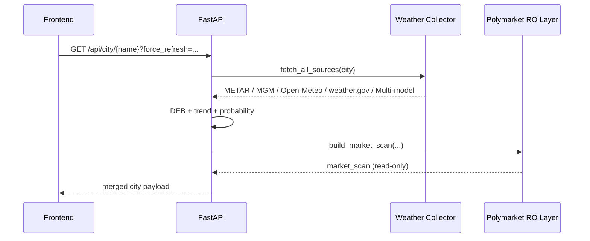

# PolyWeather API 文档（v1.3）

本文档描述当前后端真实可用接口（`web/app.py`）。  
前端一般通过 Next.js BFF 路由代理访问这些接口。

---

## 1. 基础信息

- 本地地址：`http://127.0.0.1:8000`
- 生产地址：`http://<vps-ip>:8000` 或你绑定的 HTTPS 域名
- 返回格式：`application/json`
- 缓存策略：
  - 后端分析缓存：默认 5 分钟（Ankara 特殊口径 60 秒）
  - 前端详情缓存：5 分钟 + revision 检查
  - 手动刷新：`force_refresh=true` 强制绕过缓存

---

## 2. API 思维导图

```mermaid
mindmap
  root((PolyWeather API))
    城市列表
      [GET /api/cities]
    城市主数据
      [GET /api/city/:name]
      [GET /api/city/:name/summary]
      [GET /api/city/:name/detail]
    历史数据
      [GET /api/history/:name]
    关键对象
      current
      forecast
      [probabilities (mu + distribution)]
      [multi_model / multi_model_daily]
      [market_scan (P0 只读)]
```

---

## 3. 接口总览

| 接口                       | 方法 | 用途                                  |
| :------------------------- | :--- | :------------------------------------ |
| `/api/cities`              | GET  | 城市清单与地图基础信息                |
| `/api/city/{name}`         | GET  | 城市主分析数据（侧栏/今日分析主来源） |
| `/api/city/{name}/summary` | GET  | 轻量摘要（首屏预热/低开销更新）       |
| `/api/city/{name}/detail`  | GET  | 聚合详情 + Polymarket P0 只读市场层   |
| `/api/history/{name}`      | GET  | 历史对账数据                          |

---

## 4. 关键接口详解

### 4.1 `GET /api/cities`

返回监控城市列表（地图 Marker 与侧边栏基础数据）。

示例：

```json
{
  "cities": [
    {
      "name": "ankara",
      "display_name": "Ankara",
      "lat": 39.9334,
      "lon": 32.8597,
      "risk_level": "medium",
      "risk_emoji": "🟠",
      "airport": "Esenboğa",
      "icao": "LTAC",
      "temp_unit": "celsius",
      "is_major": true
    }
  ]
}
```

### 4.2 `GET /api/city/{name}`

主数据接口，前端详情面板和今日分析最常用。

可选参数：

- `force_refresh=true|false`

核心字段：

- `name`, `display_name`, `local_date`, `local_time`, `temp_symbol`
- `risk`
- `current`
- `forecast`
- `mgm`, `mgm_nearby`
- `multi_model`, `multi_model_daily`
- `deb`
- `ensemble`
- `probabilities`（`mu` + `distribution`）
- `trend`, `peak`
- `hourly`, `hourly_next_48h`
- `source_forecasts`（当前只保留 `weather_gov`）
- `market_scan`
- `updated_at`

说明：

- `current.raw_metar` 是原始 METAR 报文。
- Ankara 专项增强使用 MGM 站网，领先站固定 `17130`。
- Meteoblue 已彻底移除，不再出现在接口字段中。

### 4.3 `GET /api/city/{name}/summary`

轻量温度摘要，用于地图首屏预热和低成本刷新。

典型字段：

- `name`, `display_name`, `icao`
- `local_time`, `temp_symbol`
- `current.temp`, `current.obs_time`
- `deb.prediction`
- `risk.level`, `risk.warning`
- `updated_at`

### 4.4 `GET /api/city/{name}/detail`

聚合视图接口，包含天气分析和市场只读层。

可选参数：

- `force_refresh=true|false`
- `market_slug=<slug>`（调试/定向市场匹配）

关键结构：

- `overview`
- `official`
- `timeseries`
- `models`
- `probabilities`
- `market_scan`
- `risk`
- `ai_analysis`

`market_scan`（P0 只读）重点字段：

- `primary_market`, `selected_condition_id`, `selected_slug`
- `yes_token`, `no_token`
- `yes_buy`, `yes_sell`, `no_buy`, `no_sell`
- `market_price`, `model_probability`, `edge_percent`
- `temperature_bucket`
- `top_buckets`（前端展示前会再去重）
- `signal_label`（`BUY YES` / `BUY NO` / `MONITOR`）
- `websocket.asset_ids`, `websocket.condition_ids`（订阅标识，不涉及下单）

注意：

- 后端已做温度桶去重与方向优先（优先与主市场同方向的 `or higher`/`or lower` 桶）。
- 前端还有二次去重兜底，避免重复温度桶刷屏。

### 4.5 `GET /api/history/{name}`

历史对账数据来源。

示例：

```json
{
  "history": [
    {
      "date": "2026-03-07",
      "actual": 7.0,
      "deb": 6.5,
      "mu": 7.2,
      "mgm": 8.0
    }
  ]
}
```

---

## 5. 请求链路（以 `/api/city/{name}` 为例）



---

## 6. 数据口径

### 6.1 主观测

- Aviation Weather / METAR 是全局主观测源。
- Ankara：结算主站仍是 `LTAC`，领先信号强化使用 MGM（`17130`）。

### 6.2 预测源

- Open-Meteo
- weather.gov（美国城市）
- 多模型：ECMWF / GFS / ICON / GEM / JMA

### 6.3 概率口径

- `mu`：动态分布中心，不是固定结算值。
- `distribution`：按温度桶输出概率分布，面向结算决策而非通用天气展示。

---

## 7. 常见问题

### 7.1 接口 500

- 先检查容器是否启动：`docker compose ps`
- 查看日志：`docker compose logs -f polyweather_web`

### 7.2 METAR 看起来“延迟”

优先核对：

- `current.obs_time`
- `current.report_time`
- `current.receipt_time`

通常是上游发布节奏，不一定是本地轮询问题。

### 7.3 前端仍显示旧内容

- 确认 Vercel 已部署最新构建
- 浏览器强刷（`Ctrl+F5`）
- 检查是否命中前端 5 分钟 TTL

---

最后更新：`2026-03-11`
