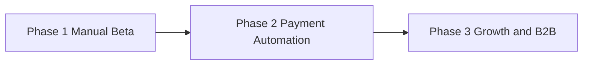

# Commercialization Roadmap

Target: make PolyWeather a sustainable paid weather-intelligence product.

---

## 1. Product Positioning

PolyWeather is not a generic weather app.  
It is a decision-support layer for temperature-settlement markets:

- observation-first (METAR/MGM),
- settlement-aware probability modeling (DEB + mu/buckets),
- market mapping (Polymarket read-only) for actionable edge detection.

---

## 2. Business Mindmap

```mermaid
mindmap
  root((PolyWeather Monetization))
    Product
      Telegram Signal Channel
      Web Dashboard
      VIP Bundle
    Pricing
      [Entry 1 USD]
      [Dashboard 5 USD]
      [Bundle 5.5 USD]
    Access Control
      [Manual activation (P1)]
      [Wallet/USDC detection (P2)]
      Entitlement middleware
    Growth
      Accuracy reports
      Retention analytics
      User preference center
```

---

## 3. Packaging and Pricing

| Tier             | Price        | Value                                     |
| :--------------- | :----------- | :---------------------------------------- |
| Telegram Channel | $1 / month   | Low-noise proactive signal feed           |
| Web Dashboard    | $5 / month   | Full multi-model context + reconciliation |
| VIP Bundle       | $5.5 / month | Dashboard + signal stream                 |

Payment direction:

- Currency: Polygon USDC
- Phasing: manual activation first, then automated entitlement sync

---

## 4. Execution Phases



### Phase 1: Manual Beta

- Keep paid channel small, optimize signal quality first.
- Manual payment confirmation + manual entitlement grant.
- Invite-gated dashboard while access control hardens.

### Phase 2: Payment Automation

- Detect wallet payment events (USDC).
- Auto-issue/refresh entitlement.
- Enforce route-level and API-level access guards.

### Phase 3: Growth and Expansion

- Self-serve billing and subscription panel.
- Operator analytics and feature usage telemetry.
- Optional B2B API package for quant teams.

---

## 5. Technical Dependencies for Revenue

| Dependency           | Why it matters                                                   |
| :------------------- | :--------------------------------------------------------------- |
| Entitlement guard    | Prevents unpaid dashboard/API access                             |
| Subscriber store     | Persistent paid user state                                       |
| Audit trail          | Explains why each alert fired                                    |
| Observability        | Detects degradation before churn                                 |
| Frontend performance | Impacts conversion and retention (Speed Insights now integrated) |

---

## 6. Immediate Commercial Priorities

1. Finish robust entitlement middleware in frontend and backend.
2. Persist subscriber/payment state in managed DB.
3. Publish transparent monthly accuracy and signal-quality reports.
4. Add support playbooks for false-alert and stale-data incidents.

---

Last Updated: `2026-03-11`
