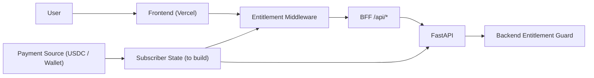

# Commercialization Roadmap

Target: make PolyWeather a sustainable paid weather-intelligence product.

---

## 1. Product Positioning

PolyWeather is not a generic weather app. It is a settlement decision layer for temperature markets:

- observation-first (METAR/MGM),
- settlement-aware modeling (DEB + mu/buckets),
- market mapping (Polymarket read-only) for actionable mispricing checks.

---

## 2. Current Monetization Readiness (2026-03-12)

| Capability | Status | Notes |
| :-- | :-- | :-- |
| Frontend entitlement gate | Implemented | Next middleware supports token gate + session cookie |
| Backend entitlement guard | Implemented | `POLYWEATHER_REQUIRE_ENTITLEMENT` + backend token header |
| Bot command entitlement pre-hook | Implemented | `/city` and `/deb` can be protected (`POLYWEATHER_BOT_REQUIRE_ENTITLEMENT`) |
| Payment event ingestion | Not implemented | No automated USDC payment reconciliation yet |
| Subscriber persistence | Not implemented | Still missing managed subscriber DB |
| Self-serve billing UI | Not implemented | No user billing center yet |

---

## 3. Access Model

### Do we need login/register to start charging?

Short answer: **no for phase 1, yes for scale**.

- Phase 1 can run with token/wallet-based entitlement and manual ops.
- For scale (self-serve renewals, refunds, support, analytics), account identity and subscriber DB become mandatory.

---

## 4. Packaging and Pricing (Draft)

| Tier | Price | Value |
| :-- | :-- | :-- |
| Telegram Signal Channel | $1 / month | Low-noise proactive signal stream |
| Web Dashboard | $5 / month | Full model context + historical reconciliation |
| VIP Bundle | $5.5 / month | Dashboard + signal stream |

Payment direction:

- Settlement/network: Polygon USDC
- Rollout: manual confirmation first, then automated entitlement sync

---

## 5. Execution Phases

### Phase 1: Manual Paid Beta

- Keep user set small and quality-focused.
- Manual payment confirmation + manual entitlement issue.
- Weekly accuracy report as trust anchor.

### Phase 2: Payment Automation

- Ingest payment events (wallet/tx).
- Auto-issue and auto-expire entitlement.
- Full parity across frontend middleware, backend API, and bot command guard.

### Phase 3: Growth and B2B

- Self-serve billing and subscriber console.
- Retention analytics and feature usage telemetry.
- Optional B2B/API package.

---

## 6. P0/P1 Commercial Engineering Backlog

### P0 (before public paid launch)

1. Subscriber store (managed PostgreSQL/Supabase) with entitlement expiry.
2. Payment event pipeline (idempotent ingest + reconciliation + retry).
3. Unified entitlement policy matrix (frontend/backend/bot).
4. Ops audit trail for alerts and entitlement changes.

### P1 (after initial paid users)

1. Billing/entitlement admin console.
2. User-level support tooling (manual override, extension, refund notes).
3. Conversion and retention dashboards.
4. Churn diagnostics linked to alert quality and latency.

---

## 7. Commercial Risk Controls

- Revenue leakage: deny by default when entitlement token/state is missing.
- Signal quality drift: publish monthly transparent accuracy summary.
- Support load: keep alert evidence standardized in push payloads.
- Compliance/ops: preserve immutable entitlement and push logs.

---

Last Updated: `2026-03-12`
