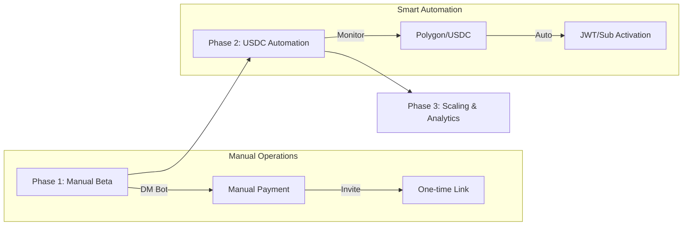

# 📈 Commercialization Roadmap

> **Target**: Transforming PolyWeather for paid weather intelligence delivery.

---

## 🎯 Product Focus

PolyWeather is positioned as a **premium intelligence service** for weather-based prediction markets (**Polymarket**). The value proposition lies in **Ankara-specialization**, **advanced advection forecasting**, and **DEB-weighted consensus**.

---

## 💰 Pricing & Monetization

| Tier                 | Price         | Primary Value Proposition                                     |
| :------------------- | :------------ | :------------------------------------------------------------ |
| **Telegram Channel** | **$1 / mo**   | High-fidelity proactive alerts, low noise.                    |
| **Web Dashboard**    | **$5 / mo**   | Comprehensive multi-model view + historical MAE benchmarking. |
| **VIP Bundle**       | **$5.5 / mo** | Full access to all intelligence streams.                      |

### 🛠️ Payment Infrastructure

- **Currency**: Polygon / USDC.
- **Method**: Initially manual activation; migrating to automatic deposit detection (Phase 2).

---

## 🗺️ Execution Roadmap

### 📦 Phase 1: Manual Beta

- **Goal**: Stabilize current alert quality and build core user group.
- **Actions**:
  - Manual subscription activation via Telegram DM.
  - Small, focused paid Telegram channel for signal tests.
  - Invitation-only Web Access (Vercel).

### 🛠️ Phase 2: Automation (USDC)

- **Goal**: Reduce operational friction.
- **Actions**:
  - **On-chain monitoring**: Detect USDC deposits to unique addresses.
  - **One-time Links**: Telegram bot automatically generates invite links with `member_limit=1`.
  - **JWT Auth**: Securing the Next.js frontend with subscriber-only tokens.

### 🌐 Phase 3: Scaling & Analytics

- **Goal**: Retention and expansion.
- **Actions**:
  - **Accuracy Leaderboard**: Monthly reports of DEB vs Market outcomes.
  - **Self-Serve Portal**: User dashboard for billing and alert settings.

---

## 🚧 Critical Constraints

- **Weather-First**: We focus on the **physical variable changes** rather than exchange-side order book execution.
- **Quality > Quantity**: Alert fatigue will churn subscribers. We enforce a "True Probability Shift" rule for notifications.
- **Local Niche**: Ankara is our flagship differentiator.

---

**📅 Last Updated**: 2026-03-06
