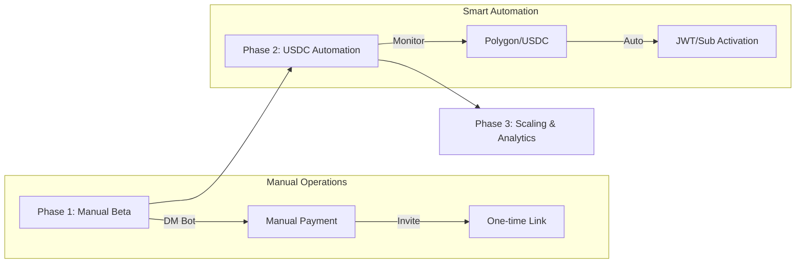

# 📈 Commercialization Roadmap

> **Target**: Transforming PolyWeather for paid weather intelligence delivery.

---

## 🎯 Product Focus

PolyWeather is positioned as a **premium intelligence service** for weather-driven prediction markets (**Polymarket**). The core differentiators remain **Ankara specialization**, **advection-aware signal logic**, and **DEB-weighted consensus**.

---

## 💰 Pricing & Monetization

| Tier                 | Price         | Primary Value Proposition                                     |
| :------------------- | :------------ | :------------------------------------------------------------ |
| **Telegram Channel** | **$1 / mo**   | High-fidelity proactive alerts, low noise.                    |
| **Web Dashboard**    | **$5 / mo**   | Full multi-model context + historical DEB benchmarking.       |
| **VIP Bundle**       | **$5.5 / mo** | Unified access to dashboard + signal stream.                  |

### 🛠️ Payment Infrastructure

- **Currency**: Polygon / USDC.
- **Method**: Phase-1 manual activation; Phase-2 automatic deposit detection and entitlement sync.

---

## 🗺️ Execution Roadmap

### 📦 Phase 1: Manual Beta

- **Goal**: Stabilize signal quality and convert initial paid users.
- **Actions**:
  - Manual subscription activation via Telegram DM.
  - Small paid Telegram channel for low-noise signal validation.
  - Invite-based Web access while entitlement layer is being finalized.
  - Keep Ankara as flagship strategy city for product credibility.

### 🛠️ Phase 2: Automation (USDC)

- **Goal**: Reduce operational friction and improve payment reliability.
- **Actions**:
  - **On-chain monitoring**: Detect USDC deposits to dedicated addresses.
  - **One-time Links**: Bot-generated invite links with strict member limits.
  - **JWT Auth**: Subscriber-only access control for the Next.js frontend.

### 🌐 Phase 3: Scaling & Analytics

- **Goal**: Improve retention and expand B2C/B2B utility.
- **Actions**:
  - **Accuracy Leaderboard**: Monthly DEB vs settled-actual reports.
  - **Self-Serve Portal**: Billing, subscription status, and alert preferences.
  - **Usage Telemetry**: Feature-level analytics for conversion optimization.

### 📡 API Expansion Priority

- **P0-1 Market Layer**
  - Polymarket Gamma discovery + `py-clob-client` pricing / order book
- **P0-2 Official Observation Layer**
  - Aviation Weather / METAR
  - weather.gov official forecast / observation / alert context
- **P1 Lead Layer**
  - Ankara keeps Turkish MGM nearby network
  - U.S. cities may later receive Mesonet enhancement without replacing METAR
- **P2 Product Layer**
  - Stripe / Polygon-USDC automation
  - Realtime entitlement sync and subscriber state management

---

## 🚧 Critical Constraints

- **Weather-First**: The product is built around physical weather shifts, not exchange-side execution tooling.
- **Quality > Quantity**: Alert fatigue directly harms retention; thresholds must favor actionable rarity.
- **UI Stability**: Commercial rollout assumes layout consistency; visual contract stays fixed while internals evolve.

---

**📅 Last Updated**: 2026-03-09
