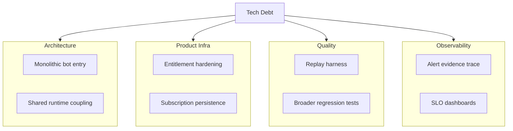

# Technical Debt Backlog

Purpose: keep engineering debt explicit while shipping production features.

---

## 1. Debt Landscape

Current system health estimate: **86% stable / 14% debt**.

---

## 2. Recently Closed (2026-03-12)

- Meteoblue API path fully removed from backend, frontend, config and docs.
- Market top-bucket duplicate temperature issue fixed (backend dedupe + frontend guard).
- Detail panel a11y conflict fixed (`aria-hidden` focus conflict resolved with `inert` + blur).
- Vercel Speed Insights integrated for frontend performance telemetry.
- Frontend BFF `ETag + Cache-Control` landed for cities/summary/history (`force_refresh` keeps `no-store`).
- Mispricing radar now hard-skips non-tradable markets (closed/inactive/not accepting orders/past endDate).
- AI analysis now includes peak-window hard constraints (before-window cannot claim "locked"/"confirmed floor").

---

## 3. High Priority Debt

| Item | Impact | Suggested Work |
| :-- | :-- | :-- |
| Monolithic bot entry (`bot_listener.py`) | Hard to test and safely refactor | Split orchestration, IO and analysis modules |
| Entitlement enforcement consistency | Revenue leakage risk | Align frontend middleware and backend enforcement |
| Subscriber persistence model | Manual operations do not scale | Move to managed PostgreSQL/Supabase state |
| Alert explainability | Operator trust and debugging cost | Standardize evidence payload per alert |

---

## 4. Medium Priority Debt

| Item | Impact | Suggested Work |
| :-- | :-- | :-- |
| Replay simulation harness | Hard to reproduce edge cases | Build deterministic replay over stored records |
| Chart/UI regression coverage | Visual regressions can slip | Add snapshot + interaction test coverage |
| Config centralization | Threshold changes are error-prone | Consolidate runtime knobs into structured config |
| Naming cleanup | Legacy terms reduce clarity | Refactor naming in market/weather boundary layer |

---

## 5. Low Priority Debt

| Item | Impact | Suggested Work |
| :-- | :-- | :-- |
| Cold-start behavior | First request latency variance | Add warming strategy for top city routes |
| Storage abstraction | Local file assumptions remain | Continue moving state to remote services |

---

## 6. Next Milestones

1. Entitlement parity: one policy across frontend and backend.
2. Subscriber DB integration and migration scripts.
3. Alert evidence schema + tooling for quick operator audit.
4. Replay runner for weather/market mixed regression scenarios.

---

Last Updated: `2026-03-12`
