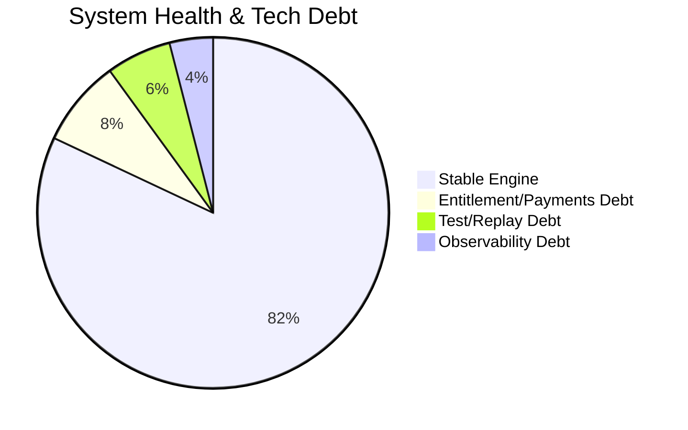

# 🛠️ Technical Debt & Engineering Backlog

> **Vision**: Moving from a research script to a production SaaS.

---

## 🏛️ System Health: 82%

The core weather engine and React dashboard runtime are now stable, but product-layer infrastructure debt is still material.

### Current Stable Modules

- [x] Multi-source Weather Aggregation
- [x] DEB Blending Algorithm
- [x] Proactive Telegram Alert Engine
- [x] Vercel Dashboard Infrastructure
- [x] React component-driven dashboard runtime (replacing legacy `public/static/app.js` rendering path)

---

## 🔴 High Priority: Immediate Focus

| Debt Item              | Impact                                              | Suggested Fix                                                    |
| :--------------------- | :-------------------------------------------------- | :--------------------------------------------------------------- |
| **Monolithic Bot**     | `bot_listener.py` is hard to test and evolve.       | Isolate UI interaction from business logic into `src/analysis`.  |
| **Subscription Store** | No persistent record of who has paid.               | Migrate from in-memory user checks to **Supabase/PostgreSQL**.   |
| **Alert Transparency** | Operators cannot easily audit "why" an alert fired. | Add an `Evidence` metadata block to all internal alert payloads. |
| **Entitlement Guard**  | Dashboard routes are public by default.             | Add JWT/session gating in Next.js middleware + backend checks.    |

---

## 🟡 Medium Priority: Quality of Life

| Debt Item                 | Impact                                              | Suggested Fix                                                                |
| :------------------------ | :-------------------------------------------------- | :--------------------------------------------------------------------------- |
| **Hard-coded Thresholds** | Modification requires code changes (e.g., 5s CD).   | Extract all business constants into a structured `config.yaml`.              |
| **Simulation Harness**    | No way to "replay" a rainy day to test alert logic. | Build a `ReplayEngine` using `data/daily_records.json`.                      |
| **Backend Naming**        | Artifacts of "market price" logic remain in naming. | Systematic refactor of variable names to reflect weather-intelligence focus. |
| **Chart Regression Tests**| UI relies on custom Chart.js lifecycles.            | Add snapshot + interaction tests for chart datasets and legends.             |

---

## 🟢 Low Priority: Optimization

| Debt Item                  | Impact                                          | Suggested Fix                                                  |
| :------------------------- | :---------------------------------------------- | :------------------------------------------------------------- |
| **Serverless Cold Starts** | Initial Vercel API calls can be slow.           | Implement edge-cache or warming cron for major city endpoints. |
| **Local SQLite Files**     | Not compatible with Vercel's ephemeral storage. | Full transition to a remote DB (Supabase/Redis).               |

---

## 🗓️ Next Milestones

1.  **DB Integration**: Connect Supabase to `src/database/db_manager.py`.
2.  **Entitlement Layer**: Enforce paid-access middleware on dashboard and API proxy routes.
3.  **Alert Transparency**: Append logic metrics (slope, lead delta, advection factors) to push payloads.
4.  **Replay & QA**: Add deterministic replay tests for map/panel/modal interaction regressions.

---

**📅 Last Updated**: 2026-03-09
