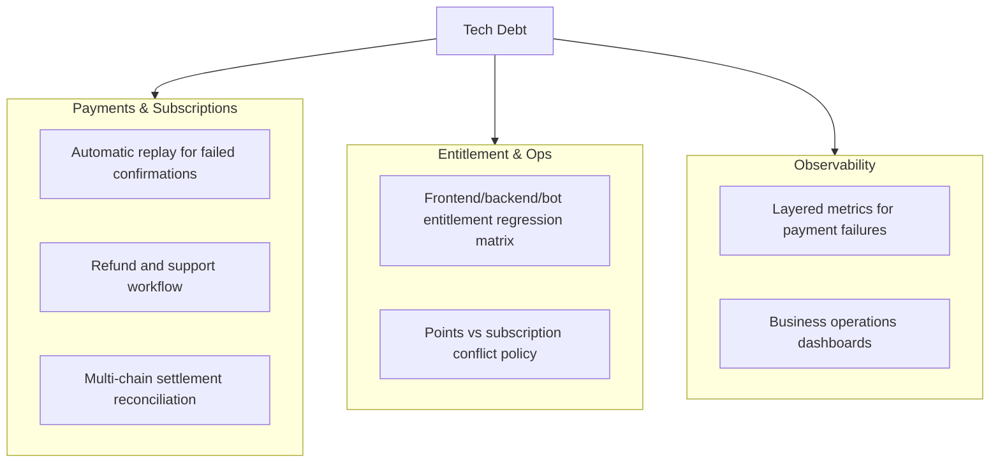

# Technical Debt Backlog (v1.4)

Last Updated: `2026-03-14`

Focus after paid launch: payment reliability, entitlement parity, and auditability.

## 1. Snapshot

Current estimate: **93% stable / 7% debt**.

## 2. Recently Closed

- P1 checkout flow live (intent -> submit -> confirm).
- Automatic reconciliation live (event loop + confirm loop).
- Wallet binding supports extension wallets + WalletConnect.
- Account center entitlement rendering is wired end-to-end.
- Wallet activity watcher supports dedicated channel routing.

## 3. High-Priority Debt

| Item | Impact | Suggested Work |
| :-- | :-- | :-- |
| Automatic replay strategy for transient tx failures | Manual intervention still needed in some edge cases | Standardize tx replay + fallback paths |
| Refund/support workflow | Commercial loop incomplete | Add refund state machine + support tooling |
| Subscription audit visualization | Slower incident triage | Build timeline view for entitlement events |
| Multi-email same-Telegram binding policy | Points ownership confusion | Add primary-account binding and migration utilities |

## 4. Medium-Priority Debt

| Item | Impact | Suggested Work |
| :-- | :-- | :-- |
| Points transparency | User confusion | Expose points breakdown by source |
| Payment error copy consistency | Conversion impact | Build error-code to UX-copy mapping table |
| Config sprawl | Ops mistakes | Consolidate payment/push configs into grouped schemas |

## 5. Low-Priority Debt

| Item | Impact | Suggested Work |
| :-- | :-- | :-- |
| Offline cache support | Non-core | Evaluate SW + IndexedDB |
| Cold-start variance | First-load jitter | Add route prewarming for hot cities |

## 6. Next Milestones

1. Ship automatic replay and alert stratification for payment anomalies.
2. Launch minimal refund/support admin flow.
3. Add business dashboards for payments, renewals, and retention.
4. Complete entitlement parity regression suite.
