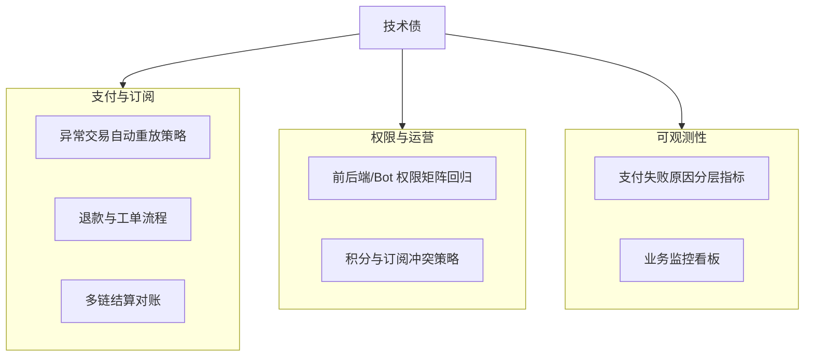

# 技术债与工程待办（v1.4.0）

最后更新：`2026-03-14`

目标：在收费上线后，优先保证支付可靠性、权限一致性和运营可追溯性。

## 1. 债务快照

当前估计：**93% 稳定 / 7% 技术债**。

## 2. 近期已关闭

- P1 支付主链路已上线（intent -> submit -> confirm）。
- 支付自动补单已上线（Event Loop + Confirm Loop）。
- 钱包绑定支持浏览器钱包 + WalletConnect。
- 账户中心与 Pro 权限展示链路打通。
- 钱包异动支持独立频道路由。

## 3. 高优先级技术债

| 项目 | 影响 | 建议动作 |
| :-- | :-- | :-- |
| 支付异常重放策略标准化 | 偶发确认失败需人工介入 | 建立 tx hash 自动回放 + 降级路径 |
| 退款与售后链路 | 商业闭环不完整 | 增加退款状态机与工单系统 |
| 订阅审计可视化 | 排障效率受限 | 建立订阅事件时间线视图 |
| 多邮箱绑定同 TG 账户策略 | 积分归属易混淆 | 引入主账号绑定策略与迁移工具 |

## 4. 中优先级技术债

| 项目 | 影响 | 建议动作 |
| :-- | :-- | :-- |
| 积分发放可解释性 | 用户理解成本高 | 输出积分来源明细（发言/签到/奖励） |
| 支付失败文案标准化 | 转化率受影响 | 建立错误码 -> 文案映射表 |
| 配置收敛 | 运维出错概率高 | 将支付/推送配置集中分组管理 |

## 5. 低优先级技术债

| 项目 | 影响 | 建议动作 |
| :-- | :-- | :-- |
| 前端离线缓存能力 | 非核心 | 评估 Service Worker + IndexedDB |
| 冷启动波动 | 首屏抖动 | 热点城市预热 |

## 6. 下阶段里程碑

1. 完成支付异常自动重放与告警分层。
2. 上线退款/售后后台最小版。
3. 建立商业化运营看板（支付、续费、留存）。
4. 完成权限矩阵自动化回归测试。
