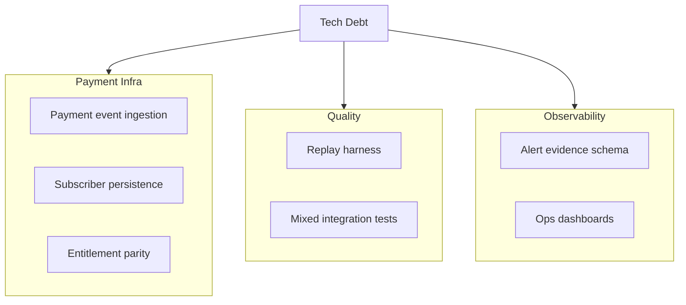

# Technical Debt Backlog

Purpose: keep engineering debt explicit while shipping production features.

---

## 1. Debt Snapshot

Current estimate: **90% stable / 10% debt**.

---

## 2. Recently Closed (2026-03-12)

- Bot entry refactor completed:
  - `bot_listener.py` simplified to thin entrypoint.
  - Runtime split into orchestrator/handlers/services/analysis/guard/coordinator layers.
- Startup diagnostics landed:
  - `/diag` command
  - loop-level startup status reporting (trade alerts, polygon watcher, polymarket watcher)
- Multi-model anchor migration completed for mispricing radar (replaced single Open-Meteo anchor).
- Non-tradable market hard-skip guard completed (closed/inactive/not accepting orders/past end time).
- Wallet activity watcher upgraded with alias parsing, link preview switch, and anti-spam debounce/immediate controls.
- Frontend BFF HTTP caching (`ETag`/`304`) completed for cities/summary/history.
- Meteoblue fully removed from runtime paths and docs.

---

## 3. Active High-Priority Debt

| Item | Impact | Suggested Work |
| :-- | :-- | :-- |
| Payment event ingestion pipeline | Cannot automate paid access reliably | Build idempotent onchain payment ingest + reconciliation worker |
| Subscriber persistence model | Manual entitlement ops do not scale | Add managed PostgreSQL/Supabase subscriber state |
| Entitlement parity matrix | Access leaks/false denies across channels | Unify policy across frontend middleware, backend API, and bot guard |
| Alert evidence contract | Harder to debug false positives quickly | Standardize machine-readable evidence schema for each push |

---

## 4. Active Medium-Priority Debt

| Item | Impact | Suggested Work |
| :-- | :-- | :-- |
| Replay simulation harness | Edge-case regressions hard to reproduce | Deterministic replay from stored weather + market snapshots |
| End-to-end integration coverage | Runtime regressions can slip | Add integration tests for `/api/city/{name}/detail` + push decisions |
| Config sprawl | Tuning is error-prone | Consolidate env knobs into structured config groups |
| Naming and data contracts | Boundary confusion persists | Normalize model/market field naming and compatibility aliases |

---

## 5. Active Low-Priority Debt

| Item | Impact | Suggested Work |
| :-- | :-- | :-- |
| Cold-start variance | First request latency jitter | Add prewarm strategy for top city routes |
| Local state files | Harder multi-instance scaling | Continue migration to managed storage |

---

## 6. Next Milestones

1. Land subscriber DB + entitlement expiry model.
2. Ship payment ingest + automatic entitlement sync.
3. Add replay harness for weather/market mixed scenarios.
4. Publish alert evidence schema and operator tooling.

---

Last Updated: `2026-03-12`
