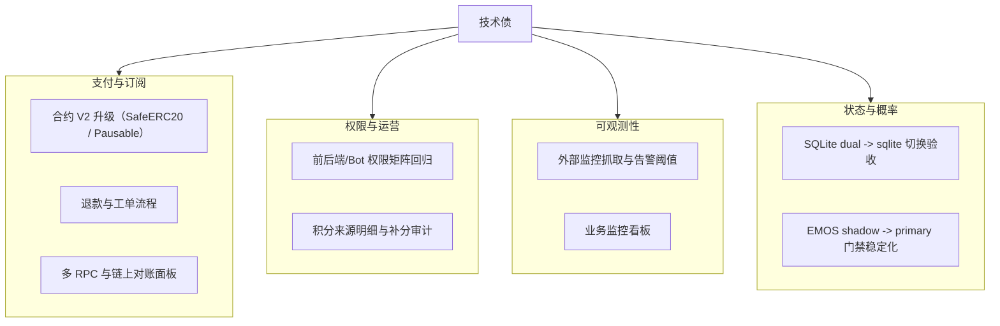

# 技术债与工程待办（v1.4.0）

最后更新：`2026-03-20`

目标：在收费上线后，优先保证状态一致性、支付可靠性、可观测性和概率引擎发布可控。

## 1. 债务快照

当前估计：**95% 稳定 / 5% 技术债**。

## 2. 近期已关闭

- 支付主链路已上线（intent -> submit -> confirm）。
- 支付自动补单已上线（Event Loop + Confirm Loop）。
- 支付事件重放脚本已补齐。
- 支付运行态 API 与 SQLite 审计事件已补齐。
- 钱包绑定支持浏览器钱包 + WalletConnect。
- 账户中心与 Pro 权限展示链路打通。
- 钱包异动支持独立频道路由。
- 运行态状态/缓存已支持 SQLite 渐进迁移。
- 轻量可观测性已上线（`/healthz`、`/api/system/status`、`/metrics`）。
- EMOS/CRPS 校准链路已上线 shadow 模式。

## 3. 高优先级技术债

| 项目 | 影响 | 建议动作 |
| :-- | :-- | :-- |
| SQLite 主读切换验收 | 仍处于 dual 过渡期 | 线上跑满 24-48 小时后切到 `sqlite` |
| EMOS 上线门禁 | 当前 `hold`，不能切 primary | 继续积累样本，重点压 `bucket_brier` |
| 外部监控与告警 | 只有轻量指标，无外部抓取 | 接 Prometheus/Grafana 或最小巡检 |
| 退款与售后链路 | 商业闭环不完整 | 增加退款状态机与工单系统 |

## 4. 中优先级技术债

| 项目 | 影响 | 建议动作 |
| :-- | :-- | :-- |
| 积分发放可解释性 | 用户理解成本高 | 输出积分来源明细（发言/奖励/手动补分） |
| 支付合约 V2 升级 | 当前仍是最小可用合约 | 升级到 SafeERC20 + Pausable + plan 绑定 |
| 支付失败文案标准化 | 转化率受影响 | 建立错误码 -> 文案映射表 |

## 5. 低优先级技术债

| 项目 | 影响 | 建议动作 |
| :-- | :-- | :-- |
| 前端离线缓存能力 | 非核心 | 评估 Service Worker + IndexedDB |
| 冷启动波动 | 首屏抖动 | 热点城市预热 |

## 6. 下阶段里程碑

1. 完成 SQLite 从 `dual` 到 `sqlite` 的主读切换。
2. 稳定 EMOS shadow，达到 rollout `observe/promote` 条件。
3. 补外部监控抓取与告警阈值。
4. 评估并推进支付合约 V2 升级。
