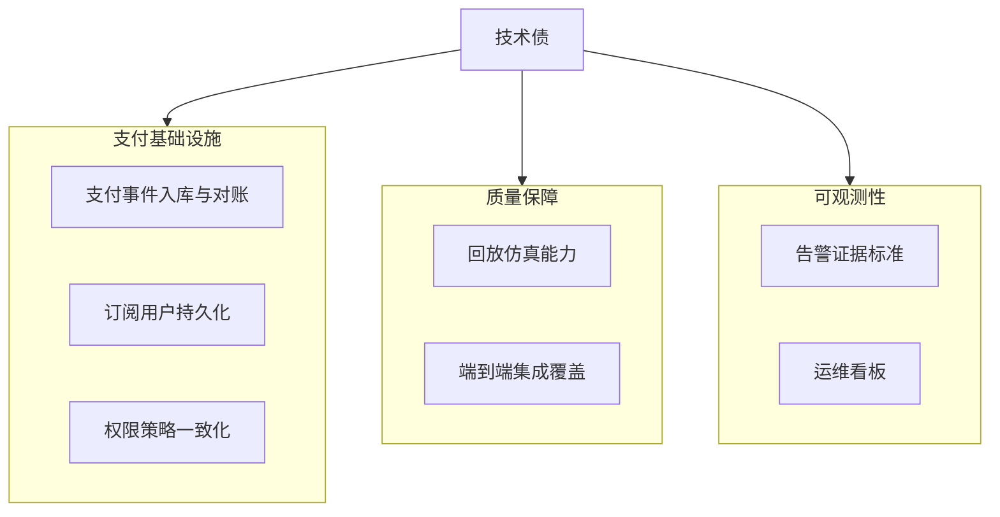

# 技术债与工程待办

目标：在持续交付的同时，让技术债可见、可追踪、可关闭。

---

## 1. 债务快照

当前估计：**90% 稳定 / 10% 技术债**。

---

## 2. 近期已关闭（2026-03-12）

- Bot 入口重构完成：
  - `bot_listener.py` 已收敛为薄入口。
  - 运行时拆分为编排层/处理层/服务层/分析层/守卫层/协调层。
- 启动诊断完成：
  - 新增 `/diag` 指令
  - 后台循环启动状态可视化（错价雷达、Polygon 钱包、Polymarket 异动）
- 错价锚点完成升级：从单一 Open-Meteo 改为多模型最高温锚点。
- 不可交易市场硬拦截完成：`closed`/inactive/不接单/超结束时间全部跳过。
- 钱包异动监听增强完成：昵称映射、链接预览开关、去抖与即时推送控制。
- 前端 BFF `ETag/304` 缓存完成（cities/summary/history）。
- Meteoblue 已从运行链路与文档中彻底移除。

---

## 3. 当前高优先级技术债

| 项目 | 影响 | 建议动作 |
| :-- | :-- | :-- |
| 支付事件采集与对账流水线 | 无法稳定自动开通付费权限 | 构建幂等 payment ingest + reconciliation worker |
| 订阅用户持久化模型 | 人工开通不可扩展 | 落地 PostgreSQL/Supabase 订阅状态 |
| 权限策略一致性矩阵 | 存在漏放行/误拦截风险 | 统一前端中间件、后端 API、Bot 守卫策略 |
| 告警证据协议 | 假阳性排障成本高 | 统一机器可读 Evidence Schema |

---

## 4. 当前中优先级技术债

| 项目 | 影响 | 建议动作 |
| :-- | :-- | :-- |
| 回放仿真能力不足 | 边缘场景回归难复现 | 基于天气+市场快照构建确定性 Replay |
| 端到端集成覆盖不足 | 运行时回归难提前发现 | 增加 `/api/city/{name}/detail` 与推送链路集成测试 |
| 配置项分散 | 阈值调优易出错 | 将关键 env 聚合为结构化配置分组 |
| 命名与字段兼容历史包袱 | 认知与维护成本高 | 统一模型/市场字段命名与兼容层 |

---

## 5. 当前低优先级技术债

| 项目 | 影响 | 建议动作 |
| :-- | :-- | :-- |
| 冷启动波动 | 首次请求延迟抖动 | 对热点城市路由做预热 |
| 本地文件状态依赖 | 多实例扩展受限 | 继续迁移到托管存储 |

---

## 6. 下阶段里程碑

1. 上线订阅用户 DB 与权限过期模型。
2. 完成支付事件入库与自动授权同步。
3. 落地天气+市场混合回放回归。
4. 发布告警证据标准与运维排障工具。

---

最后更新：`2026-03-12`
