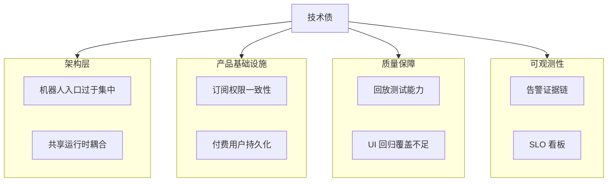

# 技术债与工程待办

目标：在持续交付的同时，把关键技术债显式化、可追踪化。

---

## 1. 技术债全景

当前系统健康度估计：**84% 稳定 / 16% 技术债**。

---

## 2. 最近已关闭项（2026-03-11）

- Meteoblue API 全链路移除（后端/前端/配置/文档）。
- 市场温度桶重复刷屏问题修复（后端去重 + 前端兜底）。
- 详情面板可访问性告警修复（`aria-hidden` 焦点冲突改为 `inert + blur`）。
- 前端已接入 Vercel Speed Insights。

---

## 3. 高优先级技术债

| 项目 | 影响 | 建议动作 |
| :-- | :-- | :-- |
| 机器人入口单体化（`bot_listener.py`） | 测试和重构风险高 | 拆分为编排层、IO 层、分析层 |
| 订阅权限策略不完全统一 | 可能造成付费泄露 | 前后端统一权限校验策略 |
| 付费用户状态持久化不足 | 人工运营不可扩展 | 迁移到托管 DB（PostgreSQL/Supabase） |
| 告警可解释性不足 | 运维排障成本高 | 统一告警证据字段（Evidence Schema） |

---

## 4. 中优先级技术债

| 项目 | 影响 | 建议动作 |
| :-- | :-- | :-- |
| 回放仿真能力不足 | 边缘场景难复现 | 基于历史记录构建可重复 Replay |
| 图表/UI 回归覆盖不足 | 视觉回归风险 | 增加快照与交互自动化测试 |
| 阈值配置分散 | 改动成本高且易错 | 统一收口到结构化配置 |
| 命名历史包袱 | 认知成本高 | 系统化命名治理 |

---

## 5. 低优先级技术债

| 项目 | 影响 | 建议动作 |
| :-- | :-- | :-- |
| 冷启动波动 | 首次请求延迟不稳定 | 热点城市路由预热 |
| 本地文件状态依赖 | 云端弹性场景受限 | 持续迁移到远程存储 |

---

## 6. 下阶段里程碑

1. 完成前后端订阅权限一致化。
2. 上线付费用户持久化与迁移脚本。
3. 建立告警证据标准并接入运维排障流。
4. 落地天气+市场混合回放回归测试。

---

最后更新：`2026-03-11`
