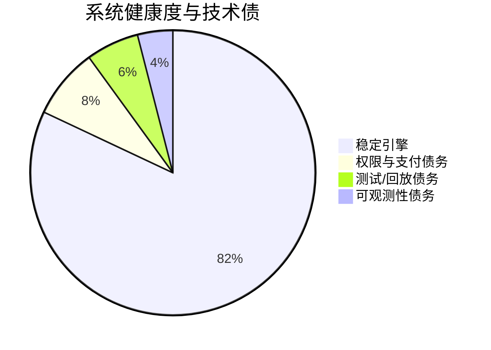

# 🛠️ 技术债与工程待办

> **愿景**：从研究脚本演进为可持续的生产级 SaaS。

---

## 🏛️ 系统健康度：82%

核心天气引擎与 React 仪表盘运行时已基本稳定，但产品层基础设施债务仍然明显。

### 当前稳定模块

- [x] 多源天气聚合
- [x] DEB 融合算法
- [x] 主动式 Telegram 预警引擎
- [x] Vercel 仪表盘基础设施
- [x] React 组件驱动仪表盘运行时（已替换 legacy `public/static/app.js` 渲染路径）

---

## 🔴 高优先级：立即处理

| 债务项                | 影响                                               | 建议修复                                                         |
| :-------------------- | :------------------------------------------------- | :--------------------------------------------------------------- |
| **Monolithic Bot**    | `bot_listener.py` 可测试性差，演进成本高。         | 将 UI 交互与业务逻辑解耦，沉入 `src/analysis`。                  |
| **Subscription Store**| 付费用户缺少持久化记录。                           | 从内存校验迁移到 **Supabase/PostgreSQL**。                       |
| **Alert Transparency**| 运维侧难以审计“告警为何触发”。                     | 为所有内部告警载荷增加 `Evidence` 元数据块。                     |
| **Entitlement Guard** | 仪表盘路由默认仍是公开可访问。                     | 在 Next.js middleware 与后端校验中加入 JWT/会话权限守卫。        |

---

## 🟡 中优先级：体验与效率

| 债务项                  | 影响                                               | 建议修复                                                                |
| :---------------------- | :------------------------------------------------- | :---------------------------------------------------------------------- |
| **Hard-coded Thresholds** | 阈值修改需要改代码（如 5s 冷却）。                | 将业务常量统一抽离到结构化 `config.yaml`。                               |
| **Simulation Harness**    | 无法“回放历史天气日”验证告警逻辑。               | 基于 `data/daily_records.json` 构建 `ReplayEngine`。                     |
| **Backend Naming**        | 仍有“市场价格时代”的命名残留。                   | 系统化重命名，统一为 weather-intelligence 语义。                         |
| **Chart Regression Tests**| 图表依赖自定义 Chart.js 生命周期，回归风险高。    | 增加图表数据集与图例的快照测试 + 交互测试。                              |

---

## 🟢 低优先级：性能优化

| 债务项                   | 影响                                               | 建议修复                                                         |
| :----------------------- | :------------------------------------------------- | :--------------------------------------------------------------- |
| **Serverless Cold Starts** | Vercel 首次 API 调用可能偏慢。                    | 为主要城市接口增加边缘缓存或预热任务。                           |
| **Local SQLite Files**     | 与 Vercel 短暂文件系统不兼容。                    | 全面迁移到远程数据库（Supabase/Redis）。                         |

---

## 🗓️ 下一阶段里程碑

1.  **DB Integration**：将 Supabase 接入 `src/database/db_manager.py`。
2.  **Entitlement Layer**：在仪表盘与 API 代理路由上落实付费访问中间件。
3.  **Alert Transparency**：在推送载荷中附加逻辑指标（斜率、领先差、平流因子）。
4.  **Replay & QA**：为地图/侧卡/modal 联动补齐可复现回放测试。

---

**📅 最后更新**：2026-03-09
