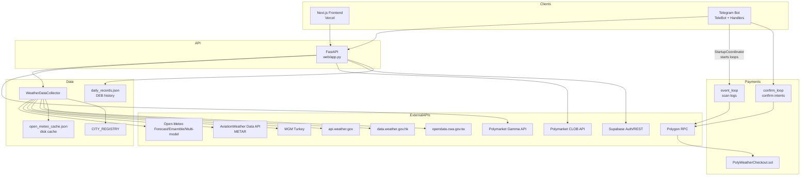

# PolyWeather 深度评估与改进提案报告

## 执行摘要

PolyWeather（仓库：`yangyuan-zhen/PolyWeather`）定位为**面向温度类结算预测市场（如 Polymarket 的温度结算合约）**的“生产级气象情报系统”，核心在于把多源天气观测/预报转化为**结算导向的概率桶（μ + bucket distribution）**，并进一步映射到市场报价完成**错价扫描**；同时提供 Web 仪表盘与 Telegram Bot 两套交互入口，并包含 Polygon 链上 USDC/USDC.e 支付、自动补单与订阅/积分体系。项目 README 明确其“Open-Core”边界：仓库公开天气聚合、基础分析、看板、Bot、标准支付流程；生产私有部分包含商业风控、阈值与运营工具等。

从工程实现看，当前版本（README 标注 `v1.4`，最后更新 `2026-03-14`）已经落地关键业务闭环：多源天气采集（Open-Meteo、AviationWeather METAR、土耳其 MGM、香港 HKO、台湾 CWA、美国 NWS 等）、DEB 动态融合、趋势/概率引擎、Polymarket 只读行情层、前端缓存策略（ETag/304、force_refresh no-store）、以及支付事件监听与确认循环。

但它也暴露出典型的“从快速迭代走向稳态生产”的结构性问题：核心模块（如 `src/data_collection/weather_sources.py`、`web/app.py`）体量巨大、职责耦合；配置/依赖/可复现性仍偏脚本化；测试覆盖存在但 CI/CD 缺失；多处自定义缓存与状态文件并发一致性风险；以及对第三方 API（Open-Meteo、AviationWeather、Supabase、Polymarket）在**配额、变更、SLA、合规**方面需要更系统的治理。

本报告给出的改进方向按收益/风险/工作量分级，优先建议聚焦三条主线： 
第一，**模块化与工程化**：将采集/分析/市场层/支付/鉴权拆成清晰边界，补齐 CI、测试、类型与规范化配置；第二，**可观测性与可靠性**：统一缓存与状态管理、增加限流与退避策略、建立指标与告警；第三，**模型与评测体系**：围绕“结算命中率 + 偏差（MAE/RMSE）+ 概率校准（Brier/CRPS）+ 错价信号有效性（Edge/PnL 模拟）”建立基准与回归测试，并可在合规前提下评估引入更先进的气象后处理（如 EMOS）或外部 AI 预报（GraphCast/FourCastNet/Pangu-Weather 的商业许可限制需特别注意）。

## 项目概览

PolyWeather 的目标与范围在 README/README_ZH 中定义得较清楚：为温度结算市场提供气象情报（多源采集→融合→概率→对照市场报价），并提供“官方看板（Vercel 前端）+ VPS 后端 + Telegram Bot”。turn58file0L1-L1 turn59file0L1-L1

项目主功能可归纳为四层：

**天气层（数据源/采集）**：聚合 20 个城市的实测与预报；支持 AviationWeather METAR（机场观测）、土耳其 MGM 站网、Open-Meteo（含多模型与集合预报）、美国 NWS（仅美国城市）、以及部分城市使用官方结算源（香港 HKO、台北 CWA）等。turn58file0L1-L1 turn41file0L1-L1 turn45file0L1-L1

**分析层（DEB/趋势/概率/结算口径）**： 
DEB（Dynamic Error Balancing）基于过去 N 天模型误差（MAE）倒数加权，输出融合预报；同时维护 `daily_records.json` 做历史对账、命中率/MAE 统计，并支持基于 WU（Weather Underground 口径）四舍五入的结算命中评估。 turn44file0L1-L1 
趋势/概率引擎在 `trend_engine.py` 中实现：综合“集合预报区间→σ/μ→高温窗口→死盘判定→温度桶概率分布→边界提示”等，用于 bot 展示与 web 结构化数据输出。

**市场层（Polymarket 行情对照）**：只读模式从 Gamma API 发现市场、从 CLOB（`py-clob-client` 或 REST 回退）读取价格/盘口并计算 edge（模型概率 − 市场概率）生成信号标签。turn55file0L1-L1

**商业化与支付**：订阅（`Pro Monthly 5 USDC`）、积分抵扣、Polygon 链上收款合约（USDC/USDC.e），并提供“事件监听 + 周期确认”的自动补单机制。

**支持的数据集/数据源**：项目不是传统“训练数据集+模型训练”的机器学习仓库；其“数据集”本质是外部实时/预报 API 与站点观测数据。对外部数据的使用需要遵守来源方的访问与速率限制，例如 AviationWeather Data API 明确限制请求频率（含每分钟请求上限/建议降低频率与使用缓存文件）。

**许可证**：仓库根目录 `LICENSE` 为 MIT。turn12file0L1-L1 同时 README 强调 Open-Core 策略与生产私有组件边界，意味着“可复现/可审计”的范围以公开部分为准。turn58file0L1-L1

（插图：项目 README 中包含产品截图，可用于快速理解信息架构与 UI 形态） 


## 架构与代码库分析

### 代码库模块地图

从 README、Docker/Compose、入口脚本与核心模块引用关系，可以抽象出如下模块地图（按“运行时组件”与“Python 域模块”两层描述）：

| 层级 | 目录/文件 | 角色定位 | 关键说明 |
| ------------- | ------------------------------------------------------------------------ | ------------------------------ | ---------------------------------------------------------------------------------------------------------------------------------------------------------------------------- |
| 运行时组件 | `frontend/` | Next.js 前端（Vercel） | 前端重构报告提到 App Router、Route Handlers（BFF）、缓存策略、支付与账户中心等。turn60file0L1-L1 turn11file0L1-L1 |
| 运行时组件 | `web/app.py` | FastAPI 后端 API | 作为前端 BFF 与 Telegram Bot 的共同 API。turn7file0L1-L1 |
| 运行时组件 | `bot_listener.py` + `src/bot/*` | Telegram Bot | 入口 `bot_listener.py` 调 `start_bot()`，并由 `StartupCoordinator` 启动多个后台 loop。turn38file0L1-L1 turn39file0L1-L1 turn40file0L1-L1 |
| Python 域模块 | `src/data_collection/*` | 天气采集 + 城市注册 + 市场读取 | `WeatherDataCollector`、`CITY_REGISTRY`、`PolymarketReadOnlyLayer` 等。turn41file0L1-L1 turn45file0L1-L1 turn55file0L1-L1 |
| Python 域模块 | `src/analysis/*` | DEB/趋势/概率/结算口径 | `deb_algorithm.py`、`trend_engine.py`、`settlement_rounding.py`。 turn44file0L1-L1 |
| Python 域模块 | `src/payments/*` + `contracts/*` | 支付合约 + 事件监听/补单 | Solidity 合约 + Python 侧事件扫描与确认循环。turn48file0L1-L1 |
| Python 域模块 | `src/auth/*`、`docs/SUPABASE_SETUP_ZH.md`、`scripts/supabase/schema.sql` | Supabase 鉴权/订阅/积分 | 使用 `/auth/v1/user` 校验 JWT、`/rest/v1/subscriptions` 查订阅（服务端角色 key 必须保密）。turn47file0L1-L1 |
| 工程与运维 | `docker-compose.yml`、`Dockerfile`、`update.sh`、`scripts/*` | 部署/验证脚本 | Compose 启两个容器（bot 与 web），脚本校验 ETag/缓存、更新重启等。 |

### 参考架构与关键工作流

项目 README 给出了一版 mermaid 参考架构图（Web/Telegram→FastAPI→采集→分析→支付/市场层）。turn58file0L1-L1 在此基础上，结合 `StartupCoordinator` 的 loop 启动与支付监听逻辑，可补充一个更“运行时视角”的架构图：



### 依赖与运行环境

**Python 依赖**：`requirements.txt` 包含 `requests`、`loguru`、`pyTelegramBotAPI`、`python-dotenv`、`numpy`、`web3`、`fastapi`、`uvicorn` 等，符合“采集+bot+api+链上交互”的需求。
**容器环境**：`Dockerfile` 基于 `python:3.11-slim`，默认启动 bot；`docker-compose.yml` 通过不同 command 分别启动 bot 与 web（`python bot_listener.py` / `python web/app.py`），并挂载运行态数据目录。
**前端依赖**：前端 README 描述 Next.js、Leaflet、Chart.js、Supabase Auth、WalletConnect 等；`frontend/package.json` 是前端依赖来源。

### 数据预处理、模型与“训练/推理”管线

本项目的“模型”主要是统计融合与规则/启发式引擎，而非深度网络训练：

**天气数据预处理**：`WeatherDataCollector` 内部做了大量“输入清洗+缓存+退避”的工程处理： 
包含 Open-Meteo 三类缓存（forecast/ensemble/multi_model）、429 冷却期、最小调用间隔、磁盘持久化缓存文件（重启后避免冷启动打爆 API）、以及 METAR/结算源缓存。turn41file0L1-L1

**DEB（Dynamic Error Balancing）**：以最近 N 天各模型的 MAE 计算倒数权重并做加权融合；同时将 `forecasts / actual_high / deb_prediction / mu / prob_snapshot` 写入 `data/daily_records.json`，并提供命中率/MAE/Brier 等统计口径。

**概率引擎**：`trend_engine.py` 以集合预报的 p10/p90 推 σ（并考虑历史 MAE floor、风向/云量/压强的 shock_score、以及峰值窗口 time-decay），再用正态近似把连续分布映射为 WU 整数“温度桶概率”。

**推理流水线（在线）**： 
Web/Telegram 请求 → FastAPI 调用采集器抓取/复用缓存 → 分析引擎输出结构化结果（μ、概率桶、趋势、死盘/窗口判定、DEB 预测、市场扫描）→ 前端渲染或 bot 消息格式化。

**检查点（checkpoints）**：传统 ML checkpoint 不适用；但项目存在两类“业务状态 checkpoint”： 
`daily_records.json`（DEB 历史与评测快照）与 `open_meteo_cache.json`（Open-Meteo 预报磁盘缓存）。

### 测试、CI/CD 与运维验证

**测试**：仓库存在 `tests/test_trend_engine.py`，覆盖 μ 计算、死盘判定、预报崩盘提示、趋势方向等核心逻辑（通过 patch 隔离外部依赖）。turn52file0L1-L1 
**CI/CD**：从仓库检索结果看，未发现公开的 GitHub Actions 工作流（`.github/workflows` 搜索为空），需要补齐自动化质量门禁。turn51file0L1-L1 
**运维验收**：提供 `scripts/validate_frontend_cache.sh` 校验 `/api/cities`、`/api/city/<city>/summary`、`/api/history/<city>` 的 ETag/Cache-Control，并对 `force_refresh` 期望 `no-store`。turn57file0L1-L1 
**部署/更新**：Compose 用于启动服务；另有 `update.sh` 通过 `pkill` + `nohup` 重启 bot 与 web。

## 优势与薄弱点

### 优势

**产品闭环完整、目标明确**：从“天气→结算→市场→错价信号→付费体系（订阅/积分/链上支付）”形成可商业化闭环，并在 README 清晰列出当前产品状态（订阅、积分抵扣、链上支付、自动补单等已上线）。turn58file0L1-L1

**复用一套分析内核服务多端**：趋势/概率/DEB 等核心逻辑被抽成分析模块，并被 web 与 bot 共用，避免“两套逻辑漂移”。turn58file0L1-L1

**面向外部 API 的工程防护意识较强**：Open-Meteo 429 冷却期、最小调用间隔、磁盘缓存、缓存 TTL 等措施表明作者已遭遇并处理速率限制与冷启动问题。turn41file0L1-L1 同时 AviationWeather 官方文档也明确建议控制频率并可使用 cache 文件降低负载，项目后续可进一步对齐最佳实践。

**支付侧有“事件监听 + 确认补单”的双通路**：支付链路天然存在“交易 pending / RPC 延迟 / 日志索引不完整”等问题，项目通过 event loop 与 confirm loop 双机制提升最终一致性。turn49file0L1-L1 turn35file0L1-L1 turn37file0L1-L1

### 薄弱点与风险

**核心文件过大导致可维护性下降**：`WeatherDataCollector` 集“多源采集 + 缓存 + 限流 + 解析 + 部分业务逻辑（城市/单位/回退策略）”于一体，规模继续增长会显著提高回归风险与重构成本。turn41file0L1-L1 同类问题往往也会出现在“单文件 FastAPI 应用”形态（`web/app.py`）。turn7file0L1-L1

**可复现性仍偏“脚本+隐式约定”**： 
虽然给了 Docker/Compose 快速启动，但缺少一份稳定的 `.env.example` / 配置 schema（哪些变量必需、默认值、敏感级别、环境分层），导致他人复现时容易踩坑；此外 `update.sh` 以 `pkill` 强杀进程方式更新，存在误杀与状态丢失风险，建议迁移到 systemd/容器滚动更新/健康检查。turn56file0L1-L1

**测试存在但依赖与 CI 缺失**：有 pytest 单测文件，但 `requirements.txt` 未体现 dev 依赖与一键运行指令，且缺少 CI 自动运行，容易出现“本地能跑、线上漂移”。turn52file0L1-L1 turn8file0L1-L1

**第三方服务合规与稳定性风险**： 
项目强依赖外部 API（Open-Meteo、AviationWeather、NWS、HKO、CWA、Polymarket、Supabase）。其中 AviationWeather Data API 有明确速率限制；Polymarket 官方说明 Gamma/Data/CLOB 三套 API 分属不同域，CLOB 交易端点需鉴权且策略可能变化；Supabase 明确强调 `service_role`/secret keys 绝不可暴露。若缺乏集中治理（重试/退避/熔断/降级/配额监控/密钥轮换），稳定性与合规不可控。

**许可证/商业使用的潜在冲突点**：仓库自身是 MIT，但如果未来尝试引入外部 AI 预报模型，需要非常谨慎：GraphCast 仓库代码 Apache-2.0，但权重使用 CC BY-NC-SA 4.0（非商业），Pangu-Weather 权重同样 BY-NC-SA 且明确禁止商业用途；不加区分地把这些模型用于付费产品会留下法律风险。

## 对标分析

为满足“至少 3 个相似开源项目或近期论文”对标，本报告选择三类代表： 
1）**AI 气象预报模型**（GraphCast / FourCastNet / Pangu-Weather）：用于评估“若 PolyWeather 未来扩展到更强预测能力”的技术与许可边界； 
2）**概率后处理方法**（EMOS）：作为 PolyWeather 概率引擎的更标准化替代/对照； 
3）**预测市场 API 客户端生态**（Polymarket/py-clob-client、aiopolymarket）：用于评估市场层的工程选型。

### 关键对比表

| 项目/论文 | 解决的问题 | 输出形态 | 性能/效果（公开描述） | 易用性与依赖 | 许可证要点 |
| --------------------------------------------------------- | ---------------------------------------------------- | ------------------------------- | -------------------------------------------------------------------------------------------------------------------------------------------------- | ---------------------------------------------------------------------------------------- | -------------------------------------------------------------------------------------------------- |
| **PolyWeather**（本仓库） | 温度结算市场气象情报：多源→概率桶→错价扫描→订阅/支付 | 生产级应用（Web+Bot+API+支付） | 以工程能力为主；内置 DEB、概率桶、死盘判定、市场扫描；覆盖 20 城市。turn58file0L1-L1 | 主要依赖外部 API；Docker Compose 一键启动。turn31file0L1-L1 | 仓库 MIT；Open-Core（部分生产规则私有）。turn12file0L1-L1 turn58file0L1-L1 |
| **GraphCast**（google-deepmind/graphcast） | 10 天全球中期预报（ML 替代/增强 NWP） | 模型代码+权重+notebooks | 论文与介绍提到在大量指标上优于主流确定性系统；仓库提供预训练权重与示例数据入口，并提示 ERA5/HRES 数据条款需另行遵守。 | 完整训练需 ERA5 等；更适合科研/平台级推理，不是产品级 BFF。 | 代码 Apache-2.0；权重 CC BY-NC-SA 4.0（商业限制）。 |
| **FourCastNet**（NVlabs/FourCastNet） | 高分辨率 data-driven 全球预报（AFNO/ViT） | 模型训练/推理代码+数据/权重链接 | README 描述：0.25° 分辨率、周尺度推理非常快，并可做大规模集合；适合平台型预报。 | 训练/数据依赖大（ERA5 子集 TB 级）；工程集成成本高。 | BSD 3-Clause（代码）。 |
| **Pangu-Weather**（198808xc/Pangu-Weather + Nature 论文） | 3D Transformer 架构的中期全球预报 | ONNX 推理代码+预训练模型 | Nature 论文称在 reanalysis 上对比 IFS 有更强确定性预报表现，并强调速度优势；仓库提供 ONNX 推理与 lite 版训练说明。 | 模型文件大（多份 ~GB 级），训练资源需求高；更适合科研推理或内部平台。 | 权重 BY-NC-SA 4.0、明确禁止商业用途。 |
| **EMOS**（Gneiting & Raftery 等） | 集合预报校准：纠偏与解决 underdispersion | 统计后处理方法 | 提出用回归形式输出概率分布（常见为高斯），并以 CRPS 等指标拟合，属于成熟的气象概率校准路线。 | 易落地：对 PolyWeather 而言只需“历史库+拟合器”。 | 方法论（论文）；可自行实现，无额外许可约束（注意论文版权）。 |
| **Polymarket/py-clob-client** | Polymarket CLOB 读写 SDK | Python SDK | 官方 SDK，支持 read-only 与交易接口；协议与端点在官方文档中给出。 | 易用，适合增强 PolyWeather 市场层。 | MIT。 |
| **aiopolymarket** | Polymarket APIs 的 async 客户端 | Python async 客户端 | 强调类型安全（Pydantic）、自动分页、重试与 backoff，适合高并发与健壮性诉求。 | 适合替换/补强当前同步 requests 与自定义缓存。 | 以仓库许可为准（此处建议上线前核验）。 |

**对标结论**：PolyWeather 与这类“全球 AI 预报模型”不在同一层级：PolyWeather 是“面向结算市场的产品化情报系统”，其价值核心是**将预测转成可交易/可结算的决策信息**。短中期内更高 ROI 的方向不是“自训大模型”，而是把现有“采集+后处理+市场映射”的链路做成**可复现、可观测、可评测、可扩展**的工程平台；在许可合规前提下，再评估引入外部模型推理作为额外信号源。turn58file0L1-L1

## 优先级改进建议

下表给出“高/中/低”优先级的具体改进清单，包含工作量估计、主要风险与可执行步骤（假设“无特定部署约束/性能指标约束”）。

| 优先级 | 改进项 | 预估工作量 | 主要收益 | 主要风险 | 可执行步骤（建议顺序） |
| ------ | --------------------------------------------------------------------------------------------------------------------------------- | -------------------: | ------------------------------------------------------------------- | ------------------------------------------------------- | ---------------------------------------------------------------------------------------------------------------------------------------------------------------------------------------------------------------------- |
| 高 | **拆分 `WeatherDataCollector` 为可插拔 Provider 架构**（OpenMeteoProvider / MetarProvider / NwsProvider / SettlementProvider 等） | 1–2 周 | 降低耦合、提高可测性，便于加入新城市/新源；减少回归面 | 重构期间线上行为漂移 | 1) 定义统一接口（输入：city/lat/lon/date；输出：标准 schema）→ 2) 把缓存/限流抽为中间层（decorator）→ 3) 用现有测试补齐 provider 单测 → 4) 灰度开启（仅部分城市走新链路）turn41file0L1-L1 |
| 高 | **拆分 `web/app.py`：路由层/服务层/DTO/依赖注入** | 1–2 周 | API 可维护性、鉴权/限流/缓存策略更清晰；更易做 OpenAPI 文档与版本化 | 改路由可能影响前端 | 1) 抽出 `services/analysis_service.py`、`services/market_service.py`、`services/payment_service.py` → 2) 引入 Pydantic models 作为响应 schema → 3) 保持 URL 不变，先做内部重构turn7file0L1-L1 |
| 高 | **建立 CI（Python + Frontend）与质量门禁**：lint/format/typecheck/test/docker build | 3–5 天 | 防回归、提高贡献效率；让 `v1.4` 之后迭代更稳 | 初期会暴露大量历史问题 | 1) Python：ruff + mypy + pytest；Node：eslint + typecheck + build → 2) GitHub Actions 两条 pipeline → 3) 给出“允许失败→逐步收紧”的迁移策略turn52file0L1-L1 turn30file0L1-L1 |
| 高 | **补齐可复现配置与密钥分级**：`.env.example` + 配置文档 + 敏感项隔离 | 2–4 天 | 新环境搭建更快、减少误配置；降低密钥泄露风险 | 需要梳理现有 env 变量 | 1) 盘点 env（Open-Meteo、Polymarket、Supabase、RPC、支付等）→ 2) `.env.example` 提供默认与说明 → 3) 标注敏感等级（尤其 `SUPABASE_SERVICE_ROLE_KEY`）并禁止前端/日志输出 |
| 高 | **统一“状态与缓存”方案**：把 JSON 文件状态迁移到 SQLite/Postgres/Redis（至少做到原子/锁一致） | 1–2 周 | 降低并发一致性 bug（多进程/多容器）、便于观测与回放 | 迁移会引入数据兼容与历史清理问题 | 1) 为 `daily_records` 与 `open_meteo_cache` 定义表结构 → 2) 先实现写入双写（JSON+DB）→ 3) 校验一致后切换读取 → 4) 下线 JSON 文件turn41file0L1-L1 |
| 中 | **市场层升级为 async + 类型安全**：引入 `aiopolymarket` 或在现有层加重试/backoff/连接池 | 4–7 天 | 行情层更稳，减少短时网络抖动；更易扩展更多市场/分页 | 依赖升级带来的行为差异 | 1) 把 requests.Session 替换为 aiohttp/httpx → 2) 在 Gamma/CLOB 调用侧实现指数退避 → 3) 引入 typed models，减少解析失败turn55file0L1-L1 |
| 中 | **概率引擎更标准化：引入 EMOS/CRPS 拟合做校准**（替换/增强当前正态近似与规则 σ） | 1–2 周 | 概率输出更可解释、可校准；适合做长期回归评测 | 需要足够历史样本；可能改变用户体验 | 1) 以 `daily_records` 为训练集（模型预报均值/方差→实际）→ 2) 先离线拟合并与现模型对比 → 3) 线上 shadow 输出（不影响主显示）→ 4) 达标后切换 |
| 中 | **支付合约/链上交互加强审计与防护**：事件重放、重入/授权边界、RPC 多节点容灾 | 1 周 | 提升资金链路可信度；减少链上卡单 | 合约升级需要迁移/再验证 | 1) 为 event loop 增加“最后处理区块高度”持久化与重放工具 → 2) RPC 端支持多 URL fallback → 3) 合约侧考虑 OpenZeppelin Ownable/SafeERC20（如升级）并更新验证流程turn49file0L1-L1 turn48file0L1-L1 |
| 低 | **引入外部 AI 预报模型作为附加信号**（GraphCast/FourCastNet/Pangu-Weather 等） | 2–6 周（取决于范围） | 可能提升极端/中期预测能力与差异化 | **商业许可限制**（多为 CC BY-NC-SA/禁止商业）与算力成本 | 1) 先做合规评审（权重许可/数据条款）→ 2) 仅在研究/非商业环境评估 → 3) 若要商用，优先选择可商用权重或自研/购买授权 |

### 文档、测试与贡献流程的具体补强建议（落到仓库层面）

1）**文档体系**：保留现有中文 API/TechDebt 文档的同时，增加三份“高价值”文档： 
（a）《运行与配置手册》：按环境（本地/测试/VPS/生产）列必需变量、默认值、敏感等级；（b）《数据源与合规说明》：列出 Open-Meteo、AviationWeather、NWS、HKO、CWA、Polymarket、Supabase 的使用条款要点、速率限制与降级策略（例如 AviationWeather 明确建议降低请求频率并提供 cache 文件）。 （c）《故障排查 Runbook》：429、支付 pending、市场扫描 miss、前端缓存异常等典型故障处理。

2）**测试金字塔**：在现有 `trend_engine` 单测基础上，补齐： 
（a）天气 provider 的“录制回放”测试（VCR 思路：固定响应→确保解析稳定）；（b）市场层的契约测试（Gamma/CLOB schema 变更时提前失败）；（c）支付链路的本地链集成测试（Hardhat/Anvil + 事件扫描回放）。这些测试能把“外部依赖漂移”尽量转成可控的回归失败。turn52file0L1-L1

3）**贡献工作流**：引入 `CONTRIBUTING.md`（分支策略、PR 模板、变更日志、版本号策略）、`CODEOWNERS`（核心模块审查人）、`SECURITY.md`（漏洞披露与密钥处理），并把静态检查（ruff/eslint）作为 pre-commit + CI 必过项。

## 建议实验与基准

PolyWeather 的评测应围绕“结算场景”而非传统数值天气预报所有变量。建议建立两类基准：**气象预测基准（结算导向）**与**市场信号基准（交易导向）**。

### 气象预测与概率校准基准

**数据集**（建议从现有生产数据演进） 
1）`daily_records.json` 的历史快照：已包含多模型预报、`actual_high`、`deb_prediction`、`mu` 与概率快照字段，天然可转成评测数据（建议迁移到 DB 后做版本化导出）。 
2）观测“真值”统一口径：对 METAR 城市用 AviationWeather Data API；对香港/台北等按结算源（HKO/CWA）作为真值，和项目当前逻辑一致。turn41file0L1-L1

**指标** 
1）确定性误差：MAE、RMSE（按城市、按季节、按风险等级分组）； 
2）结算命中率：`WU_round(pred) == WU_round(actual)`（项目已有统计口径）； turn44file0L1-L1 
3）概率质量：Brier Score（对离散温度桶），以及建议补充 CRPS（连续变量概率评分，EMOS 体系常用）。 
4）校准曲线：预测概率分箱的可靠性图（reliability diagram）与 Sharpness（分布集中度）。

**基线**

- Baseline A：Open-Meteo 当日最高温（或 forecast median）作为点预测；
- Baseline B：等权平均（DEB 在历史少时也会回退此策略）；
- Baseline C：当前 DEB；
- Baseline D：EMOS（以 ensemble 均值/方差为输入，拟合 μ 与 σ，优化 CRPS）。

**预期结果（定性）**

- 若历史样本足够，DEB 应在“系统性偏差明显”的城市提升 MAE；
- EMOS 类方法通常能在概率校准（可靠性与 CRPS）上更稳定，尤其当 ensemble 信息可用（项目已接入 Open-Meteo ensemble/p10/p90）。

**算力**：以上评测全部可在 CPU 上完成；数据量按“20 城市 × 180 天”级别，pandas/duckdb 即可。若引入更复杂拟合（如分层贝叶斯/分位数回归），也通常不需要 GPU。

### 错价信号与市场有效性基准

**数据集**

- 保存每次扫描输出：`date/city/bucket/model_prob/market_price/liquidity/edge`，并加上未来 `settled_bucket` 作为标签；Polymarket 市场发现与报价来自 Gamma/CLOB（官方文档说明三套 API：Gamma/Data/CLOB）。

**指标**

- Signal 覆盖率：能否找到正确 market / bucket；
- Edge 稳健性：不同流动性分位的 edge 分布；
- 交易模拟（如需）：在考虑滑点/手续费/成交概率下的期望收益（即使项目当前只读，也可以离线评估“若执行”会怎样）。

**基线**

- 简单策略：仅用市场中间价（不做模型）作为概率；
- 当前策略：模型概率 vs 市场概率 edge 阈值；turn55file0L1-L1
- 改进策略：引入“流动性/盘口深度/波动”作为信号置信度（aiopolymarket/py-clob-client 提供更完整的盘口读取能力）。

**算力**：CPU 即可；关键在于数据采样与回放。

## 路线图与风险缓解

下面给出一个**12 周**（约 3 个月）的建议路线图，按“可稳定交付的工程里程碑”组织；人力以“1 名后端/数据工程 + 1 名前端（可兼职）+ 0.5 名链上工程（按需）”估算。

| 时间窗 | 里程碑 | 交付物 | 资源/备注 |
| ----------- | ----------------------------------------- | --------------------------------------------------------------------------------------------------------------------------------------------------------- | -------------------------------------- |
| 第 1–2 周 | 工程地基：CI + 规范 + 配置可复现 | GitHub Actions；ruff/eslint；pytest 可一键跑；`.env.example`；敏感项分级说明（尤其 Supabase service role key 不可暴露）。 | 后端为主；前端补 eslint/typecheck |
| 第 3–5 周 | 核心模块解耦：采集 Provider 化 + API 分层 | provider 接口与实现；`web/app.py` 拆分路由与服务；核心 schema（Pydantic） | 风险：行为漂移；用回放测试压住 |
| 第 6–8 周 | 状态/缓存统一 + 可观测性 | `daily_records/open_meteo_cache` 迁移 DB；指标（请求量/429/延迟/命中率）；告警阈值 | 可先用 SQLite/Redis，后续再上 Postgres |
| 第 9–10 周 | 评测体系上线 | 离线评测脚本（MAE/RMSE/WU-hit/Brier/CRPS）；日报/周报自动生成 | 直接基于项目现有字段扩展 |
| 第 11–12 周 | 概率引擎升级（可选）+ 市场层健壮性增强 | EMOS/CRPS 拟合的 shadow 输出；Gamma/CLOB 客户端增强（async、重试、分页） | 以“小步可回滚”为原则，避免一次性替换 |

### 主要风险与缓解策略

**外部 API 速率限制/格式变更**：AviationWeather 明确 rate limit 与建议使用 cache 文件；Open-Meteo 也可能在不同端点策略上变化。缓解：统一“请求预算”与退避/熔断；关键响应做 schema 校验与回放测试；对高频数据优先拉取官方 cache/批量接口（若可用）。

**密钥泄露与权限滥用**：Supabase 明确强调 `service_role` 属高权限密钥，绝不可出现在前端或公开环境。缓解：密钥分级、CI secret scan、运行时最小权限、日志脱敏。

**支付链路最终一致性与链上不确定性**：链上事件索引延迟、RPC 不稳定、交易确认数不足都会导致误判。缓解：保持“事件监听 + 确认补单”双路径，并增加“事件重放/对账工具”、多 RPC fallback、以及链上高度持久化。turn49file0L1-L1 turn37file0L1-L1

**引入外部 AI 预报模型的商业合规风险**：GraphCast/Pangu-Weather 的权重许可均带非商业限制（CC BY-NC-SA/BY-NC-SA）；若 PolyWeather 是付费产品，必须先做法务与授权评审。缓解：只在研究环境评估；商用优先选择可商用权重/购买授权/自研。

**Open-Core 边界导致的“公开仓库与生产行为不一致”**：README 明确生产存在私有风控与阈值。缓解：把“公开核心”的可复现与评测做扎实（接口/数据 schema/测试/评测），私有策略只作为可插拔 policy layer 接入。turn58file0L1-L1

```text
链接汇总（便于审阅）
- PolyWeather 仓库（本次评估对象）：https://github.com/yangyuan-zhen/PolyWeather
- Polymarket API 文档（Gamma/Data/CLOB）：https://docs.polymarket.com/api-reference
- AviationWeather Data API（METAR 等）：https://aviationweather.gov/data/api/
- Open-Meteo Docs（Forecast）：https://open-meteo.com/en/docs
- Open-Meteo Docs（Ensemble）：https://open-meteo.com/en/docs/ensemble-api
- Supabase REST API：https://supabase.com/docs/guides/api
- Supabase API keys（service_role 风险）：https://supabase.com/docs/guides/api/api-keys
- GraphCast（代码 Apache-2.0；权重 CC BY-NC-SA）：https://github.com/google-deepmind/graphcast
- FourCastNet（BSD-3）：https://github.com/NVlabs/FourCastNet
- Pangu-Weather（权重 BY-NC-SA，禁商用）：https://github.com/198808xc/Pangu-Weather
- Polymarket 官方 Python CLOB SDK（MIT）：https://github.com/Polymarket/py-clob-client
- aiopolymarket（async、类型安全）：https://github.com/the-odds-company/aiopolymarket
```
